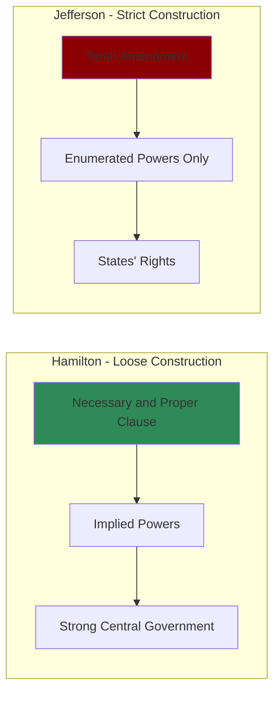
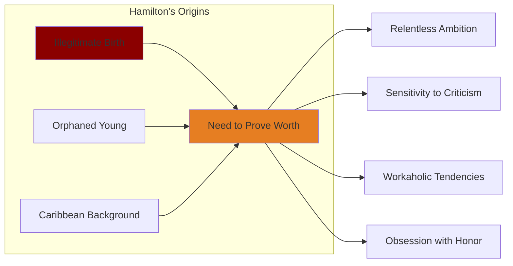

# Core Concepts

## Hamilton's Financial Revolution

Chernow's central achievement is explaining Hamilton's financial program. As Treasury Secretary, Hamilton proposed that the federal government assume state debts, create a national bank, establish a mint, and impose tariffs to encourage manufacturing. This program established American credit, created a unified national economy, and set the country on a path to industrial capitalism.

```mermaid
flowchart TD
    subgraph Hamilton's Financial System
        A[Assume State Debts] --> B[National Credit]
        C[Bank of the United States] --> D[Stable Currency]
        E[Manufacturing] --> F[Diversified Economy]
        G[Excise Taxes] --> H[Federal Revenue]
    end
    B --> I[American Capitalism]
    D --> I
    F --> I
    H --> I
    style A fill:#2E8B57
    style C fill:#2E8B57
    style E fill:#2E8B57
    style I fill:#1C1C1C
```

## Loose Construction vs. Strict Construction

The central constitutional debate of the early republic. Hamilton argued for "implied powers" — the Constitution granted the government powers not explicitly listed but necessary to carry out its functions. Jefferson argued for strict construction: the government could only do what the Constitution explicitly authorized.

## The Immigrant's Drive

Chernow emphasizes how Hamilton's status as an orphaned immigrant from the Caribbean shaped his psychology. He had to prove himself constantly, which drove his relentless work ethic and his sensitivity to slights. His illegitimate birth made him obsessed with honor and reputation.

## The Hamilton-Jefferson Rivalry

The book traces the epic rivalry between Hamilton and Jefferson, which Chernow presents as the foundational argument of American politics. Hamilton wanted a powerful federal government, a commercial economy, and close ties with Britain. Jefferson wanted limited federal power, an agrarian economy, and alignment with revolutionary France. Their conflict defined the first party system.

## The Duel with Burr

Chernow's account of the fatal duel with Aaron Burr is a masterpiece of historical narrative. He shows how the duel was the culmination of years of political rivalry and personal animosity, and how Hamilton's death was both tragic and paradoxical — a man who had spent his life building the American republic died at the hands of a fellow American in an illegal duel.

# Chapter Insights

## The Caribbean Boy

Hamilton's childhood on the island of Nevis and his early work as a clerk for a trading company. His intelligence was noticed by local merchants who sponsored his education in America.

## The Revolutionary

Hamilton served as Washington's aide-de-camp during the Revolutionary War, essentially running the army's operations. This gave him an insider's view of the Confederation's weaknesses.

## The Federalist

With Madison and Jay, Hamilton wrote the Federalist Papers, the most important commentary on the Constitution ever written. He wrote 51 of the 85 essays.

## The Treasury Secretary

The core of the book: Hamilton's four years as Treasury Secretary, during which he created the American financial system.

## The Rivalry

The escalating conflict with Jefferson and his allies, which became increasingly personal and vicious.

## The Duel

The final chapter: Hamilton's duel with Aaron Burr and his death on July 12, 1804.

# Practical Applications

- **Political theory**: The Hamilton-Jefferson debate remains relevant to modern arguments about federal power
- **Financial policy**: Hamilton's debt assumption and national bank established principles still debated
- **Leadership**: Hamilton's rise from immigrant to founder offers lessons in ambition and achievement

# Reading Guide

## Sufficiency Assessment

This summary captures Hamilton's life arc and major achievements. The full book offers deep context, character portraits, and political analysis.

## Recommended Reading Path

| Reader Type | Time | What to Read |
|---|---|---|
| Casual | ~20 min | This summary |
| Interested | ~5-6 hr | Summary + Chapters on Treasury, The Federalist, Duel |
| Full | ~16-18 hr | Full book |

## What You'll Miss

- The detailed political maneuvering in Washington's cabinet
- Chernow's mini-biographies of Hamilton's family and associates
- The full drama of the Reynolds affair and Hamilton's public confession
