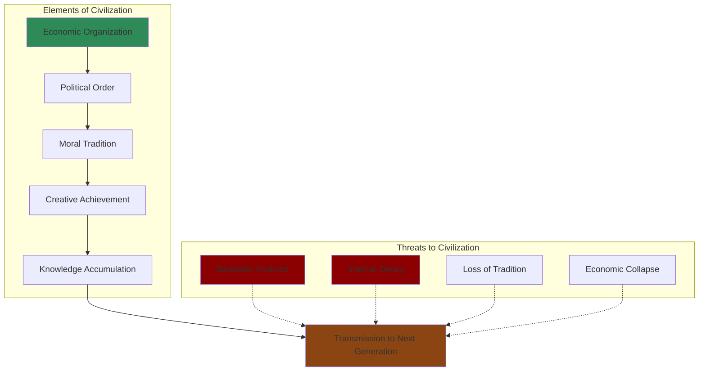
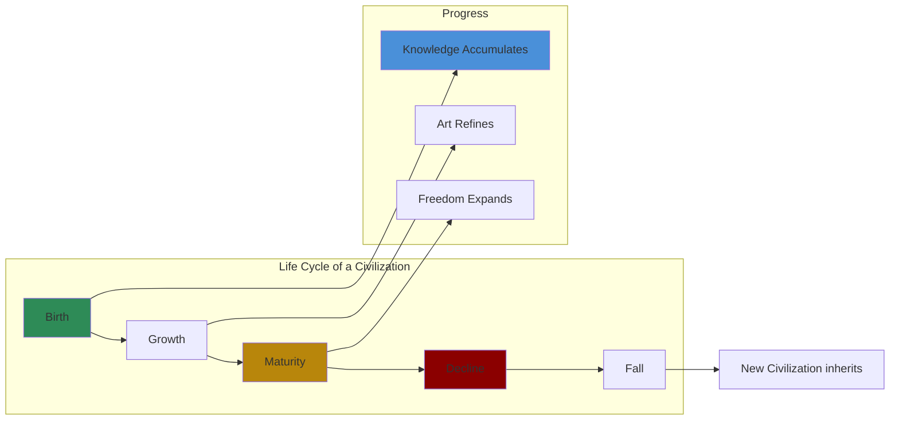

# Core Concepts

## Civilization as Heritage

The Durants defined civilization as "social order promoting cultural creation." It is not something natural or inevitable but the accumulated heritage of knowledge, art, and institutions that each generation inherits and must transmit. Civilization can be lost — and has been lost many times in history.

## The Cyclical Pattern

Durant saw civilizations as organic entities that are born, grow, flourish, decline, and die. But he saw progress as real within civilizations — the accumulation of knowledge, the refinement of art, the growth of freedom. Each civilization builds on its predecessors.

## Integrated History

The Durants insisted that history cannot be understood in specialized compartments. Political history without economic context is shallow. Art history without political context is rootless. Their series integrates all dimensions of human experience in each period covered.

## The Role of Great Individuals

Unlike many modern historians who emphasize structural forces, the Durants believed that great individuals shape history. Their volumes give central place to the great statesmen, philosophers, artists, and scientists who defined each age.

# Volume Summaries

## Volume 1: Our Oriental Heritage (1935)

Covering the ancient Near East: Sumer, Egypt, Babylon, Assyria, Persia, and India and China to about 1930. Durant treats Eastern civilizations with respect but from a Western perspective.

## Volume 2: The Life of Greece (1939)

A comprehensive history of ancient Greece from the Minoans to the Roman conquest. This volume was a particular labor of love for Durant.

## Volume 3: Caesar and Christ (1944)

Rome from its foundation through the rise of Christianity. Durant treats both pagan and Christian civilization with sympathy.

## Volume 4: The Age of Faith (1950)

From Constantine to Dante: the Byzantine Empire, Islam, and medieval Europe.

## Volume 5: The Renaissance (1953)

Italy from 1300 to 1576. Durant's Renaissance is vibrant, violent, and creatively explosive.

## Volume 6: The Reformation (1957)

From Wycliffe to Calvin: the religious upheaval that shattered medieval Christendom.

## Volume 7: The Age of Reason Begins (1961)

1558-1648: Shakespeare, Elizabeth I, the Thirty Years' War, and the dawn of modern science.

## Volumes 8-11: From Louis XIV to Napoleon

Covering the age of absolutism, the Enlightenment, and the French Revolution, culminating in Napoleon.

# Practical Applications

- **Reading guide**: Use the series as a multi-year reading program in world civilization
- **Reference**: The index volumes provide a comprehensive reference to Western civilization
- **Education**: The series can structure a self-taught liberal education

# Reading Guide

## Sufficiency Assessment

This summary covers the scope and structure of the series. Each volume offers far more detail and narrative texture.

## Recommended Reading Path

| Reader Type | Time | What to Read |
|---|---|---|
| Curious | ~20 min | This summary |
| Beginner | ~10-15 hr | The Lessons of History (the distilled version) |
| Committed | ~100+ hr | The full series, starting with Volume 1 |

## What You'll Miss

- The beautiful prose of the full volumes
- The detailed character portraits of historical figures
- The integration of art, philosophy, and politics
