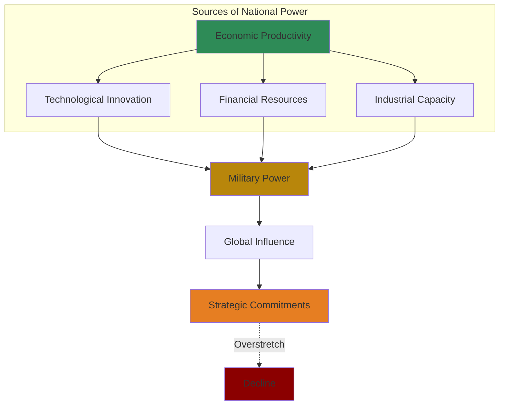

# Core Concepts

## The Productive Base

Kennedy's central argument: national power in the modern era rests on economic productivity. A nation's ability to field armies, build navies, and project influence depends on its industrial and technological base. Great powers rise when their economies grow faster than their rivals, and they decline when their economic dynamism flags.

## Imperial Overstretch

The most famous concept in the book. Kennedy argues that great powers typically decline not because they are defeated in war but because they overextend themselves militarily. As their commitments grow, military spending crowds out productive investment, leading to relative economic decline, which in turn undermines military power.

## The Changing Global Balance

Kennedy shows that the international system is characterized by constant shifts in the relative power of states. The rise of new powers and the decline of old ones is the normal condition of international politics, driven by differential rates of economic growth and technological change.

## The 1500-2000 Trajectory

The book traces five centuries of great power politics: the rise of the Habsburgs, their decline as Spain overextended; the rise of France, Britain, and the Netherlands; the industrial revolution and the rise of Germany, the United States, and Japan; and the twentieth-century struggles between these powers.

# Chapter Insights

## Part 1: Pre-Industrial World

Kennedy examines the great powers of the pre-industrial era: Ming China, the Ottoman Empire, the Habsburgs, France, and England. He shows that even before industrialization, the same pattern of economic base determining military power held true.

## Part 2: The Industrial Era

The industrial revolution transformed the basis of national power. Britain's early industrialization gave it an enormous advantage. Germany's rapid industrialization in the late 19th century challenged British supremacy.

## Part 3: The Twentieth Century

The two world wars, the Cold War, and the relative decline of the United States. Kennedy argues that the United States, like all great powers before it, faces the challenge of maintaining global commitments with a declining share of global economic product.

# The US Case

Kennedy's analysis of the United States was the most controversial part of his book. He argued that the US showed classic signs of imperial overstretch: extensive global military commitments, rising defense spending, and relative economic decline compared to rising powers like Japan and Germany. The debate this provoked was intense and continues today.

# Practical Applications

- **Strategic planning**: Use Kennedy's framework to assess national power and strategy
- **Investment**: Understand which nations are rising and declining
- **Policy**: Recognize the danger of overcommitment and the importance of economic productivity

# Reading Guide

## Sufficiency Assessment

This summary captures Kennedy's thesis and historical framework. The full book provides detailed evidence and case studies.

## Recommended Reading Path

| Reader Type | Time | What to Read |
|---|---|---|
| Casual | ~15 min | This summary |
| Interested | ~4-5 hr | Summary + Part 3 on the 20th century |
| Full | ~12-15 hr | Full book |

## What You'll Miss

- Kennedy's detailed economic data and tables
- The nuanced case studies of each great power
- The debate about US decline that the book provoked
