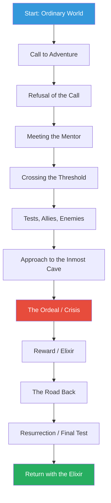
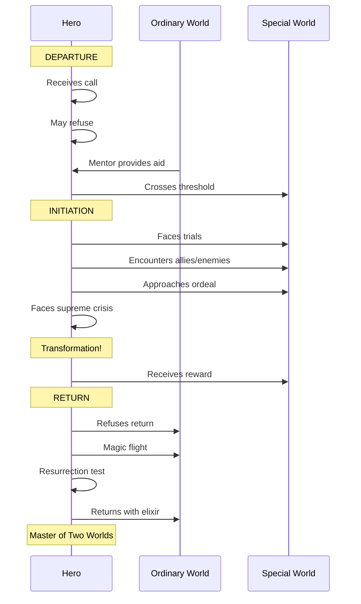
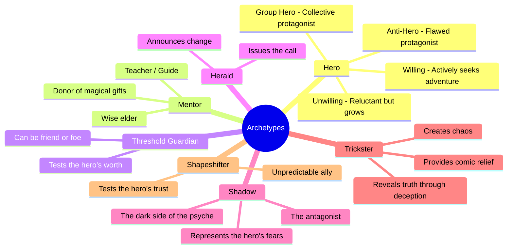

## The Monomyth

Campbell's central concept is the monomyth: the idea that all heroic narratives in all cultures follow a single underlying pattern. He identified this pattern after decades of studying myths from every inhabited continent and found that the basic sequence of departure, initiation, and return appears in virtually every tradition.

The monomyth begins with the hero in the ordinary world, receiving a call to adventure. The call is often refused initially — the hero is reluctant, afraid, or committed to other responsibilities. A mentor figure appears to provide guidance and encouragement. With the mentor's help, the hero crosses the threshold into the unknown, a special world of adventure.

In the special world, the hero faces tests, makes allies and enemies, and approaches the central ordeal. The ordeal is the crisis of the story, the moment the hero must face the greatest fear. Surviving the ordeal transforms the hero and yields a reward — the elixir, treasure, or knowledge. The hero must then return to the ordinary world, often facing a final test along the way. The journey is complete when the hero returns with the elixir and shares it with the community.

## The Three Phases

Campbell divides the monomyth into three major phases, each containing several stages.

**Departure** includes the call to adventure, often delivered by a herald figure; the refusal of the call, where the hero expresses reluctance; supernatural aid, where a protective figure provides tools or wisdom; crossing the first threshold, where the hero commits to the journey; and the belly of the whale, the final separation from the known world.

**Initiation** is the longest and richest phase. The road of trials is a series of tests that prepare the hero for the central ordeal. The meeting with the goddess represents the hero's encounter with unconditional love and acceptance. Woman as temptress, a stage that has been criticized for its sexism, represents the temptation to abandon the quest for worldly pleasures. Atonement with the father is the reconciliation with authority and the acceptance of adult responsibility. Apotheosis is the hero's transcendence of ordinary human limitations. The ultimate boon is the achievement of the quest's goal.

**Return** involves refusal of the return, where the hero may not want to leave the special world; the magic flight, a chase sequence where the hero escapes with the boon; rescue from without, where the hero needs help to return; crossing the return threshold, where the hero must integrate the journey's lessons into ordinary life; master of two worlds, where the hero can now navigate both ordinary and special worlds; and freedom to live, where the hero is liberated from the fear of death.

## Archetypes

Drawing on Carl Jung's theory of archetypes, Campbell identifies recurring character types that appear across all mythologies:

The hero is the protagonist who undertakes the journey. The mentor provides guidance and gifts. The threshold guardian tests the hero before allowing entry into the special world. The herald announces the call to adventure. The shadow is the antagonist, representing what the hero fears and must overcome. The trickster provides comic relief and disrupts the established order, often revealing hidden truths. The shapeshifter is an unstable figure whose loyalties are uncertain.

## The Cosmogonic Cycle

Part Two of the book examines the broader cosmic patterns that myths describe. Creation myths, Campbell argues, are not primitive science but symbolic expressions of the emergence of consciousness from the unconscious. The hero's journey is a microcosmic version of this cosmic pattern: the individual consciousness separating from the collective, undergoing trials, and returning transformed.

Campbell traces the figure of the world creator across cultures, from Indra in Hinduism to the Great Spirit in Native American mythology. The hero who creates or renews the world is the same figure who undergoes the personal journey — the two are reflections of each other.

## The Function of Myth

Campbell identified four functions of mythology. The mystical function reconciles consciousness with the universe, creating a sense of awe and wonder at the mystery of existence. The cosmological function provides a picture of the universe that is consistent with the knowledge of the time. The sociological function validates and supports a particular social order. The pedagogical function guides individuals through the stages of life.

In the modern world, Campbell argues, the cosmological and sociological functions have been taken over by science and politics. But the mystical and pedagogical functions remain vital — and without mythology to serve them, modern individuals are left without guidance for psychological and spiritual development.

## Chapter Insights

### Part I: The Adventure of the Hero
The core of the book, presenting the monomyth in detail with examples from dozens of cultures.

### Chapter 1: Departure
The stages leading up to the hero's entry into the special world.

### Chapter 2: Initiation
The central transformation of the hero through trials and the supreme ordeal.

### Chapter 3: Return
Bringing the boon back to the community, often the most difficult part of the journey.

### Part II: The Cosmogonic Cycle
The cosmic patterns that myths describe, from creation to the end of the world.

### Chapter 4: The Key
The relationship between individual psychology and universal mythology.

## Practical Applications

For writers, the monomyth provides a comprehensive narrative template that can be adapted to any genre. George Lucas used it to structure Star Wars. Christopher Vogler adapted it into a screenwriting guide, The Writer's Journey, that is used in Hollywood development offices. For therapists and coaches, the hero's journey provides a framework for understanding personal transformation.

## Reading Guide

### Sufficiency Assessment

This summary captures the core of Campbell's monomyth: the three phases, the major stages, the key archetypes, and the functions of mythology. It omits the vast number of examples from world mythology and the detailed treatment of the cosmogonic cycle.

### Recommended Reading Path

| Reader Type | Time | What to Read |
|---|---|---|
| Casual | ~20 min | This summary |
| Interested | ~4 hr | Summary + Part I of the book |
| Scholar | ~16 hr | Full book |

### Chapters to Read in Full

- **Part I, Introduction** — The monomyth concept and the hero pattern
- **Chapter 1** — The departure phase
- **Chapter 2** — The initiation phase (the heart of the book)
- **Chapter 3** — The return phase

### What You'll Miss by Not Reading the Full Book

The richness of the mythological examples, the analysis of the cosmogonic cycle, and Campbell's speculations on the relationship between myth and modern life.
