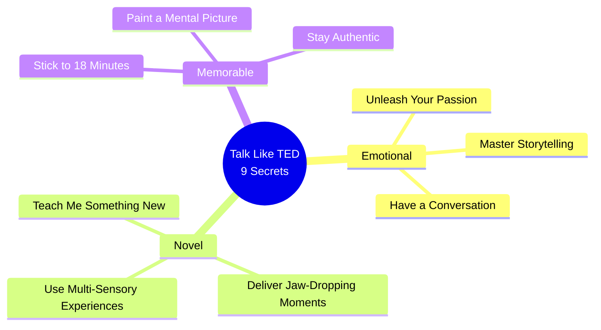
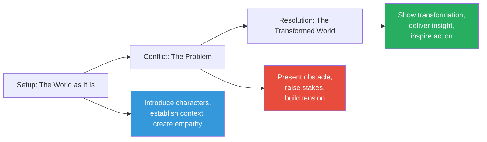
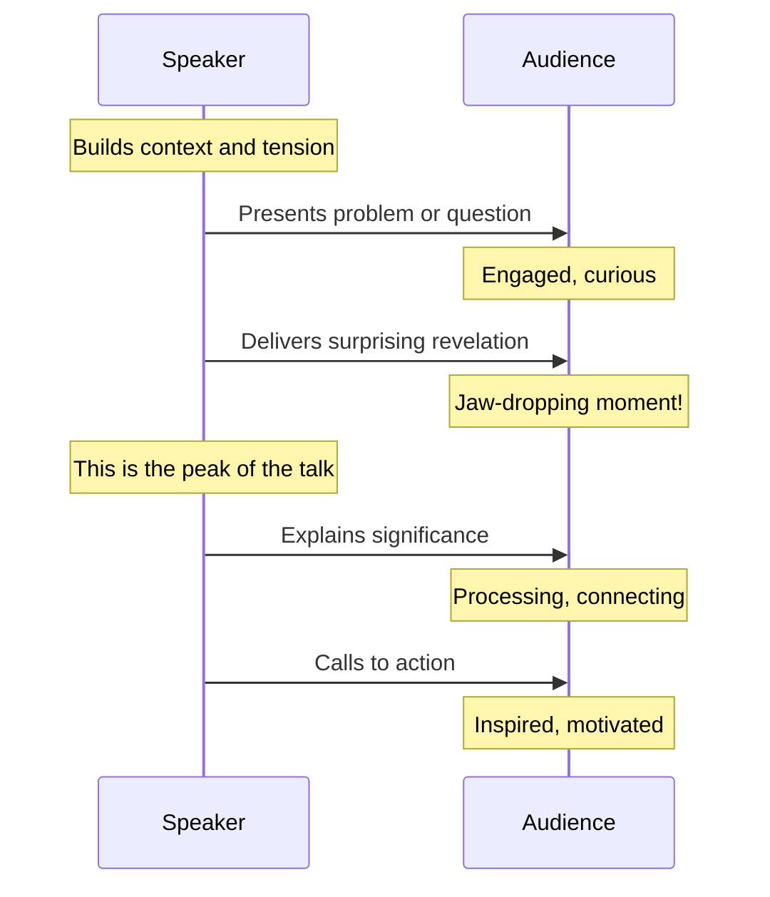

## The Nine Secrets

Gallo organises the book around nine principles that he identified by analysing hundreds of TED talks and interviewing the most successful speakers. Each principle is supported by examples from specific talks and by research from neuroscience, psychology, and communication studies.

## Secret 1: Unleash the Passion Within

Every great TED talk is driven by the speaker's genuine passion for the subject. Gallo argues that passion is not optional — audiences can detect inauthenticity instantly, and no amount of technique can compensate for a speaker who does not care.

The most passionate speakers share three characteristics: they are obsessed with their topic, they communicate with enthusiasm and energy, and they connect their subject to something larger than themselves. Gallo cites the example of Sir Ken Robinson, whose talk "Do Schools Kill Creativity?" is the most viewed TED talk of all time. Robinson's passion for transforming education is evident in every word and gesture.

## Secret 2: Master the Art of Storytelling

Stories are the most powerful communication tool humans have. Gallo explains why: narrative activates more areas of the brain than factual presentation, creating emotional engagement that makes information stickier.

Effective presentations follow a three-act structure: setup (the world as it is), conflict (the problem or challenge), and resolution (the transformed world). The most memorable TED talks are built around a single narrative arc with a clear hero, a defined obstacle, and a satisfying resolution.

Gallo provides specific techniques for incorporating storytelling: use personal stories to build credibility, use other people's stories to illustrate universal truths, and use metaphors to make abstract concepts concrete.

## Secret 3: Have a Conversation

The most TED-like delivery is conversational, not performative. Speakers who read from notes or recite memorized scripts create distance. Speakers who speak as if talking to one person create intimacy.

Conversational delivery requires three elements: natural language (avoid jargon and scripted phrases), vocal variety (vary pitch, pace, and volume), and authentic gestures (movement that emerges naturally from the words). Gallo emphasises that conversational does not mean unprepared — the most natural-looking speakers have practised the most.

## Secret 4: Teach Me Something New

Novelty triggers dopamine release in the brain, making audiences more attentive and more likely to remember what they hear. Gallo advises speakers to present new information, a surprising perspective, or an unexpected connection within the first thirty seconds of the talk.

The most effective novelty techniques include: revealing a surprising statistic or fact, presenting a counterintuitive argument, demonstrating a phenomenon live on stage, and connecting two seemingly unrelated ideas.

## Secret 5: Deliver Jaw-Dropping Moments

The most viral TED talks contain moments that audiences feel compelled to share. These are not gimmicks but carefully crafted elements that deliver emotional impact. Bill Gates releasing mosquitoes into the auditorium to make a point about malaria. Jill Bolte Taylor holding a human brain on stage.

Gallo advises speakers to plan one such moment — a revelation, demonstration, or emotional peak that creates a powerful memory.

## Secret 6: Stick to the 18-Minute Rule

TED's 18-minute limit is not arbitrary. Research in cognitive psychology shows that attention spans in lecture settings max out at around 18 minutes. The constraint forces speakers to identify the single most important idea and focus on it ruthlessly.

Gallo provides techniques for compressing content: identify the core message and eliminate everything that does not support it, use the "elevator pitch" test, and structure the talk as a single narrative arc rather than a collection of points.

## Secret 7: Paint a Mental Picture

Vivid language that creates images in the listener's mind is more memorable than abstract concepts. Gallo advises speakers to use concrete language, sensory details, and specific examples rather than generalizations.

Techniques include: using metaphors and analogies to make abstract concepts concrete, describing scenes with sensory details, and using specific numbers and names rather than vague quantities.

## Secret 8: Use Multi-Sensory Experiences

Presentations that engage multiple senses create richer and more durable memories. Gallo advises against text-heavy slides and recommends using powerful images, video clips, props, demonstrations, and even sound.

The most effective visual presentations use the "less is more" principle: one powerful image per slide, minimal text, and a clear visual hierarchy. Gallo cites the example of Hans Rosling, whose animated data visualisations made statistics come alive.

## Secret 9: Stay Authentic and Vulnerable

Audiences connect with authentic human beings, not polished performers. Gallo argues that vulnerability is a strength, not a weakness. Speakers who share failures, doubts, or personal struggles create emotional connections that polished confidence cannot achieve.

## Chapter Insights

### Part 1: Emotional
Covers secrets 1-3: passion, storytelling, and conversational delivery. The emotional foundation of great presentations.

### Part 2: Novel
Covers secrets 4-6: novelty, jaw-dropping moments, and the 18-minute rule. Techniques for capturing and holding attention.

### Part 3: Memorable
Covers secrets 7-9: mental pictures, multi-sensory experiences, and authenticity. Ensuring the message sticks.

### Part 4: The TED Commandments
Gallo concludes with the unwritten rules of the TED stage and practical advice for preparing, practising, and delivering a talk.

## Reading Guide

### Sufficiency Assessment

This summary captures the full nine-secret framework and the key research supporting each principle. It omits the detailed speaker interviews and specific talk analyses that make the book so engaging.

### Recommended Reading Path

| Reader Type | Time | What to Read |
|---|---|---|
| Casual | ~15 min | This summary + Secret 1, 2, 3 |
| Busy professional | ~1 hr | Secrets 1, 2, 3, 6, 9 |
| Serious speaker | ~8 hr | Full book + watch referenced TED talks |

### Chapters to Read in Full

- **Secret 2** — Storytelling (the most important skill)
- **Secret 3** — Conversational delivery (the most common weakness)
- **Secret 6** — The 18-minute rule (the most practical constraint)

### What You'll Miss by Not Reading the Full Book

The specific TED talk analyses, the speaker interviews, and the detailed rehearsal techniques in the final chapters.
