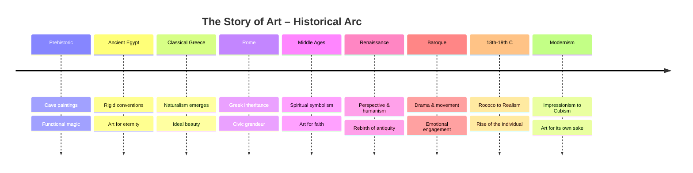
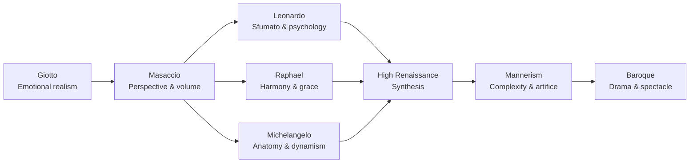
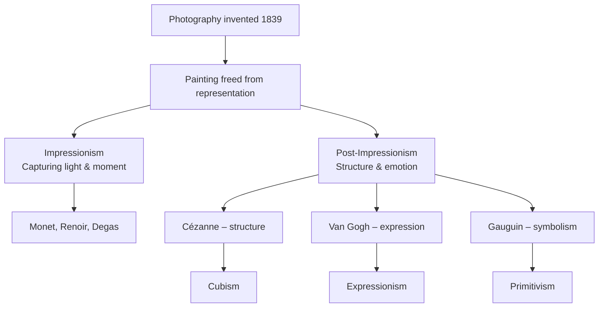

## The Narrative Arc: From Cave to Cubism

Gombrich's underlying argument is stated in the first paragraph: "There is no such thing as Art. There are only artists." This deliberately provocative opening sets the tone for the entire book. Gombrich rejects the idea of art as a single progressive enterprise. Instead, he tells the story of individual artists working within traditions, solving problems, and responding to the demands of their time and place.

## Part I: The Foundations

### Prehistoric and Ancient Art

Gombrich begins at the Chauvet and Altamira caves, where Paleolithic hunters painted animals with astonishing skill. He argues these were not "art for art's sake" but functional images — part of hunting rituals, ways of gaining power over animals by capturing their likeness. This establishes a theme: art always serves a purpose, even if that purpose changes.

Ancient Egyptian art is the first fully developed tradition Gombrich examines. He explains the Egyptian "conceptual" approach: rather than showing how things look from a single viewpoint, Egyptian artists showed each part of the body from its most characteristic angle — the eye in profile but the eye itself as seen from the front. The result is a consistent, powerful visual language that endured for 3,000 years. Gombrich emphasizes that Egyptian conventions were not failures of skill but deliberate choices serving religious and political purposes — the preservation of the soul and the glorification of the pharaoh.

### Classical Greece and Rome

Greek art represents the great turning point: the decision to make art look like the world as seen by a single viewer. Gombrich traces the development from Archaic kouroi (stiff, frontal, symmetrical) to Classical sculpture (contrapposto, naturalistic proportions, movement) to Hellenistic drama (pathos, emotion, theatricality). The key innovation was the Greek discovery of foreshortening — the technique of showing the human body as it actually appears from a specific viewpoint.

Roman art, for Gombrich, is the practical inheritor of Greek ideals. Roman portraiture added psychological depth and individual character; Roman architecture achieved unprecedented scale and engineering sophistication. The Empire's art served imperial power, but it also created the infrastructure through which Greek artistic values spread across Europe and the Mediterranean.

### The Middle Ages and the Byzantine Tradition

Gombrich challenges the Renaissance myth that the Middle Ages were a "dark" period for art. He shows that medieval artists, working within a Christian worldview that distrusted the material world, developed powerful new visual languages of their own. Byzantine mosaics with their flattened, gold-backed figures expressed spiritual transcendence. Gothic cathedrals with their soaring vaults and stained glass created a foretaste of heaven. The illuminated manuscripts of the monasteries preserved the craft of painting through centuries of political instability.

Gombrich's analysis of medieval art is among the book's finest passages. He explains the "inverted perspective" of Byzantine icons, the "horror vacui" (fear of empty space) of Hiberno-Saxon manuscript illumination, and the theological logic behind the increased naturalism of 13th and 14th-century religious painting.

## Part II: The Renaissance and After

### The Early Renaissance

Giotto is Gombrich's hero of the early Renaissance — the first artist since antiquity to give figures weight, volume, and emotional presence. His Arena Chapel frescoes tell Biblical stories with unprecedented human drama. From Giotto, Gombrich traces the accelerating mastery of perspective, anatomy, and naturalistic representation through Masaccio, Donatello, and Brunelleschi in Florence.

The discovery of linear perspective by Brunelleschi in the 1420s is presented as the decisive technical breakthrough. For the first time, painting could create a convincing illusion of three-dimensional space on a flat surface. Gombrich explains not just how perspective works but why it mattered: it transformed the painter from a craftsman into something like a magician who could create a window into another world.

### The High Renaissance

The three titans of the High Renaissance — Leonardo, Michelangelo, and Raphael — each receive extended treatment. Leonardo's sfumato (the smoky blurring of outlines) and his obsessive anatomical studies are presented as the culmination of Renaissance naturalism. Michelangelo's Sistine Chapel ceiling and David are analyzed as monuments of human potential and divine aspiration. Raphael's Stanze frescoes are praised for their perfect compositional harmony and their ability to synthesize the discoveries of Leonardo and Michelangelo into a serene, balanced whole.

### Northern Renaissance

Gombrich gives equal weight to the Northern Renaissance, centered in Flanders and Germany. Jan van Eyck's Ghent Altarpiece, with its painstaking oil technique and mirror-like surface detail, represents a different path to realism — not through perspective and anatomy but through observation of light, texture, and surface. Dürer, who traveled to Italy and synthesized Northern precision with Italian theory, is presented as the bridge between these two traditions.

## Part III: The Baroque and the Modern Era

### The Baroque

The Baroque emerges from the Counter-Reformation Church's demand for art that moves the faithful emotionally. Caravaggio's dramatic chiaroscuro and street-real figures brought religious scenes into the present tense. Bernini's sculptures caught figures at the peak of action. Rubens's swirling compositions and voluptuous nudes expressed the vitality of Catholic Europe.

Gombrich contrasts the Protestant North, where artists turned to portraiture, still life, and landscape — genres that didn't exist in the same form before. Rembrandt is the towering figure here, using light not just as a visual effect but as a moral and psychological force.

### The 18th Century

The Rococo's frivolity (Watteau, Fragonard) gives way to the Enlightenment's seriousness. The discovery of Pompeii and Herculaneum sparked Neoclassicism — David's severe, civic-minded paintings served the French Revolution. Goya's dark, psychologically penetrating works anticipate modern concerns.

### The 19th Century: Revolution in Art

The 19th century is where Gombrich's narrative accelerates. The invention of photography freed painting from its obligation to represent reality. Suddenly, artists had to answer a new question: if not accurate representation, then what is painting for?

Gombrich traces the response through Impressionism (Monet, Renoir), Post-Impressionism (Cézanne, Van Gogh, Gauguin), and the various movements that followed. Cézanne, in particular, is identified as the "father of modern art" because he changed the fundamental question of painting from "what do I see?" to "how can I organize the picture plane?"

### The 20th Century

The final chapters cover Cubism (Picasso, Braque), Expressionism, Fauvism, Surrealism, and abstract art. Gombrich maintains his non-judgmental approach, explaining each movement's aims and accomplishments without declaring winners. He is notably more cautious about contemporary art, acknowledging that historical distance is needed for fair assessment.

He concludes with a reflection on the diversity of modern art and the difficulty of finding a single narrative thread. The book ends where it began: with individual artists making individual decisions about what art should be.

## Critical Reception

The book has sold over 8 million copies, translated into 30 languages, and gone through 16 editions. Its influence on how art history is taught and understood is incalculable. Criticisms include its Western-centric focus (non-Western art receives minimal treatment), its teleological narrative (the story seems to lead inevitably to modernism), and its underrepresentation of women artists. Gombrich acknowledged these limitations in later editions, adding more female artists and expanding the non-Western sections, but the book remains fundamentally a history of Western art.

## Reading Guide

### Sufficiency Assessment

This summary captures Gombrich's narrative arc, key arguments, and major periods. What it compresses: the richness of Gombrich's individual analyses of specific works, the elegance of his prose, and the cumulative effect of his patient, non-technical explanations. The book's power is in how it teaches you to look — a dimension that cannot be summarized.

### Recommended Reading Path

| Reader Type | Time | What to Read |
|---|---|---|
| Casual | ~15 min | This summary |
| Interested | ~3-5 hr | Summary + Part I (Foundations) + Renaissance chapters |
| Scholar/Practitioner | ~15-20 hr | Full book with visual companion |

### What You'll Miss

Gombrich's ability to make you see a familiar painting with fresh eyes. His careful analysis of dozens of specific works. The cumulative experience of moving through 30,000 years of art history in a single sustained narrative. The reproductions, which are central to the learning experience.
