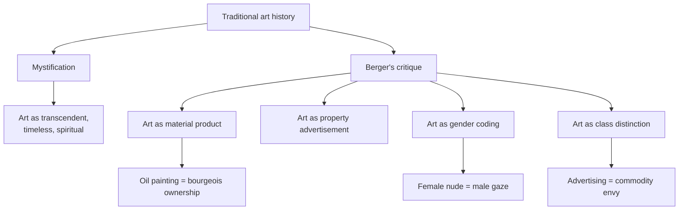
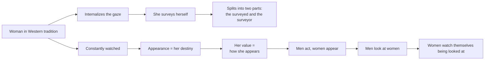

## The Structure of Seeing

Berger opens with a radical claim: "Seeing comes before words. The child looks and recognizes before it can speak." But this primary act of seeing is not innocent. "The way we see things is affected by what we know or what we believe." Berger's project is to expose the cultural and historical conditioning that shapes how we look at images — particularly the art of the European tradition.

The book emerged from Berger's frustration with the dominant art criticism of his time, which treated great art as a realm of transcendent beauty and spiritual value, disconnected from the messy realities of power, money, and social inequality. Berger saw this approach as "mystification" — a way of preserving elite privilege by making art appreciation seem like a special gift that only the cultured possess.



## Essay 1: The Mystification of Art

The first essay attacks the myth that great art belongs to a separate spiritual realm accessible only to the cultivated few. Berger argues that museums, art historians, and the culture industry have transformed paintings into "a record of a special kind of property." The oil painting tradition, from the Renaissance through the 19th century, did not depict the world as it was — it depicted the world as property.

Berger's key example: the portrait of a landowner with his estate in the background is not just a likeness. It is a title deed, a visual assertion of ownership. "Oil painting did to appearances what capital did to social relations. It reduced everything to the equality of objects. Everything became exchangeable because everything became a commodity."

The mystification is accomplished by treating these paintings as timeless masterpieces, ignoring their original function as property records, status markers, and instruments of class power.

## Essay 2: The Female Nude and the Male Gaze

Berger's most famous and influential essay concerns the representation of women in European oil painting. He makes a devastating observation: in the vast majority of nude paintings, the woman is aware of being seen. She is not naked — she is nude. The difference: "To be naked is to be oneself. To be nude is to be seen naked by others and yet not recognized for oneself."



Berger traces this dynamic from the biblical story of Susanna and the Elders through Titian's Venus of Urbino to Manet's Olympia. In each case, the female subject is positioned as an object of male desire. She is there to be looked at. Her own sexuality is not her own — it is staged for the male spectator.

The essay introduced the concept that would later be theorized as "the male gaze" by feminist film critics like Laura Mulvey. Berger's account is less systematic than Mulvey's but more accessible and grounded in specific paintings.

## Essay 3: Reproduction and Its Consequences

Walter Benjamin argued in 1936 that mechanical reproduction destroys the "aura" of the original work of art. Berger extends this argument to show how reproduction changes meaning. When a painting is photographed, printed in a book, or broadcast on television, it can be cropped, colored, juxtaposed with other images, and seen in contexts the artist never intended.

This is liberating: reproduction democratizes access to art and breaks the monopoly of the museum. But it also makes images vulnerable to co-optation. Berger shows how a Van Gogh painting, reproduced alongside a photograph of a starving peasant, takes on a completely different meaning than when it hangs in a gallery.

Most importantly, reproduction reveals the ideological content of images. When paintings are removed from their original contexts and seen in books, their role as property records, status symbols, and gender scripts becomes visible in ways the original display concealed.

## Essay 4: Advertising as Art's Successor

The final essay draws a direct line from the oil painting tradition to modern advertising. Berger argues that advertising is not a break with the past but a continuation of the same visual logic. Oil painting showed the spectator what they could own; advertising shows the spectator what they could become.

The difference: oil painting displayed the possessions of the wealthy to an audience that could not have them, while advertising creates a state of envious longing that can be temporarily satisfied by buying the product. "The purpose of publicity is to make the spectator marginally dissatisfied with his present way of life."

```mermaid
flowchart LR
    O[Oil painting 1500-1900] --> P["Shows what you<br/>can own (property)"]
    A[Advertising post-1920] --> B["Shows what you<br/>can become (glamour)"]
    O --> C[Display of wealth]
    A --> D[Promise of transformation]
    C --> E[Social class is destiny]
    D --> F[Social class is changeable<br/>(through consumption)]
    E --> G[Envy of the rich]
    F --> H[Envy of the idealized self]
    G --> I[Static society]
    H --> J[Dynamic consumer capitalism]
```

Berger traces the visual conventions that advertising borrows from oil painting: the same gestures, the same lighting, the same compositional devices. The difference is that advertising has replaced the display of property with the display of lifestyle. "The publicity image belongs to the moment. We see it as we turn a page, as we turn a corner. It comes and goes. But the image of the oil painting belongs to the continuity of time. It is there for its own duration."

## The Image-Only Essays

Essays 3, 5, and 7 are composed almost entirely of images without captions. These visual essays force the reader to reflect on the process of looking itself. In Essay 3, Berger juxtaposes images of women from different historical periods and cultures, inviting the reader to see the recurring patterns of female representation. In Essay 5, he places photographs of poverty alongside luxury advertisements, exposing the inequality that advertising depends on. In Essay 7, he constructs a visual argument about the relationship between oil painting and advertising that words could not adequately convey.

## Reading Guide

### Sufficiency Assessment

This summary captures Berger's four main arguments and their interconnections. The image-only essays cannot be reproduced in summary, but their essential point — that visual juxtaposition creates meaning — is integrated into the analysis. What is necessarily lost: the experience of seeing Berger's chosen images in sequence and the cumulative rhetorical force of his argument.

### Recommended Reading Path

| Reader Type | Time | What to Read |
|---|---|---|
| Casual | ~15 min | This summary |
| Interested | ~2-3 hr | Full text (readable in one sitting) |
| Scholar | ~4-5 hr | Full text + secondary literature + original BBC series |
