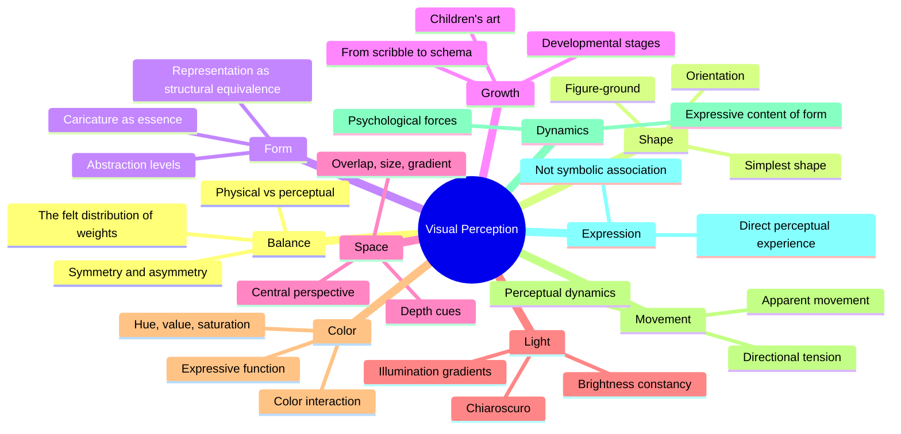
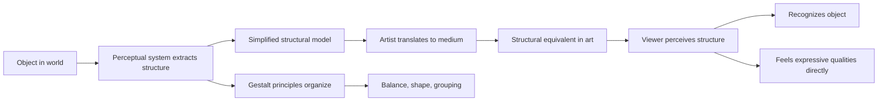

## The Gestalt Foundation

Arnheim builds on the core insight of Gestalt psychology: the whole is different from the sum of its parts. When we look at a painting, we do not first see individual brushstrokes and then assemble them into a face. We see the face directly. The perceptual system organizes raw sensory data into meaningful wholes according to innate principles — principles that artists have exploited intuitively for centuries.

His method is to examine each perceptual principle in turn, show how it operates in everyday vision, and then demonstrate its role in the creation and appreciation of art. The book is organized around ten fundamental perceptual categories.

## Balance

Balance is the foundation. Arnheim argues that every act of vision involves the perception of forces — pushes and pulls, attractions and repulsions — within the visual field. The eye seeks equilibrium. A composition that achieves balance feels right; one that does not feels unsettling or incomplete.

Balance can be symmetrical (formal, stable) or asymmetrical (dynamic, lively). Arnheim uses paintings by Cezanne, Raphael, and Rembrandt to show how master compositions achieve a felt equilibrium despite asymmetry. The hidden geometry of these paintings — the subtle alignments that the eye registers without conscious attention — is Arnheim's subject.

The center of a composition is not just a geometric point but a perceptual fulcrum. Arnheim demonstrates how artists manipulate the relationship between the physical center of the canvas and the perceptual center of the composition to create tension, movement, or stability.

## Shape

Shape is defined by figure-ground relationships. The simplest shape, for Arnheim, is the one the eye can grasp most easily — usually a circle, square, or triangle. More complex shapes are perceived as deviations from these simplest forms. The eye sees a slightly irregular oval as "an imperfect circle," not as a unique shape in its own right.

Arnheim applies this to the interpretation of abstraction. Abstract art is not a rejection of recognizable form but a reduction to essential perceptual structures. A Mondrian grid is not empty geometry but a field of perceptual forces in dynamic equilibrium.

## Form and Representation

Arnheim makes a crucial argument: representation is not imitation. When an artist makes a picture of something, they are not copying its appearance but creating a "structural equivalent" for it. A child's drawing of a person — a circle for the head, lines for the limbs — works not because it looks like a person but because it captures the essential structural features of the human figure: a central mass with projecting members.

This is why caricature can be more effective than realistic portraiture. The caricaturist distorts the face to emphasize its structural features, creating a more powerful perceptual equivalent of the person than a photographic copy would.

## Growth

Arnheim studies the development of visual representation in children, tracing the evolution from scribbles to schematic drawings to increasingly naturalistic renderings. He argues that this development recapitulates the history of art: both children and early artistic cultures begin with the simplest structural equivalents and only gradually develop more complex representational systems.

This developmental framework provides a powerful argument against the idea that artistic skill is merely technical proficiency. Children's drawings are not failed attempts at realism; they are successful attempts at structural equivalence appropriate to the child's perceptual and cognitive stage.

## Space

How do flat pictures create the illusion of depth? Arnheim analyzes the various depth cues — overlap, relative size, vertical position, perspective convergence, light and shadow gradients — and shows how each works on the perceptual system. Linear perspective is only one of many spatial systems, each with its own expressive possibilities.

The flatness of the picture plane, for Arnheim, is not a limitation to be overcome but a resource to be used. The best paintings create a tension between flatness and depth, between the physical surface and the illusory space.

## Light and Color

Arnheim devotes substantial chapters to light and color, treating each as both a physical phenomenon and a perceptual force. Light creates space, reveals form, and carries expressive content — the dramatic chiaroscuro of Caravaggio, the soft luminosity of Vermeer, the harsh glare of German Expressionism.

Color receives similar treatment. Arnheim explains the perceptual dimensions of hue, value, and saturation, and shows how color interactions create effects that cannot be predicted from individual colors in isolation. The simultaneous contrast effects that interested Josef Albers are analyzed from a Gestalt perspective.

## Movement and Dynamics

Movement in static art is always implied, not actual. Arnheim analyzes how directional forces, compositional vectors, and the perceptual tendency to complete actions create the experience of movement in painting and sculpture. The "frozen moment" captures not a snapshot but the perceptual essence of a movement.

More importantly, Arnheim argues that dynamics — the felt forces within a composition — are the primary carriers of expression. Before we interpret what a painting represents symbolically, we directly experience its dynamics. A Gothic spire feels like it is reaching upward; a crouching figure feels compressed. This direct perceptual experience is the foundation of all artistic expression.

## Expression

The final chapter synthesizes the book's argument about expression. Artistic expression is not symbolic meaning that we decode intellectually. It is the direct experience of perceptual forces. We see sadness in a weeping willow not because we associate the drooping branches with sadness but because the perceptual dynamics of the willow — the downward pull, the limp lines — directly create the feeling of sadness.

This is Arnheim's most important contribution to aesthetic theory: expression is a primary perceptual quality, not a secondary intellectual interpretation. The dynamics we see in a painting are not metaphors for emotion; they are the emotion, present in the visual field and experienced directly by the perceiver.

## Reading Guide

### Sufficiency Assessment

This summary captures Arnheim's framework and key arguments across all ten perceptual categories. What is necessarily compressed: the detailed analyses of specific artworks, the careful experimental evidence, and the cumulative effect of Arnheim's systematic approach. The book's density and rigor cannot be summarized without loss.

### Recommended Reading Path

| Reader Type | Time | What to Read |
|---|---|---|
| Casual | ~15 min | This summary |
| Interested | ~4-6 hr | Summary + Balance, Shape, Form chapters |
| Practitioner | ~15-20 hr | Full book, working through examples |
