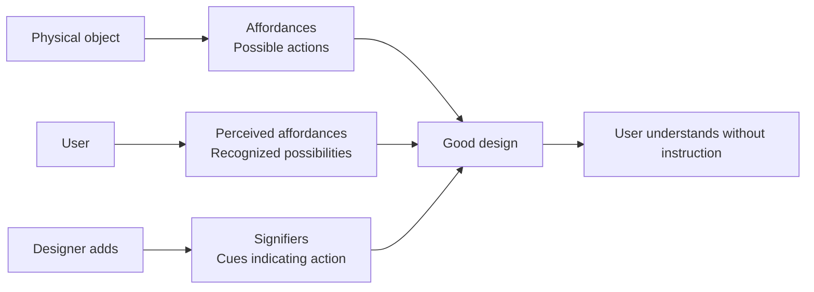
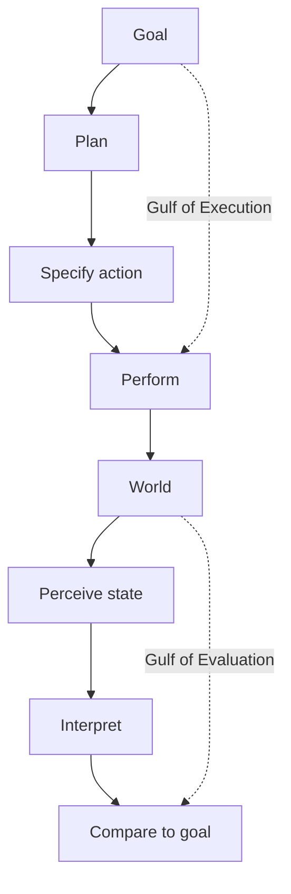

## The Psychopathology of Everyday Things

Norman opens with a problem that everyone recognizes: doors that you push when you should pull, faucets that confuse hot and cold, stoves with burner controls arranged in an arbitrary pattern. These are not minor annoyances — they are failures of design that reveal a deeper problem: designers do not understand the psychology of the people who will use their products.

The chapter introduces the concept that made Norman famous: **affordances**. An affordance is the relationship between a physical object and a person that determines how the object can be used. A chair affords sitting. A button affords pushing. Affordances are perceived — the user must recognize what action is possible. This leads to **signifiers**: visual cues that communicate where actions should take place. A flat plate on a door is a signifier for pushing; a handle is a signifier for pulling. Bad design arises when signifiers conflict with affordances.

Norman's second crucial contribution: **conceptual models**. Users form mental models of how things work. Good design provides an accurate conceptual model through visible structure, feedback, and consistent behavior. Bad design creates a false model, leading to confusion and error.

## The Seven Stages of Action

Norman's framework for understanding human interaction with any product:

1. **Goal** — What do you want to accomplish?
2. **Plan** — How will you accomplish it?
3. **Specify** — What specific action sequence will you use?
4. **Perform** — Execute the action
5. **Perceive** — What happened in the world?
6. **Interpret** — What does that mean?
7. **Compare** — Did you achieve your goal?

Between these stages lie two critical gaps. The **Gulf of Execution** is the gap between the user's goal and the actions the product makes available. The **Gulf of Evaluation** is the gap between the product's state and the user's ability to understand it. Good design bridges both gulfs.

## Knowledge in the World and in the Head

Norman distinguishes between two types of knowledge that guide behavior. Knowledge in the world is information present in the environment — signs, labels, constraints, the shape of objects. Knowledge in the head is what you have memorized. Good design relies on knowledge in the world, reducing the user's memory load.

This explains why experienced users and beginners need different interfaces. Beginners rely on external cues. Experts have internalized the knowledge and want efficiency. The challenge is designing for both.

## The Seven Principles of Design

Norman distills his framework into seven actionable principles:

1. **Discoverability** — Users must be able to figure out what actions are possible
2. **Feedback** — Every action must have an immediate, noticeable consequence
3. **Conceptual model** — The design must communicate how it works
4. **Affordances** — Properties that suggest possible actions
5. **Signifiers** — Cues that communicate where actions happen
6. **Mapping** — The relationship between controls and their effects should be natural
7. **Constraints** — Physical, logical, semantic, and cultural constraints prevent errors

## Design Thinking

The revised edition adds a substantial chapter on design thinking — the human-centered innovation process that integrates user needs, technological possibilities, and business requirements. Norman presents design thinking as a cycle of observation, ideation, prototyping, and testing. He emphasizes that the process is iterative, not linear, and that the best designs emerge from repeated cycles of refinement.

## Human Error

Norman's most liberating argument: human error is not the cause of accidents but the symptom of poor design. He distinguishes between slips (execution errors — doing the wrong thing) and mistakes (planning errors — believing the wrong thing). Slips happen when the user intends the right action but executes it wrong, usually because of poor feedback or confusing signifiers. Mistakes happen when the user has the wrong conceptual model.

The solution is not to train users to be more careful but to design systems that are error-tolerant. Forgive mistakes, make errors reversible, and provide clear feedback about the current state.

## Reading Guide

### Sufficiency Assessment

This summary captures Norman's core concepts and their interrelationships. The book's value lies partly in its examples — the analysis of specific doors, stoves, phones, and software interfaces — which cannot be fully reproduced here. The conceptual framework, however, is faithfully presented.

### Recommended Reading Path

| Reader Type | Time | What to Read |
|---|---|---|
| Casual | ~15 min | This summary |
| Interested | ~3-4 hr | Summary + Chapters 1-3, 6 |
| Practitioner | ~8-10 hr | Full book |
