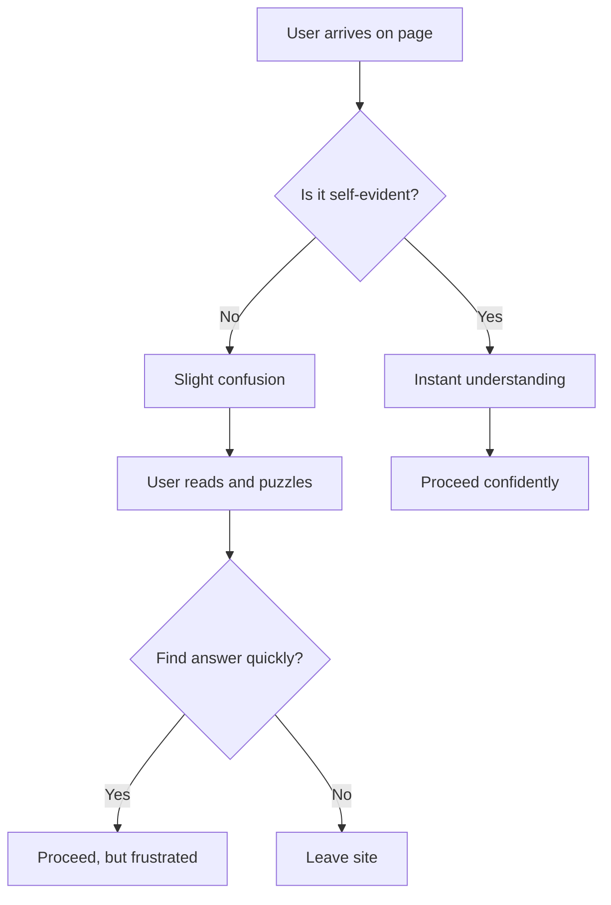
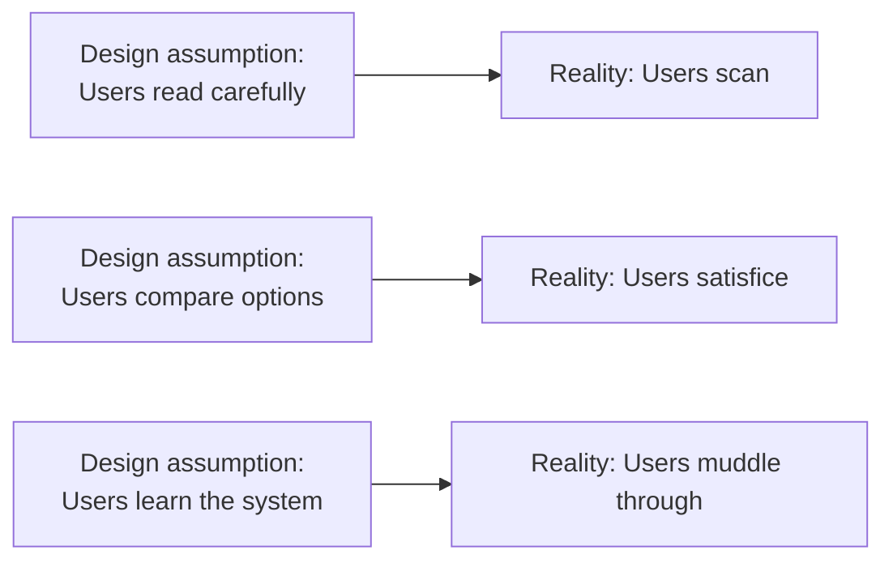

## The Core Principle

Krug's first law of usability is the title of the book: **Don't Make Me Think**. A web page should be self-evident. When users arrive at a page, they should immediately understand what it is, what it offers, and what to do next — without reading instructions, without puzzling over labels, without asking "is this clickable?"

The opposite is a page that makes you think: ambiguous navigation labels, unclear calls to action, cluttered layouts where nothing stands out. Every moment of uncertainty is a small failure. Users who have to think are users who are likely to leave.

Krug is not saying that pages should be simple or dumb. He is saying that the cognitive load of understanding the interface should approach zero. The user's mental energy should go toward their task, not toward decoding the interface.

## How Users Actually Use the Web

Krug shatters several myths about user behavior:

**Myth 1: Users read pages.** They don't. They scan. Users glance at a page, grab whatever catches their eye, and move on. Krug's evidence: eye-tracking studies show that users rarely read more than 20-28 percent of a page.

**Myth 2: Users make optimal choices.** They don't. They satisfice — they choose the first reasonable option rather than weighing all possibilities. This is rational behavior: the cost of finding the best option often exceeds the benefit.

**Myth 3: Users figure out how things work.** They don't. Once they find something that works, they stick with it. Users do not explore websites systematically. They muddle through, relying on what worked before, even if it is not the most efficient path.

## The Design Principles

Krug translates these observations into design principles:

**1. Create a clear visual hierarchy.** The most important elements should be the most visible. Related elements should be grouped visually. Elements should be nested to show relationships.

**2. Use conventions.** Users expect the logo to be in the top left corner. They expect navigation to be at the top or left. They expect the shopping cart icon to mean purchase. Do not be creative with conventions — they exist because they work.

**3. Break pages into clearly defined areas.** Users should be able to quickly tell which parts of the page are navigation, which are content, and which are advertising.

**4. Make it obvious what's clickable.** Links need to look like links. Buttons need to look like buttons. This is so fundamental that Krug is amazed how often designers forget it.

**5. Kill the welcome mat.** Websites often waste the first paragraph of every page explaining what the page is about. Users know what page they are on from the navigation. Jump straight to the content.

## Navigation

Navigation is the most important element of a website. Krug's advice: navigation should answer four questions: Where am I? Where have I been? Where can I go? What's on this site?

Good navigation provides context. It tells users what part of the site they are in, what is nearby, and how to return. Every page should have the same navigation structure. Consistency builds confidence.

## The Home Page

The home page is special because it gets the most scrutiny. Krug's advice: the home page should convey the big picture — what the site does, who it is for, and why the user should care — in seconds. It should also provide a clear starting point for every major task.

Krug recommends one particular technique: the tagline. A good tagline tells users instantly what the site offers. If you cannot explain your site in eight words, you have a problem.

## Usability Testing

The book's second half is devoted to usability testing. Krug's philosophy: a morning of testing with three users is better than a month of debate among experts. The key insight is that testing does not need to be expensive or elaborate. You do not need a lab, special equipment, or a large sample. You need a quiet room, a computer, and a few representative users.

Krug's testing method: have users perform specific tasks while talking through their thought process. Watch where they hesitate, where they click, and what confuses them. The results are immediately actionable. You will see problems you never imagined existed.

The third edition added a chapter on mobile usability, acknowledging that the same principles apply to the small screen but with the additional constraint of limited space. Krug advises simplifying even more: reduce the number of choices, make buttons finger-friendly, and ensure the most important content is visible without scrolling.

## Reading Guide

### Sufficiency Assessment

This summary covers Krug's core principles, findings about user behavior, and testing methodology. The book's humor and conversational tone are part of its teaching method; the serious advice is presented fully here.

### Recommended Reading Path

| Reader Type | Time | What to Read |
|---|---|---|
| Casual | ~15 min | This summary |
| Interested | ~2-3 hr | Full book (fast read) |
| Practitioner | ~4-5 hr | Full book + do a usability test |
