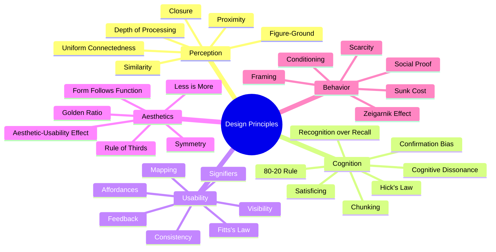

## The Reference Format

Each of the 125 principles follows a consistent structure:
- **Definition** — A concise statement of what the principle is
- **Description** — How the principle works and why
- **Examples** — Visual and textual examples from multiple design domains
- **When to apply** — Contexts where the principle is most useful
- **When to break** — Situations where violating the principle may be appropriate

This format makes the book usable as both a reference (look up a specific principle) and a primer (browse alphabetically to build understanding). The authors deliberately avoid prioritizing any principle over others — each gets exactly the same space, signaling that their usefulness depends on context, not any inherent hierarchy.

## Key Principles by Category

### Principles of Perception

**Figure-Ground:** The eye perceives elements as either standing out (figure) or receding into the background (ground). This fundamental perceptual distinction affects everything from logo design to interface layout.

**Closure:** The mind tends to perceive incomplete forms as complete. This allows designers to use minimal visual information while the viewer's brain fills in the rest. The classic example is the IBM logo with its striped letters.

**Proximity:** Elements that are close together are perceived as related. This is one of the most powerful and most violated principles in information design. Group related items visually and the user will understand the relationship without explanation.

**Similarity:** Elements that share visual characteristics (color, shape, size) are perceived as belonging together. This principle allows designers to create visual categories without labels.

**Uniform Connectedness:** Elements connected by a visual line, box, or background are perceived as grouped. This is stronger than proximity or similarity because it creates explicit relationships.

### Principles of Cognition

**80/20 Rule (Pareto Principle):** Roughly 80 percent of effects come from 20 percent of causes. In design, this means that a small number of features account for most usage. Focus design effort on the features people actually use.

**Chunking:** Information is easier to understand and remember when grouped into smaller chunks. Phone numbers are chunked (555-867-5309) — not presented as a single string. This applies to menu design, form layout, and information architecture.

**Hick's Law:** The time it takes to make a decision increases with the number and complexity of choices. Reducing choices speeds decision-making. This is why good navigation limits options.

**Recognition over Recall:** Recognizing something is easier than recalling it from memory. Interfaces should present options for recognition rather than requiring users to remember and type information.

**Satisficing:** People choose the first adequate option rather than the optimal one. This is not laziness but efficiency. Design for satisficing behavior by making the best choice the easiest one.

### Principles of Usability

**Fitts's Law:** The time to acquire a target is a function of the distance to the target and its size. Big buttons close to the user's current position are fastest to click. This has profound implications for interface layout.

**Consistency:** Using the same conventions, patterns, and behaviors throughout a design reduces learning time and errors. Consistency can be internal (within the design) or external (matching industry conventions).

**Feedback:** Every action should have an immediate, noticeable response. Feedback confirms that the system received the command and indicates what happened. Without feedback, users feel lost.

### Principles of Aesthetics

**Aesthetic-Usability Effect:** Users perceive more attractive designs as easier to use. This is not just bias — attractive designs actually are easier to use because they reduce frustration and increase tolerance for minor issues.

**Golden Ratio:** A proportion of approximately 1:1.618 that appears frequently in nature and is perceived as particularly pleasing. Used in layout, typography, and composition across design disciplines.

**Form Follows Function:** The shape of an object should be primarily determined by its intended function. This modernist principle is often cited but also often violated — and sometimes deliberately, for expressive effect.

### Principles of Behavior

**Social Proof:** People tend to follow the behavior of others, especially in uncertain situations. Showing that others have performed an action (reviews, testimonials, usage statistics) encourages new users to do the same.

**Scarcity:** People value things that are rare or limited. Indicating limited availability can increase desire, but only if the scarcity is genuine.

**Zeigarnik Effect:** People remember interrupted tasks better than completed tasks. This is why progress indicators (showing partial completion) are powerful motivators. The user wants to resolve the tension of the unfinished task.

## Reading Guide

### Sufficiency Assessment

This summary organizes the key principles by category and explains how the reference format works. The book's value is its comprehensiveness — 125 principles cannot be fully summarized. This overview covers the most commonly referenced principles and their applications.

### Recommended Reading Path

| Reader Type | Time | What to Read |
|---|---|---|
| Casual | ~15 min | This summary + 10 principles that catch your eye |
| Interested | ~3-5 hr | Browse 50-75 principles |
| Practitioner | Ongoing | Keep on your desk as a reference |
