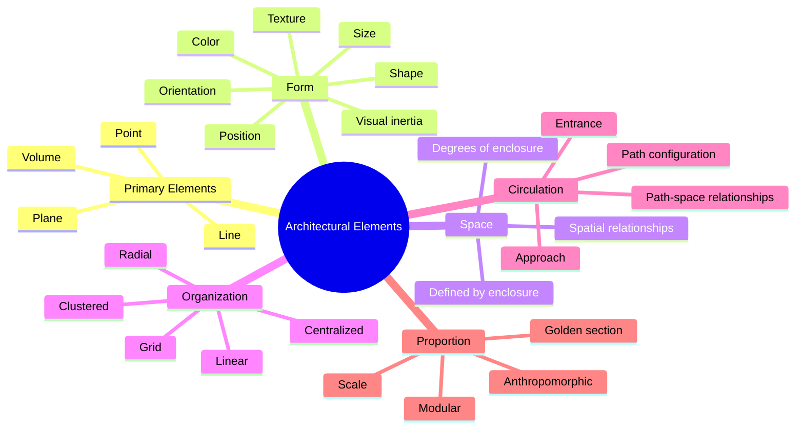
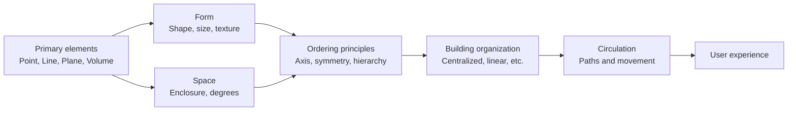

## The Visual Grammar of Architecture

Ching's book is organized around a systematic hierarchy of architectural elements, from the smallest to the largest scale, and the principles that govern their arrangement. The underlying argument: all architectural design, no matter how complex, can be understood as the manipulation of a finite set of elements and ordering principles.

## Primary Elements

Ching begins with the most basic elements of architectural form.

**Point** marks a position in space. A point has no dimension but can become a visual focus — a column, an obelisk, a landmark. Multiple points create lines.

**Line** has length but not width. Lines can define edges, create axes, and guide movement. A line extended becomes a plane.

**Plane** has length and width. Planes define the boundaries of architectural space: walls, floors, roofs. Planes can be vertical (supporting, enclosing, separating) or horizontal (supporting, bridging, connecting).

**Volume** has length, width, and depth — the three dimensions of architectural space. A volume is the space enclosed by planes. A building is a hierarchy of volumes.

## Form and Space

Ching's central insight: form and space are interdependent. Form creates space; space shapes form. A building is not a collection of forms but a set of spatial experiences created by forms.

**Form** is defined by shape, size, color, texture, position, orientation, and visual inertia — the tendency of a form to appear stable or dynamic based on its geometry.

**Space** is defined by the forms that enclose it. Ching classifies spaces by their degree of enclosure: fully enclosed spaces (rooms), spaces defined by planes (courtyards), spaces implied by overhead elements (a canopy), and spaces defined by changes in level.

## Ordering Principles

Ching presents eight ordering principles that bring coherence to architectural design:

1. **Axis** — A line established by two points in space, around which elements can be arranged. Axes create direction and organize movement.

2. **Symmetry** — The balanced distribution of equivalent elements around a common axis. Symmetry creates formality and stability.

3. **Hierarchy** — The articulation of importance or significance through size, shape, or placement. Not all spaces in a building are equal; hierarchy communicates which ones matter most.

4. **Rhythm** — The repetition of elements at regular or irregular intervals. Rhythm creates movement and continuity.

5. **Datum** — A line, plane, or volume that organizes a pattern of elements through reference. A datum is the baseline or grid that gives coherence to disparate elements.

6. **Transformation** — The manipulation of form through subtraction, addition, or deformation. The same basic form can generate multiple variations.

7. **Proportion and Scale** — The relationship between the dimensions of a building and the human body. Proportion systems (golden section, modular scale) create visual harmony; scale determines whether a building feels intimate or monumental.

8. **Circulation** — The movement of people through a building: approach, entrance, path, and destination. Circulation is the narrative thread of architectural experience.

## Architectural Organization

Ching classifies building organization into five types:

**Centralized organization** — A central, dominant space around which secondary spaces are grouped. Examples: the Pantheon, Chartres Cathedral.

**Linear organization** — Spaces arranged in a sequence along a line. Examples: museum galleries, a monastery corridor.

**Radial organization** — A central space from which linear arms extend outward. Examples: the Pentagon, many hospitals.

**Clustered organization** — Spaces grouped by proximity or shared function without a dominant central space. Examples: vernacular villages, university campuses.

**Grid organization** — Spaces organized by a structural grid. Examples: Mies van der Rohe's buildings, most skyscrapers.

## Proportion and Scale

Ching provides an extended treatment of proportion systems: the golden section (the Parthenon, Le Corbusier's Modulor), the classical orders (columns with height-to-width ratios), the Renaissance proportional systems (Palladio's villas), and the anthropomorphic tradition (buildings proportioned to the human body).

Scale is distinguished from proportion. Proportion is about internal relationships; scale is about the relationship between a building and human size. Monumental scale overwhelms; intimate scale comforts; human scale makes the building feel like it was made for its users.

## Reading Guide

### Sufficiency Assessment

This summary captures Ching's elemental vocabulary and ordering principles. The book's primary value is visual — the drawings that illustrate each concept — which cannot be reproduced in text. The conceptual framework, however, is faithfully presented.

### Recommended Reading Path

| Reader Type | Time | What to Read |
|---|---|---|
| Casual | ~15 min | This summary |
| Interested | ~4-6 hr | Browse the drawings + read section introductions |
| Student | ~20-30 hr | Full book, studying each drawing |
