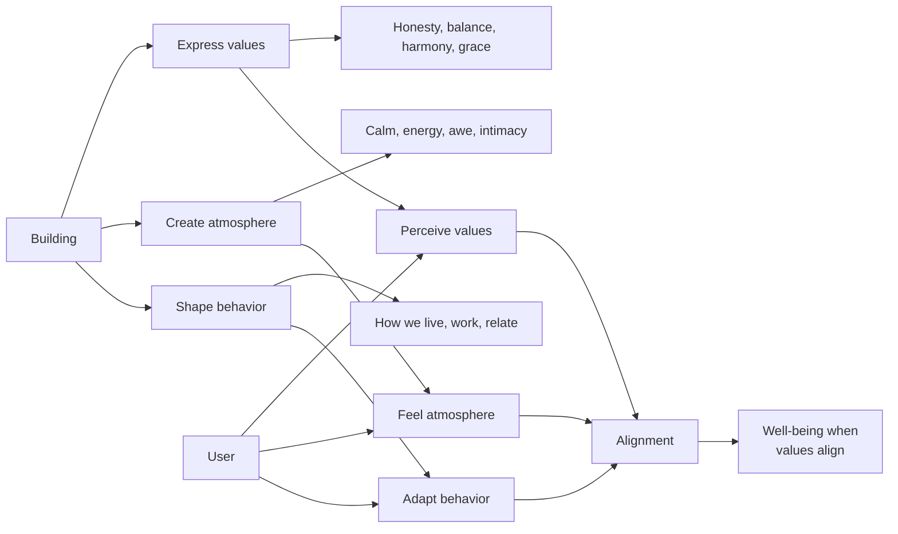
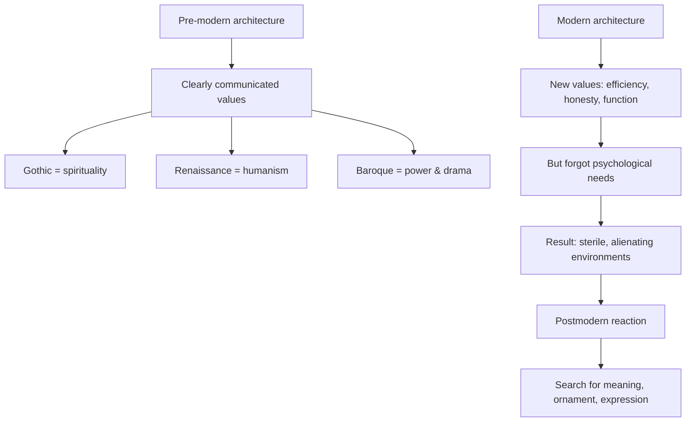

## The Significance of Architecture

De Botton opens with a striking claim: architecture matters more than we admit. We spend most of our lives indoors, surrounded by walls, ceilings, floors, and windows. These elements silently shape our moods, our thoughts, and our sense of ourselves. Yet we rarely pause to ask whether the buildings we inhabit are helping or harming our well-being.

The book's central question: **Can a building make you happy?** De Botton's answer is yes — not in any simple, deterministic way, but because buildings express values, and living in alignment with our values is essential to well-being.

## The Communication of Values

Buildings communicate through their forms, materials, and details. A classical portico says "welcome" with dignity. A minimalist glass facade says "transparency and efficiency." A building covered in decorative ornament says "we value craftsmanship and richness."

De Botton traces this communicative function through architectural history. Gothic cathedrals expressed the glory of God through verticality and light. Renaissance palaces expressed humanist confidence through proportion and order. Modernist villas expressed faith in rationality through clean lines and industrial materials.

The problem, de Botton argues, is that modern architecture forgot this communicative function. The International Style of the mid-20th century valued efficiency, honesty of materials, and functionalism — but it forgot that buildings also need to speak to the human heart. The result was the soulless concrete towers and sterile housing projects that have made so many cities ugly.

## The Nature of Beauty

De Botton turns to the philosophy of beauty. Why do we find some buildings beautiful and others not? He rejects pure subjectivism ("beauty is in the eye of the beholder") and argues that our judgments of beauty reflect genuine perceptions of value. We call a building beautiful when its forms embody virtues we admire: balance, harmony, proportion, honesty, grace.

A building that "works" aesthetically is one that makes visible the qualities we wish to see in our own lives. We want to live in buildings that embody integrity because we want to be people of integrity. We admire buildings that balance competing demands because we want to balance our own lives.

This ethical dimension of architecture is de Botton's most original contribution. Beauty is not a luxury or an ornament. It is a daily reminder of values we might otherwise forget.

## The Ideal Home

De Botton devotes a chapter to the concept of home. What makes a house a home? His answer: a home is a physical embodiment of our best selves. The objects we surround ourselves with — the furniture we choose, the colors we paint, the art we hang — are expressions of our identity and aspirations.

A well-ordered home can help us think clearly. A beautiful home can lift our spirits. A home that reflects our values can remind us of who we are trying to become. This is why we feel unsettled in spaces that clash with our sense of self.

De Botton encourages readers to take their domestic environment seriously. The arrangement of furniture, the choice of materials, the quality of light — these are not trivial matters. They shape our daily experience of life.

## The Failure of Modernism

De Botton offers a measured critique of modern architecture. He acknowledges modernism's achievements: the liberation from historical styles, the honest use of materials, the focus on function. But he argues that modernism failed to address fundamental human needs: ornament, decoration, symbolism, and the expression of values.

The modernist house, stripped of ornament and decoration, can feel cold and unhomely. The modernist city, with its towers separated by windswept plazas, can feel inhuman. De Botton quotes Winston Churchill: "We shape our buildings; thereafter they shape us." Modernism shaped buildings that shaped people into isolated, alienated beings.

The solution is not to return to historical styles but to develop a new architecture that combines modern materials and methods with attention to human psychological needs.

## Reading Guide

### Sufficiency Assessment

This summary captures de Botton's main arguments about the relationship between architecture, values, beauty, and well-being. The book's richness lies in its specific examples and its elegant prose, which are necessarily compressed here.

### Recommended Reading Path

| Reader Type | Time | What to Read |
|---|---|---|
| Casual | ~15 min | This summary |
| Interested | ~2-3 hr | Full book (readable in one sitting) |
| Practitioner | ~4-5 hr | Full book + reflection exercises |
