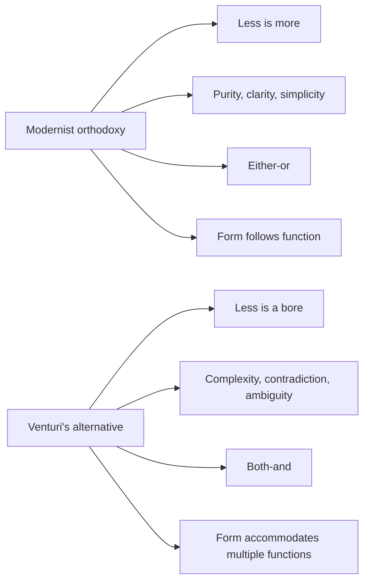
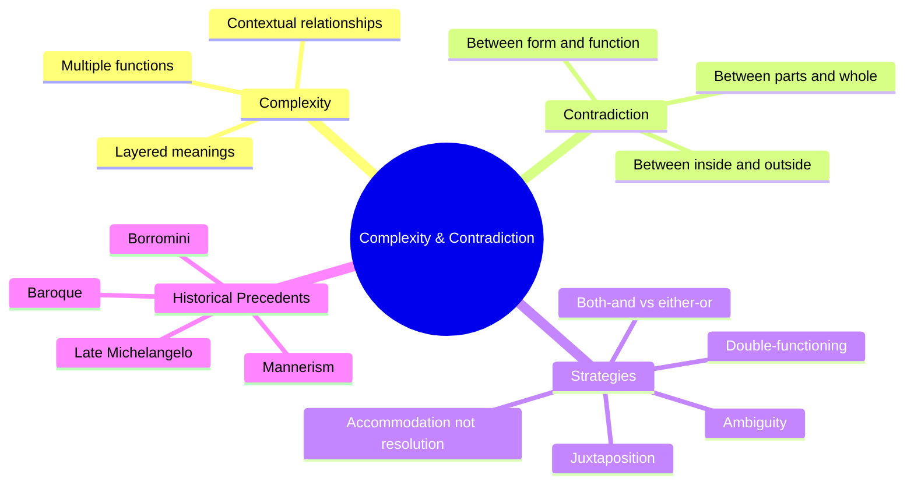

## The Central Argument

Venturi opens by declaring war on the modernist consensus. He quotes August Heckscher: "The movement from a sense of simplicity to an awareness of complexity and contradiction is characteristic of the periods that produce the greatest works of art." Venturi's argument: the modernist insistence on simplicity, clarity, and functional purity has produced architecture that is reductive, boring, and disconnected from the messy reality of human life.

His alternative: architecture should embrace "both-and" rather than "either-or." A building should be able to accommodate multiple purposes, multiple meanings, and multiple readings. The best architecture operates on several levels simultaneously, creating richness and depth.

## Complexity and Contradiction as Method

Venturi does not simply argue that complexity is good. He provides a systematic method for incorporating complexity into architectural design.

**Ambiguity:** Elements can have more than one meaning or function. A colonnade can define space, create circulation, and frame views simultaneously. The best architectural elements are not assigned a single function but allowed to work in multiple ways.

**Double-functioning elements:** A wall can be both structure and decoration. A stair can be both circulation and sculpture. Venturi draws on Mannerist architecture (Michelangelo's Laurentian Library, Giulio Romano's Palazzo Te) where elements deliberately perform multiple roles.

**Contradiction adapted:** When functions or forms conflict, the best architecture does not eliminate the conflict but accommodates it. A building's interior may tell one story and its exterior another. This is not failure but richness.

**Contradiction juxtaposed:** Elements from different systems or periods can be placed side by side, creating productive tension. Venturi admires buildings where classical and modern, or simple and complex, coexist.

## The Inside and the Outside

Venturi devotes a key chapter to the relationship between interior and exterior. Modernist orthodoxy demanded that the exterior honestly express the interior. A building's form should reveal its internal organization.

Venturi argues that this is unnecessarily restrictive. The outside of a building relates to its urban context — the street, the neighborhood, the city. The inside relates to its occupants and functions. These two sets of demands may conflict, and a good building accommodates both. The facade may respond to the street while the interior responds to its own logic. The contradiction between inside and outside is not a flaw but a source of architectural interest.

## The Obligation Toward the Difficult Whole

Venturi's most important concept: a building should not be a collection of independent parts but a "difficult whole" — a unified composition that incorporates diverse, even conflicting, elements without losing coherence.

This is the opposite of the modernist pavilion: a simple box with everything arranged inside. Venturi admires buildings like Le Corbusier's Villa Savoye and Alvar Aalto's Saynatsalo Town Hall, which achieve unity not by eliminating variety but by organizing complexity into a coherent whole.

The "difficult whole" requires the architect to manage relationships between parts — to create tensions and resolutions, rhythms and counter-rhythms. This is harder than designing a simple box, but the result is more rewarding.

## The Use of Historical Reference

Venturi rehabilitates historical reference in architecture. The modernist prohibition against historical borrowing was, he argues, misguided. Architecture has always built on the past. The issue is not whether to use history but how.

Venturi distinguishes between the "symbolic" use of historical forms (the column that stands for tradition) and the "adaptive" use (the column that serves a new function in a new context). Adaptive reuse of historical elements is a legitimate and potentially powerful architectural strategy.

This chapter provided the theoretical foundation for postmodern architecture's revival of historical ornament, classical orders, and traditional forms — though Venturi himself was more restrained than the postmodernists who followed him.

## Reading Guide

### Sufficiency Assessment

This summary captures Venturi's key arguments and their historical context. The book's argument is illustrated with over 350 architectural photographs that are essential to understanding Venturi's points but cannot be reproduced here.

### Recommended Reading Path

| Reader Type | Time | What to Read |
|---|---|---|
| Casual | ~15 min | This summary |
| Interested | ~3-4 hr | Summary + key chapters (1-3, 7-8) |
| Scholar | ~8-10 hr | Full book with illustrations |
