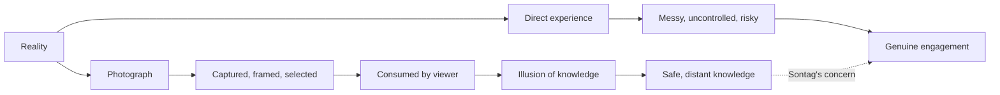
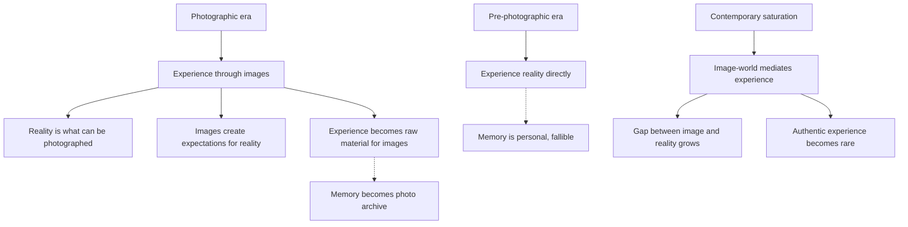

## Six Essays on Photography

Sontag's book collects six essays, each examining a different dimension of photography's impact on culture and consciousness.

### 1. In Plato's Cave

Sontag opens by invoking Plato's allegory of the cave: humans chained in a cave, seeing only shadows on the wall, mistaking them for reality. Photography, she argues, has created a new kind of cave — a world where we experience reality primarily through images. "Humankind lingers unregenerately in Plato's cave, still reveling, its age-old habit, in mere images of the truth."

Photographs give us the sense that we know the world, but Sontag argues that this knowing is illusory. To know the world through photographs is to know it at a distance, safely framed, without the risk of direct experience. The camera makes the world accessible but also makes it manageable, containable, and consumable.

### 2. America, Seen Through Photographs, Darkly

The second essay examines the documentary tradition in American photography, focusing on the work of Walker Evans, Dorothea Lange, and Robert Frank. Sontag traces the tension between photography's claim to document reality and its inescapable aesthetic dimension.

Even the most documentary photograph is a composition, a selection, a framing. The famous Farm Security Administration photographs of the Depression era were not transparent records of suffering; they were aesthetically crafted images that made suffering beautiful. Sontag asks whether aestheticizing suffering is a form of exploitation.

### 3. Melancholy Objects

This essay explores surrealism and photography. Sontag argues that photography is inherently surreal because it transforms everything into an object of aesthetic interest. A photograph of a garbage dump, a corpse, or a factory can be as visually compelling as a photograph of a beautiful landscape.

The camera's capacity to make anything interesting — to find beauty anywhere — is both liberating and troubling. It democratizes our attention but also flattens value distinctions. In a world of photographs, everything becomes potentially interesting, and therefore nothing is truly sacred.

### 4. The Heroism of Vision

Sontag examines the photographer as a type: the restless observer, the adventurer of vision, the collector of images. She traces the figure of the photographer from the Victorian gentleman-explorer to the modern photojournalist and fashion photographer.

The photographer, Sontag argues, is a "voyeur" — someone who looks at the world without participating in it. This is not necessarily a criticism but an observation about the psychology of photography. The photographer's relationship to the world is mediated by the camera, which provides both contact and distance.

### 5. Photography and the Beautiful Life

The fifth essay turns to photography's role in creating and disseminating standards of beauty and success. Fashion photography, celebrity photography, and advertising imagery create a parallel world of glamour that exists alongside everyday life.

Sontag argues that photography has become the primary vehicle for defining what a "good life" looks like. We measure our own lives against the images we see — and find them wanting. The beautiful life presented in photographs is always elsewhere, always possessed by others.

### 6. The Image-World

The final essay synthesizes Sontag's arguments about the consequences of living in a society saturated with images. She identifies a fundamental paradox: the more we experience through photographs, the less we experience directly. "Needing to have reality confirmed and experience enhanced by photographs is an aesthetic consumerism to which everyone is now addicted."

Photography, Sontag concludes, has created an "image-world" that stands between us and reality. We do not experience the world and then photograph it. We experience the world in photographic terms — looking for good shots, framing our lives for social media, treating experience as raw material for images.

## Reading Guide

### Sufficiency Assessment

This summary captures Sontag's six essays and their core arguments. The book's rhetorical power — Sontag's aphoristic style, her willingness to make provocative and even uncomfortable claims — is necessarily diminished in summary.

### Recommended Reading Path

| Reader Type | Time | What to Read |
|---|---|---|
| Casual | ~15 min | This summary |
| Interested | ~3-4 hr | Essays 1, 3, and 6 (the most important) |
| Scholar | ~6-8 hr | All six essays |
