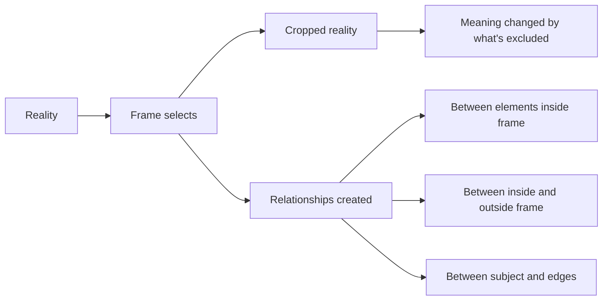
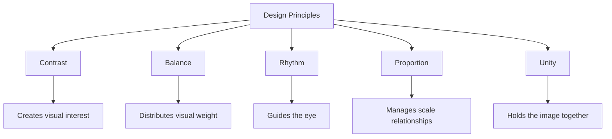

## The Photographic Frame

Freeman begins with the most fundamental act of photography: framing. The camera frame is not a neutral window on the world. It is a powerful editing tool that creates meaning through inclusion and exclusion. Everything inside the frame is related; everything outside is absent.

The act of framing is the photographer's first and most important compositional decision. Freeman distinguishes between the "viewfinder frame" (what you see through the camera) and the "compositional frame" (the relationships you create within that rectangle).

Freeman identifies four types of frame: the horizontal frame (landscape orientation, the most common and natural), the vertical frame (portrait orientation, for height and formality), the square frame (balanced and static), and the panorama (extended horizontal for narrative scope).

## Design Principles in Photography

Freeman adapts traditional design principles to the specific demands of photography:

**Contrast:** The fundamental organizing principle. Visual contrast (light vs. dark, large vs. small, sharp vs. soft, warm vs. cool) creates interest and structure. A photograph without contrast is flat and dull.

**Balance:** Visual weight must be distributed within the frame. Symmetrical balance is formal and stable; asymmetrical balance is dynamic and interesting. The rule of thirds is a simplified guide to asymmetrical balance.

**Rhythm:** Repetition of elements creates patterns that guide the eye. Freeman shows how architectural details, natural formations, and human-made patterns can create photographic rhythm.

**Proportion:** The relationship between the size of elements within the frame. The golden ratio appears in photography as it does in other visual arts, though Freeman treats it as one tool among many, not a mystical formula.

## Light and Color

Light is not just an exposure consideration; it is a compositional tool. Freeman categorizes light by its direction (front, side, back), quality (hard, soft), and color (warm, cool). Each type of light creates different visual effects and emotional tones.

Color composition follows the principles of color theory: complementary colors create vibrant contrast; analogous colors create harmony; saturation and value determine visual weight. Freeman shows how to use color intentionally rather than accepting whatever colors appear in the frame.

## Motion and Moment

Photography is the art of the decisive moment — a phrase Freeman borrows from Cartier-Bresson. But the decisive moment is not just about timing. It is about understanding how motion creates meaning in a still image.

Motion in photography can be frozen (capturing a split-second moment), blurred (suggesting movement), or panned (following a moving subject to create a sharp subject against a blurred background). Each approach creates a different visual experience.

## Post-Processing as Composition

One of Freeman's most distinctive contributions: post-processing is not a separate activity from composition but a continuation of it. Cropping adjusts the frame. Tonal adjustments change contrast and emphasis. Color adjustments alter relationships within the image. A good photographer composes from the moment of capture through the final output.

## Reading Guide

### Sufficiency Assessment

This summary captures Freeman's approach to photographic composition and the key principles he teaches. The book's value is visual — the hundreds of photographs and diagrams that demonstrate each principle — and these cannot be reproduced in summary.

### Recommended Reading Path

| Reader Type | Time | What to Read |
|---|---|---|
| Casual | ~15 min | This summary |
| Interested | ~4-6 hr | Browse the images, read the captions |
| Practitioner | ~10-15 hr | Full book, study each image |
