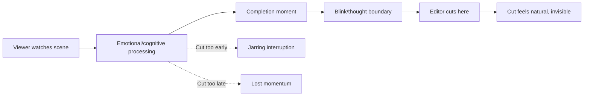
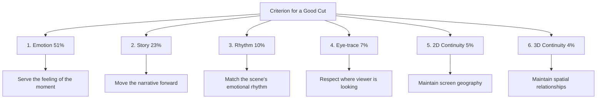

## The Blink as Model

Murch opens with a striking observation: humans blink more often than necessary to keep the eyes moist. Research shows that blinking corresponds to moments of emotional and cognitive punctuation — the end of a thought, a moment of completion, a readiness for what comes next.

Film editing, Murch argues, operates on the same principle. A cut is a blink. It separates one thought from the next. When a cut happens at the right moment, the audience barely notices. When it happens at the wrong moment, the audience feels a jarring discontinuity. The editor's job is to match the rhythm of cutting to the rhythm of the viewer's cognition.

## The Rule of Six

Murch's most practical contribution: the six criteria for a good cut, ranked in order of importance:

1. **Emotion** (51%) — Does the cut serve the emotional truth of the scene?
2. **Story** (23%) — Does the cut advance the story?
3. **Rhythm** (10%) — Does the cut occur at the right moment rhythmically?
4. **Eye-trace** (7%) — Does the cut respect the viewer's focus of attention?
5. **Two-dimensional plane** (5%) — Does the cut maintain screen geography?
6. **Three-dimensional space** (4%) — Does the cut maintain spatial continuity?

The percentages are deliberately provocative. Murch assigns 51% weight to emotion because, he argues, if the emotion is right, audiences will forgive almost any technical flaw. But if the emotion is wrong, no amount of technical perfection will save the scene.

## Why Cuts Work

Murch explores the fundamental paradox of film editing: film is made up of individual shots, each taken from a different position at a different time, yet when edited together, they create a seamless continuous experience. Why does this work?

His answer is that film editing mirrors the way human consciousness processes reality. We do not experience the world as a continuous stream. Our attention jumps from one focus to another. We look at a face, then at a hand, then at a door. Each glance is a shot. The cut between shots mimics the jump of attention.

This "theory of the cut" explains why continuity editing (matching action, maintaining screen direction) works. It is not about creating an illusion of seamlessness. It is about matching the natural rhythm of human attention.

## Digital vs. Film Editing

The second edition (2001) added a chapter on digital editing. Murch, who made the transition from film to digital during his career, offers a balanced assessment. Digital editing is faster and more flexible, but it introduces new challenges. The ease of making changes can lead to over-editing. The ability to try endless alternatives can create indecision.

Murch's most striking observation: digital editing has changed the *process* of editing but not the *principles*. The same criteria for a good cut apply whether the editor is splicing film or clicking a mouse.

## Dreams, Blinks, and Consciousness

The book's final chapter ventures into philosophy and neuroscience. Murch connects editing to dreaming, memory, and consciousness. Dreams, like films, are composed of discrete images that create a continuous experience. Memory edits our past into a coherent narrative.

The editor, Murch suggests, is not just a technician. They are a partner with the director in the creation of consciousness — shaping not just what the audience sees but how they feel and think.

## Reading Guide

### Sufficiency Assessment

This summary captures Murch's key concepts and their interconnections. The book's value lies partly in Murch's voice — his wisdom, humility, and passion — which is necessarily diminished in summary.

### Recommended Reading Path

| Reader Type | Time | What to Read |
|---|---|---|
| Casual | ~15 min | This summary |
| Interested | ~2-3 hr | Full book (short and readable) |
| Practitioner | ~4-5 hr | Full book + watch films Murch edited |
