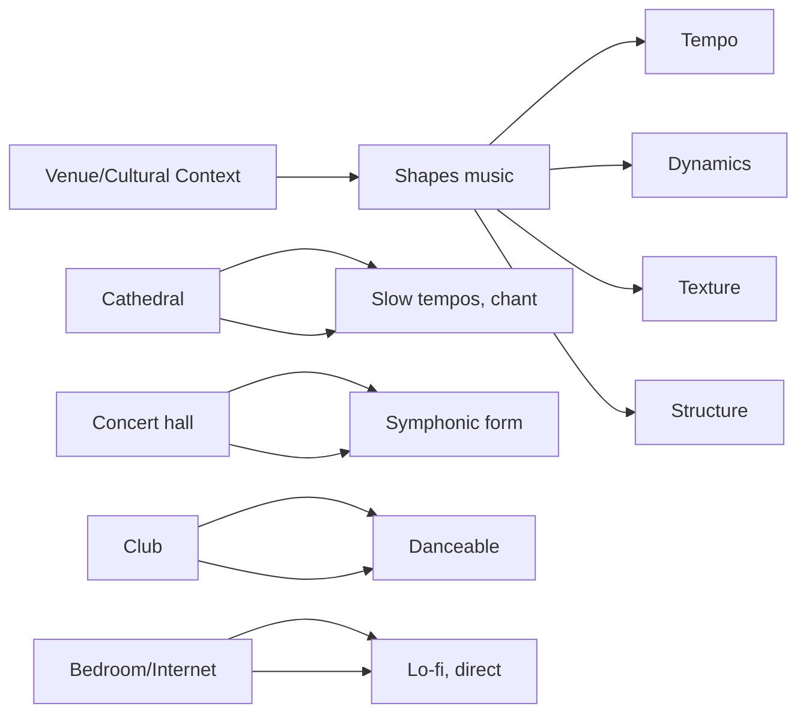

## Music and Context

Byrne's opening argument is the book's most original contribution. Music is not a pure expression of artistic vision. It is shaped fundamentally by the space in which it is performed. A Gregorian chant was designed for the reverberant acoustics of a stone cathedral. A chamber music piece was designed for the resonant walls of a small room. A stadium rock anthem was designed to be heard in arenas with massive sound systems.

Byrne traces the history of Western music through its venues: from cathedrals to concert halls, from clubs to stadiums, from bedrooms to streaming platforms. Each venue space created its own musical forms. The acoustics of a venue determine tempo, dynamics, and texture. Reverb dictates how fast notes can follow each other. Volume determines how subtle the music can be.

## Creation and Collaboration

Byrne devotes substantial space to the creative process. He describes how he writes songs, from the initial spark to the finished recording. The process is not linear. It is iterative, messy, and collaborative.

Collaboration, for Byrne, is a mysterious process. You do not choose your collaborators based on a rational calculation. You trust your instincts and respond to the unexpected. Some of Byrne's best work (with Brian Eno, with the various musicians on *My Life in the Bush of Ghosts*) came from experiments where he did not know what would happen.

He introduces the concept of "the developing brain" — the collaborative unit that forms when a group of musicians works together long enough. The group develops its own intelligence, distinct from any individual member. Talking Heads was such a unit; the members could anticipate each other's moves and respond without conscious thought.

## Technology and Recording

The recording studio is a musical instrument. Byrne traces how recording technology has changed music: from the acoustic limitations of early microphones (which favored certain voices and instruments) to multi-track recording (which enabled the Beatles' sonic experiments) to digital audio workstations (which democratized production).

Digital technology, Byrne argues, has been both liberating and disorienting. Anyone can now make a professional-sounding recording on a laptop. But the sheer volume of music being made makes it harder for any single work to be heard. The democratization of production has not been matched by democratization of attention.

## The Business of Music

Byrne provides a clear-eyed analysis of the music industry's economics. He traces the shift from selling physical products (records, CDs) to streaming. The economics of streaming are brutal for most musicians. Byrne offers practical advice: diversify income streams, control your rights, understand your audience, and make music you believe in rather than pursuing commercial trends.

## How to Listen

The book concludes with a chapter on listening. Byrne argues that we have forgotten how to listen deeply. In an age of constant background music and distracted listening, the focused attention required for genuine musical experience is becoming rare. He encourages readers to reclaim the art of listening — to sit with music, undistracted, and let it work on its own terms.

## Reading Guide

### Sufficiency Assessment

This summary captures Byrne's main arguments and the book's thematic structure. The book's idiosyncratic charm — its digressions, illustrations, and Byrne's distinctive voice — is necessarily compressed.

### Recommended Reading Path

| Reader Type | Time | What to Read |
|---|---|---|
| Casual | ~15 min | This summary |
| Interested | ~3-4 hr | Context chapter + Creation chapter + Business chapter |
| Practitioner | ~6-8 hr | Full book |
