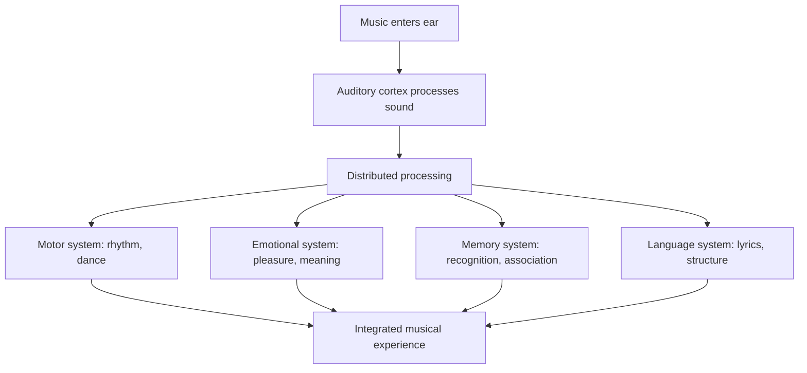
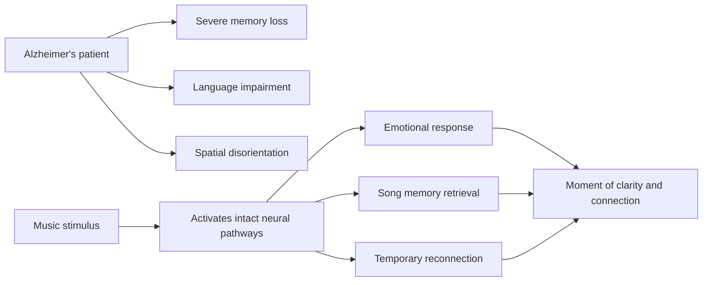

## The Musical Brain

Sacks opens by establishing a fact that challenges common assumptions: musicality is not a rare talent possessed by a few gifted people. It is a universal human capacity. Almost everyone can recognize a tune, move to a rhythm, and respond emotionally to music. The exceptions — people with amusia (tone deafness) — are the neurological exceptions that prove the rule.

The brain's processing of music is remarkably distributed. Unlike language, which has relatively localized centers (Broca's and Wernicke's areas), music engages networks across both hemispheres, involving auditory, motor, emotional, and memory systems. This distributed processing explains why music can survive damage that destroys other functions, and why music can reach people who have lost the ability to speak or remember.

## Case Studies

Sacks's method is the clinical case study, and the book is organized around remarkable cases that illuminate different aspects of musical experience.

**The Musical Hallucinations of Mrs. O'C.** An elderly woman begins hearing songs playing constantly in her head — clear, complete, and uncontrollable. Sacks traces the phenomenon to visual loss (Charles Bonnet syndrome) that forces the brain to generate its own sensory experience. The case reveals that musical imagery is not metaphorical but real — the brain generates music internally, and under the right conditions, that generation becomes autonomous.

**The Man Who Thought His Wife Was a Hat.** Sacks's most famous case (from his earlier book) appears here in musical context. Dr. P., a musician with visual agnosia, could recognize his students by their voices but not their faces. He could function musically despite severe brain damage, demonstrating music's independence from other cognitive systems.

**Music and Tourette's.** Sacks describes a surgeon with Tourette's syndrome whose tics disappear completely while he operates or plays drums. Music and focused physical activity can temporarily override the neurological circuits that generate tics — a case that illuminates both Tourette's and the power of rhythmic engagement.

**Alzheimer's and Music.** Perhaps the most moving cases: patients with advanced Alzheimer's who cannot recognize their families, cannot speak, and cannot remember what happened five minutes ago — but who can sing entire songs from memory and experience genuine emotion while doing so. Music reaches parts of the brain that other forms of stimulation cannot.

**The Case of the Sudden Musician.** A man is struck by lightning and develops an obsessive passion for classical piano, practicing for hours daily despite having no previous interest in music. Sacks explores how brain trauma can unmask latent abilities or create new ones — a phenomenon that illuminates neural plasticity and the mysterious relationship between brain damage and creativity.

## Musical Emotion

Sacks devotes a chapter to the mystery of musical emotion. Why does music make us feel joy, sadness, nostalgia, or awe? The answer seems to lie in music's connection to ancient brain systems. Music activates the limbic system, the brain's emotional center, and triggers the release of dopamine — the same neurotransmitter involved in pleasure, reward, and addiction.

Music also connects to memory through the hippocampus and other medial temporal structures. A song heard decades ago can trigger vivid recall of the associated time, place, and emotion. This is why music is such a powerful trigger for autobiographical memory — and why it is so effective in dementia care.

## Reading Guide

### Sufficiency Assessment

This summary captures the book's structure, Sacks's approach, and key case studies. The richness of Sacks's writing — his compassion, his curiosity, his willingness to let the cases speak for themselves — is necessarily dimmed.

### Recommended Reading Path

| Reader Type | Time | What to Read |
|---|---|---|
| Casual | ~15 min | This summary |
| Interested | ~4-6 hr | Read any 5-6 case studies that interest you |
| Practitioner | ~10-12 hr | Full book |
