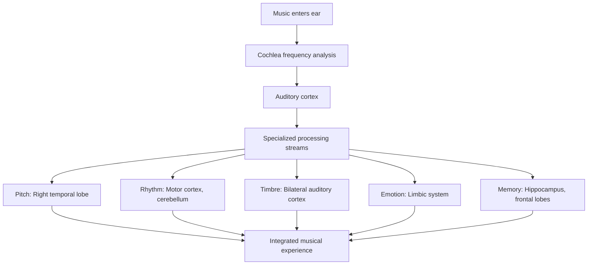
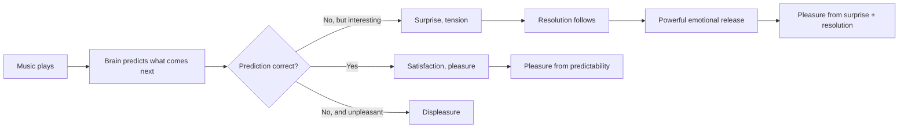

## The Building Blocks of Music

Levitin begins by establishing the basic elements of music: pitch, rhythm, tempo, contour, timbre, loudness, and spatial location. Each element is processed by different neural systems, and understanding how each works illuminates both music and the brain.

**Pitch** is the perceptual correlate of sound frequency. The brain processes pitch through the auditory cortex, but the perception of melody — a sequence of pitches — involves additional regions, including memory systems that recognize familiar patterns.

**Rhythm** engages the motor system. When we hear a beat, our brains activate the same circuits that control movement. This is why we cannot help tapping our feet to music. Rhythm may be the most primitive element of music, predating melody and harmony in human evolution.

**Timbre** is the quality that distinguishes different instruments playing the same note. Timbre processing involves analysis of the sound's harmonic spectrum and is handled by specialized neural circuits.

## The Brain's Musical Structure

Levitin debunks the myth of a single brain center for music. Unlike language, which relies on relatively localized regions (Broca's and Wernicke's areas), music processing is distributed across the brain. This distributed architecture has important consequences. Damage to one region may impair some musical abilities while leaving others intact. A musician with aphasia (language loss) may still be able to play and compose.

The brain processes music hierarchically. Low-level features (pitch, rhythm) are processed in the auditory cortex. Higher-level features (melody, harmony, structure) engage frontal and temporal regions. The emotional response to music involves the limbic system and reward pathways.

## Musical Expectations and Emotion

Levitin's most important contribution may be his explanation of musical emotion. Why does music make us feel? The answer lies in the brain's prediction and reward systems.

The brain is constantly predicting what will happen next — in music as in everything else. When the music follows our expectations, we feel satisfaction. When it violates our expectations in interesting ways (a surprising chord, an unexpected rhythmic shift), we feel surprise, tension, and then resolution. The alternation of tension and release is the foundation of musical emotion.

The dopamine system is central. Music triggers dopamine release in the nucleus accumbens, the same reward center activated by food, sex, and addictive drugs. The anticipation of a musical peak can be as rewarding as the peak itself.

## Musical Memory

Levitin explores how the brain stores and retrieves musical memories. Musical memory is remarkably robust. Patients with amnesia who cannot remember what happened an hour ago can still recognize songs from decades earlier. This durability reflects the distributed nature of musical memory — it is encoded in multiple brain systems, so damage to any single system is unlikely to erase it completely.

The "earworm" phenomenon (songs that get stuck in your head) reflects the brain's tendency to complete musical patterns. When a song is interrupted or incomplete, the brain keeps replaying it in an attempt to achieve closure.

## The Musician's Brain

Musical training changes the brain structurally and functionally. Musicians have larger auditory cortices, more developed motor regions, and stronger connections between brain regions. These changes are use-dependent: the more you practice, the more your brain adapts.

Levitin presents evidence that early musical training produces lasting brain changes, even if the person does not continue playing. The critical period for musical training — like language — is childhood, but the adult brain remains plastic enough to learn new musical skills.

## Reading Guide

### Sufficiency Assessment

This summary captures the book's key concepts: the elements of music, their neural processing, the mechanism of musical emotion, and the effects of training. The book's explanatory power — its ability to make complex neuroscience accessible — is partly preserved in summary.

### Recommended Reading Path

| Reader Type | Time | What to Read |
|---|---|---|
| Casual | ~15 min | This summary |
| Interested | ~3-4 hr | Chapters 1-4 (basics) + 6-7 (emotion and memory) |
| Practitioner | ~6-8 hr | Full book |
