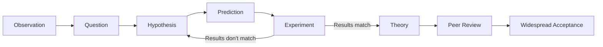
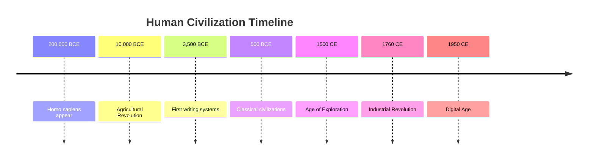

# Core Concepts

The foundational ideas in general knowledge across disciplines.

## The Interconnectedness of Knowledge

DK's organizing principle is that knowledge across domains forms an interconnected web. Understanding how the water cycle connects to agriculture, which connects to civilization, which connects to history, creates a richer mental model than isolated facts. The book is structured around five major domains: Space, Earth, Life, Human Society, and Culture.

## The Scientific Method

The book emphasizes that science is not a collection of facts but a process for understanding the natural world. Observation, hypothesis formation, experimentation, and peer review create a self-correcting system that has produced reliable knowledge about everything from subatomic particles to galaxy clusters.

## Human History as Pattern

DK presents human history not as a list of dates and kings but as a series of patterns: the transition from hunter-gatherer to farmer, the rise of cities and states, the expansion of trade networks, the acceleration of technological change. Each pattern reveals how human societies organize and transform.

# Chapter Insights

## Space: The Universe

Covers the Big Bang, galaxies, stars, planets, and the solar system. DK's visual approach shines with cutaway diagrams showing stellar structure, planetary interiors, and cosmic scale comparisons. The key insight is that the universe is vast, ancient, and governed by physical laws that we can understand and test.

## Earth: Geology and Geography

Explores Earth's structure, plate tectonics, rock cycles, weather systems, oceans, and climate zones. DK emphasizes Earth as a dynamic, changing system. The visual centerpiece is a series of map-based spreads showing tectonic boundaries, ocean currents, and climate patterns as interconnected global systems.

## Life: Biology and Ecology

Covers evolution, cell biology, genetics, the tree of life, ecosystems, and biodiversity. The section emphasizes that all life shares common ancestry and biochemical machinery. DK's cutaway diagrams of cells, organs, and ecosystems are particularly effective.

## Human Society: History and Civilization

Traces human history from Paleolithic times to the present, with emphasis on the major transitions that shaped modern society: agriculture, urbanization, industrialization, and globalization. The section uses timelines, maps of empires, and comparative charts of civilizations.

## Culture: Arts, Ideas, and Technology

Covers world religions, philosophy, literature, visual arts, music, architecture, and technology. DK emphasizes cultural diversity and cross-cultural influence, showing how ideas and artistic styles travel across time and space.

# Practical Applications

- **Cross-disciplinary thinking**: Connect concepts across science, history, and culture for richer understanding
- **Visual learning strategies**: Use diagrams and infographics to grasp complex systems
- **Building mental models**: Create a conceptual framework that makes new information easier to absorb

# Actionable Lessons

1. **Start with the big picture** — Understanding how domains connect makes details more meaningful
2. **Use visual tools** — Diagrams, timelines, and maps encode information more efficiently than text
3. **Build knowledge progressively** — Master fundamentals before moving to specialized topics

# Action Plan

## Sufficiency Assessment

This summary captures the book's scope and approach across all five knowledge domains. It covers the organizational framework but omits the thousands of specific facts, diagrams, and illustrations that make the full book valuable.

## Recommended Reading Path

| Reader Type | Time | What to Read |
|---|---|---|
| Casual | ~15 min | This summary |
| Interested | ~2-3 hr | Space, Earth, Life sections |
| Reference user | Ongoing | Browse by topic of interest |

## What You'll Miss by Not Reading the Full Book

- The hundreds of detailed illustrations, cutaway diagrams, and photographs
- The specific facts, statistics, and cultural references that enrich the text
- The cross-reference system that connects related topics across sections
