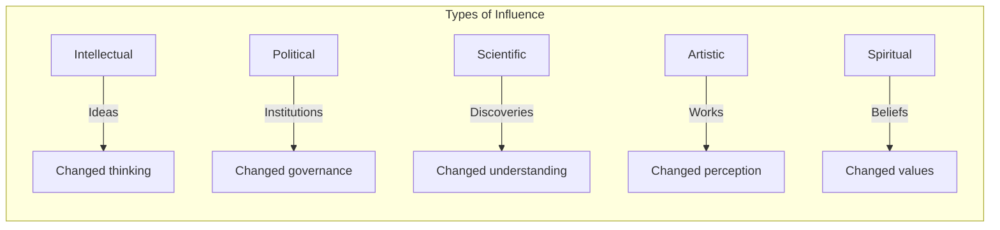
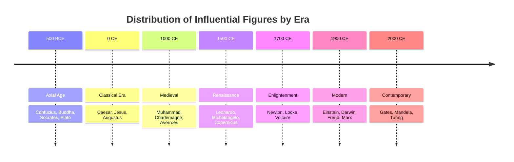

# Core Concepts

The foundational ideas about influence and its measurement.

## Defining Influence

Britannica's editors define influence as the capacity to shape human thought, behavior, or circumstances across time and space. This definition distinguishes influence from mere power (which may be temporary and coercive) or fame (which may be shallow and fleeting). True influence changes how people think, what they value, or how they organize their societies.

## The Historical Context of Influence

Britannica emphasizes that influence is historically contingent. A figure who is influential in one era may be forgotten in another; conversely, neglected figures can be rediscovered and celebrated centuries later. The book situates each person in their historical moment, showing how their context enabled and shaped their influence.

## The Geography of Influence

The book highlights that influence is not evenly distributed across the globe. Certain regions and periods produce clusters of influential figures due to economic, political, and cultural conditions. The Islamic Golden Age, Renaissance Italy, and 20th-century Europe are examples of such clusters.

# Chapter Insights

## Ancient Thinkers and Leaders

Profiles of figures from the Axial Age (c. 800-200 BCE), when many of the world's major philosophical and religious traditions emerged. Coverage includes Confucius, Socrates, Plato, Aristotle, Buddha, and the major Hebrew prophets. Britannica emphasizes how these figures established intellectual frameworks that continue to shape thought today.

## Scientists and Innovators

From Archimedes to Newton to Einstein to Turing, this section traces the development of scientific thought through the people who advanced it. Britannica highlights not just the discoveries but the methods and habits of mind that enabled them.

## Political Leaders and Statesmen

Covers rulers, generals, and statesmen who shaped political history: Alexander, Caesar, Augustus, Genghis Khan, Elizabeth I, Washington, Napoleon, Lincoln, Churchill, Gandhi, and Mandela. Britannica's approach balances acknowledgment of achievements with attention to flaws and controversies.

## Artists and Writers

Profiles of figures who transformed artistic expression: Homer, Shakespeare, Michelangelo, Beethoven, Dickens, Picasso, and others. Britannica emphasizes the technical innovations and cultural impact of each figure's work.

## Religious and Spiritual Leaders

Coverage of the founders and shapers of major religious traditions: Moses, Jesus, Muhammad, the Buddha, Confucius, Laozi, Guru Nanak, and others. Britannica takes a descriptive rather than evaluative approach, explaining each figure's influence on their tradition.

# Practical Applications

- **Understanding influence**: Recognize that lasting impact requires more than momentary prominence
- **Biographical thinking**: Use individuals as lenses for understanding historical periods
- **Pattern recognition**: Notice how influential figures tend to emerge at historical inflection points

# Actionable Lessons

1. **Context matters** — Influence is a product of person and moment working together
2. **Ideas outlast actions** — The most durable influence is intellectual, not political
3. **Diversity of influence** — Different cultures and eras value different kinds of contribution

# Action Plan

## Sufficiency Assessment

This summary captures the book's framework for understanding influence and its range of biographical coverage. It cannot replace the depth of the individual profiles.

## Recommended Reading Path

| Reader Type | Time | What to Read |
|---|---|---|
| Casual | ~15 min | This summary + 5 figures |
| Interested | ~2 hr | Summary + one section |
| Reference user | Ongoing | Browse by interest |

## What You'll Miss

- The detailed biographical narratives for each figure
- Britannica's editorial context and cross-references
- The assessment of each figure's lasting significance
