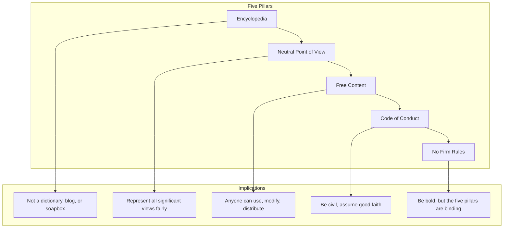
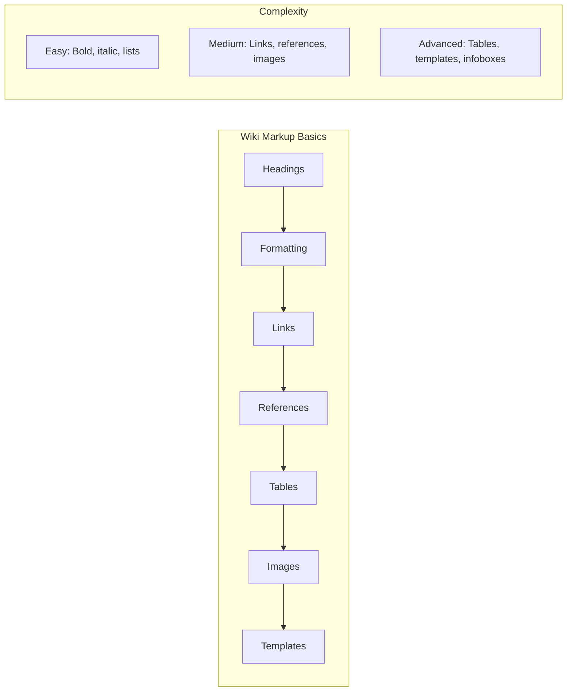
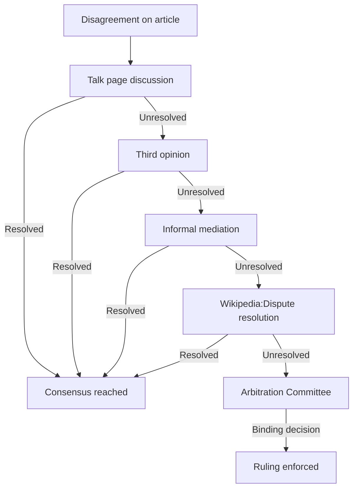

# Core Concepts

The foundational ideas about Wikipedia editing and community participation.

## The Five Pillars

Wikipedia's editorial philosophy rests on five fundamental principles. Wikipedia is an encyclopedia, written from a neutral point of view, using free content, following a code of conduct, and having no firm rules beyond these principles. Understanding these pillars is essential for any editor.

## Wiki Markup

Wikipedia uses a lightweight markup language for formatting. Broughton provides comprehensive coverage of wiki syntax: headings, lists, tables, links, images, templates, and references. Mastering markup is the technical foundation of effective editing.

## Community and Dispute Resolution

The Wikipedia community has developed sophisticated mechanisms for resolving disputes and maintaining quality. Broughton covers the hierarchy of dispute resolution: talk page discussion, third opinion, mediation, formal dispute resolution, and arbitration. He emphasizes that most disputes are resolved through civil discussion.

# Chapter Insights

## Chapter 1: Editing Basics

Introduces the Wikipedia interface, how to edit a page, basic wiki markup (bold, italic, links, headings), and how to preview and save changes. Encourages new editors to be bold but also to use the sandbox for practice.

## Chapter 2: Documenting Sources

Covers Wikipedia's verifiability policy and the importance of citing reliable sources. Broughton explains how to format footnotes, create a References section, and evaluate source reliability. This chapter is essential for creating credible content.

## Chapter 3: Article Structure

Explains the standard structure of a Wikipedia article: lead section, table of contents, body sections, and appendices. Covers naming conventions, disambiguation pages, and redirects.

## Chapter 4: Collaboration

Focuses on working with other editors: using talk pages, communicating constructively, assuming good faith, and resolving disagreements. Broughton emphasizes that Wikipedia is fundamentally a collaborative project.

## Chapter 5: Policies and Guidelines

A comprehensive overview of Wikipedia's policies and guidelines: what is and is not acceptable content, how to handle biographies of living persons, copyright issues, and conflict of interest.

## Chapter 6: Advanced Editing

Covers advanced wiki markup: tables, templates, infoboxes, collapsible sections, mathematical formulas, and image galleries. This chapter is for editors ready to move beyond basic editing.

# Practical Applications

- **Digital literacy**: Understand how Wikipedia actually works as a knowledge platform
- **Source evaluation**: Learn criteria for assessing source reliability
- **Collaborative writing**: Develop skills for working in online collaborative environments
- **Information verification**: Understand the mechanisms behind fact-checking at scale

# Actionable Lessons

1. **Start small** — Fix typos and add references before attempting major edits
2. **Use the sandbox** — Practice wiki markup before editing live articles
3. **Engage on talk pages** — Discuss significant changes before making them
4. **Cite your sources** — Every significant claim needs a reliable source

# Action Plan

## Sufficiency Assessment

This summary covers the book's key frameworks for Wikipedia editing but omits the detailed technical markup guides and step-by-step procedures that form much of the book's practical value.

## Recommended Reading Path

| Reader Type | Time | What to Read |
|---|---|---|
| Casual contributor | ~30 min | Chapters 1-3 |
| Active editor | ~3 hr | Full book |
| Wikipedian | ~8-10 hr | Full book + hands-on practice |

## What You'll Miss

- The detailed wiki markup reference with examples
- The complete policy and guideline overview
- The troubleshooting guide for common editing problems
- The specific procedures for handling disputes
