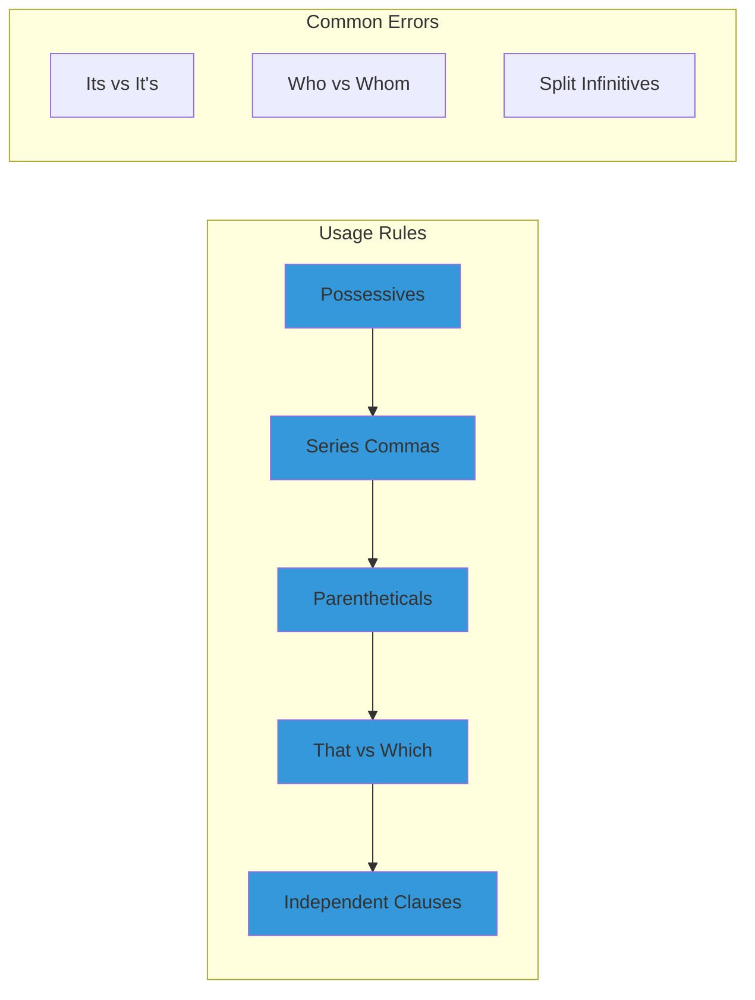
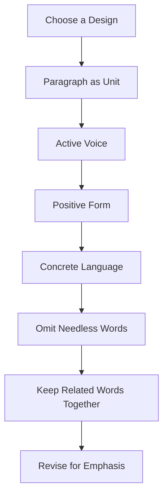

# Core Concepts

The foundational principles of clear English writing.

## Elementary Rules of Usage

Strunk presents eleven fundamental rules covering possessives, commas, parentheses, quotation marks, and sentence structure. Each rule is stated as a direct command and illustrated with examples. The most famous rules include forming possessives of nouns, using commas in series, and placing the comma before the conjunction in a series.

## Principles of Composition

The heart of the book. Strunk's principles include choosing a suitable design, making the paragraph the unit of composition, using the active voice, putting statements in positive form, using definite and concrete language, omitting needless words, keeping related words together, and revising for emphasis.

## The Famous Rule: Omit Needless Words

Strunk's most famous principle: "A sentence should contain no unnecessary words, a paragraph no unnecessary sentences, for the same reason that a drawing should have no unnecessary lines and a machine no unnecessary parts." This principle underlies all his advice about concision and clarity.

## Active vs. Passive Voice

Strunk famously prefers active voice: "The active voice is usually more direct and vigorous than the passive." He provides examples showing how converting passive constructions to active voice improves clarity and energy. This rule has been widely debated but remains influential.

# Chapter Insights

## Chapter 1: Elementary Rules of Usage

Eleven rules covering punctuation, word choice, and grammar. Examples include forming possessives of singular nouns by adding apostrophe-s, using commas to separate items in a series, and distinguishing between restrictive and non-restrictive clauses with "that" versus "which."

## Chapter 2: Elementary Principles of Composition

Eleven principles of effective writing. Key principles include choosing a suitable design and sticking to it, using the active voice, putting statements in positive form, using definite and concrete language, omitting needless words, and placing the emphatic words at the end of a sentence.

## Chapter 3: Matters of Form

Covers formatting conventions: headings, footnotes, citations, titles, and numbers. This chapter is the most date-specific, reflecting conventions that have evolved since publication.

## Chapter 4: Words and Expressions Commonly Misused

A glossary of commonly misused words and phrases: "aggravate" vs "irritate," "different from" vs "different than," "due to" vs "because of," "infer" vs "imply," "lay" vs "lie," "that" vs "which," and dozens more.

## Chapter 5: An Approach to Style

The most philosophical chapter, added largely by E.B. White. It discusses style as a reflection of the writer's character and encourages writers to develop their own voice while following the principles of clarity and simplicity.

# Practical Applications

- **Academic writing**: Apply the principles for clearer papers and theses
- **Business writing**: Use active voice and concise language for memos and reports
- **Creative writing**: Understand the rules before breaking them deliberately
- **Editing**: Use Strunk's principles as a checklist for revision

# Actionable Lessons

1. **Revise for brevity** — Cut every word that does not do necessary work
2. **Prefer active voice** — Unless you have a specific reason for passive
3. **Be specific** — Concrete language communicates more than abstractions
4. **Write positively** — Say what something is, not what it is not

# Action Plan

## Sufficiency Assessment

This summary captures the book's core principles and most famous rules. It cannot replace the full book, which is so short that the original should always be preferred.

## Recommended Reading Path

| Reader Type | Time | What to Read |
|---|---|---|
| All | 1-2 hr | The full book — it is only 105 pages |

## What You'll Miss

- The precise phrasing of each rule with original examples
- The subtlety of White's approach to style in Chapter 5
- The full glossary of misused words and expressions
