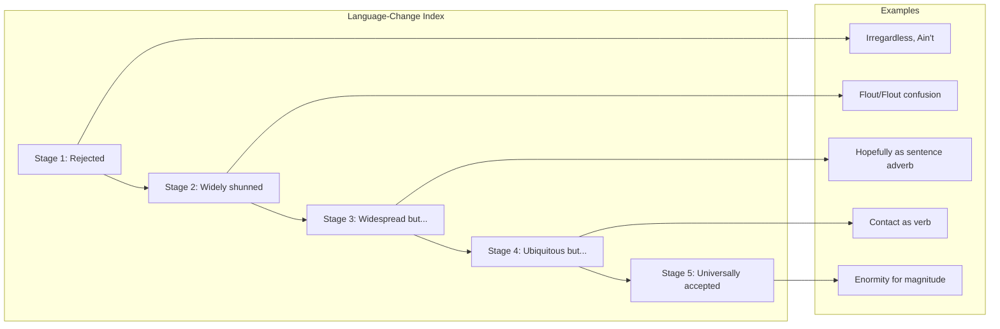
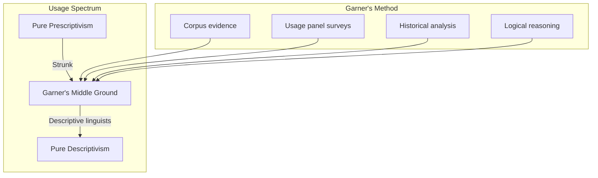

# Core Concepts

The foundational ideas about English usage and the Language-Change Index.

## The Language-Change Index

Garner's most important contribution to usage studies. The index rates disputed usages on a five-stage scale from rejection to acceptance, providing a rational framework for decisions about language use.

Stage 1 usages are universally condemned by educated speakers. Stage 5 usages were once disputed but are now universally accepted. Garner argues that writers should generally avoid Stage 1 and 2 usages, think carefully about Stage 3, and accept Stage 4 and 5.

## Prescriptive vs. Descriptive Balance

Garner occupies a distinctive middle ground between strict prescriptivism and pure descriptivism. He believes that usage guides should describe how language is actually used while also providing guidance about what is most effective in different contexts. His approach is evidence-based, drawing on large language corpora and surveys of usage panelists.

## The Essay on the English Language

The book opens with a substantial introductory essay covering the history of the English language, the rise of usage guides, and Garner's philosophy of usage. This essay is one of the best brief histories of English available and establishes the framework for the dictionary entries that follow.

# Key Features

## Dictionary of Usage

The main body of the book is an A-to-Z dictionary covering thousands of usage questions. Each entry provides the disputed usage, the historical background, the current state of the language, and Garner's recommendation with its Language-Change Index rating.

## Usage Panel Surveys

Garner surveys panels of expert writers and editors on disputed usages, providing quantitative data about what the language's most careful users actually do. These surveys give empirical grounding to what might otherwise be mere opinion.

## Quotations from Literature

Entries are illustrated with quotations from literature, journalism, and academic writing, showing how the language is actually used by respected writers. These examples ground Garner's advice in real-world usage.

## Practical Recommendations

Each entry ends with a clear recommendation: use or avoid, in formal or informal contexts. The recommendations are nuanced but actionable, providing practical guidance for writers facing specific usage decisions.

# Practical Applications

- **Professional editing**: Use the Language-Change Index to justify editorial decisions
- **Academic writing**: Navigate disputed usages with confidence
- **Legal writing**: Garner's original field — precision is paramount
- **Language teaching**: Explain usage questions with evidence rather than rules of thumb

# Actionable Lessons

1. **Use the Language-Change Index** as a rational framework for usage decisions
2. **Consider context** — some usages are fine for speech but not formal writing
3. **Know the standard before departing from it** — deliberate rule-breaking is different from ignorance
4. **Consult the evidence** — usage questions should be settled by data, not prejudice

# Action Plan

## Sufficiency Assessment

This summary captures Garner's framework and approach but cannot replace the detailed entries for individual usage questions.

## Recommended Reading Path

| Reader Type | Time | What to Read |
|---|---|---|
| Curious | ~30 min | Introductory essay + this summary |
| Writer | Ongoing | Use as reference for specific questions |
| Language lover | ~5 hr | Introductory essay + browse entries |

## What You'll Miss

- The thousands of detailed usage entries with examples
- The full Language-Change Index analysis for each disputed usage
- The historical depth tracing each usage controversy
- The usage panel survey data
