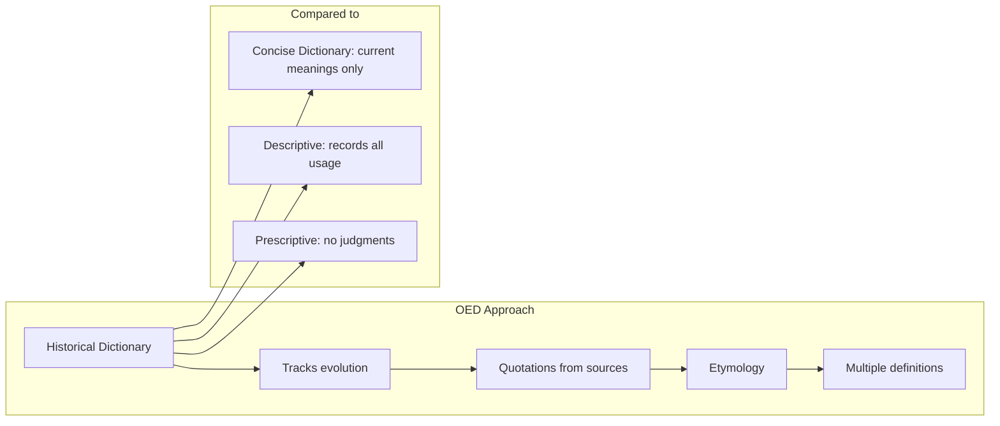
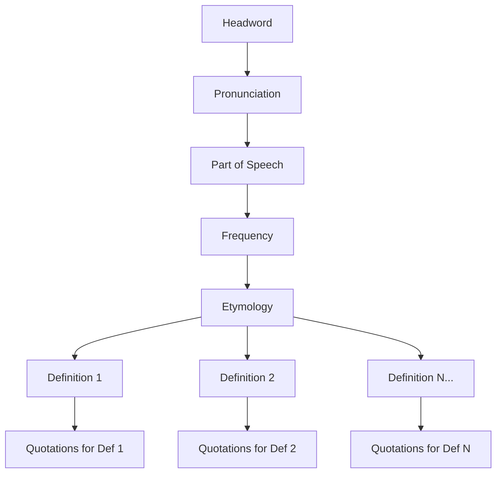

# Core Concepts

The foundational ideas about lexicography and the OED's approach.

## Historical Principles

The OED is a historical dictionary, meaning it traces the development of each word from its earliest recorded appearance to the present. Unlike a concise dictionary that gives only current meanings, the OED shows how words have changed over time, what meanings have been lost or gained, and how usage has evolved.

## The Entry Structure

Each OED entry follows a consistent structure: headword, pronunciation, part of speech, frequency band, etymology, definitions organized chronologically, and illustrative quotations for each definition. The etymology traces the word through its ancestors, often back to Proto-Indo-European roots.

## The Scale of the Work

The second edition contains over 600,000 words, with nearly 2.5 million illustrative quotations from more than 10,000 sources spanning 1,000 years of English. The total text contains over 50 million words. The Compact Edition compresses this into 2 volumes of 2,400 pages each using micrographic technology that reduces four pages of the original to one.

## The Quotation System

The OED's unique feature is its use of dated quotations to illustrate the history of each word. Every definition is supported by quotations showing the word in actual use, arranged chronologically from earliest to latest. This system makes the OED not just a dictionary but an anthology of English writing.

# Key Features

## Etymology

Each entry traces the word's history through its linguistic ancestors. For native English words, this typically means tracing through Old English to Proto-Germanic to Proto-Indo-European. Loanwords are traced to their source languages with the path of transmission noted.

## Pronunciation

The OED provides pronunciation for both British Received Pronunciation and General American English using the International Phonetic Alphabet. Historical pronunciation changes are noted in the etymological section.

## Frequency Bands

Modern entries include frequency information showing how commonly each word is used, from Band 1 (extremely rare) to Band 8 (among the most common words in English). This helps readers understand a word's practical importance.

## The Compact Edition Design

The Compact Edition is famous for its micrographic type. Each page of the compact edition contains four pages of the original reduced to about 5 point type. A magnifying glass is provided with each set. This design makes the work physically accessible while preserving the complete text.

# Practical Applications

- **Academic research**: Trace the history and usage of specific terms
- **Creative writing**: Find the perfect word with full understanding of its connotations
- **Etymology research**: Explore the origins and evolution of vocabulary
- **Linguistic history**: Study how the English language has changed over time

# Actionable Lessons

1. **Use quotations to understand nuance** — The illustrative examples reveal how words are actually used
2. **Trace etymology for deeper understanding** — Knowing a word's origins illuminates its current meanings
3. **Historical perspective shows that language change is normal** — Today's disputed usage may become tomorrow's standard
4. **The OED is for exploration, not just lookup** — Browsing entries reveals unexpected connections

# Action Plan

## Sufficiency Assessment

This summary describes the OED's structure and significance but cannot convey the depth and richness of the actual entries.

## Recommended Reading Path

| Reader Type | Time | What to Read |
|---|---|---|
| Curious | ~20 min | Read about the OED's history |
| Word lover | Ongoing | Explore random entries |
| Researcher | As needed | Targeted word research |

## What You'll Miss

- The thousands of fascinating quotations from across English literature
- The deep etymological research tracing words to their origins
- The experience of browsing and discovering unexpected linguistic connections
- The physical experience of using the Compact Edition with its magnifying glass
