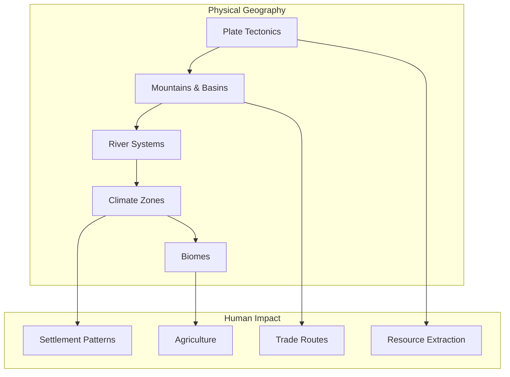
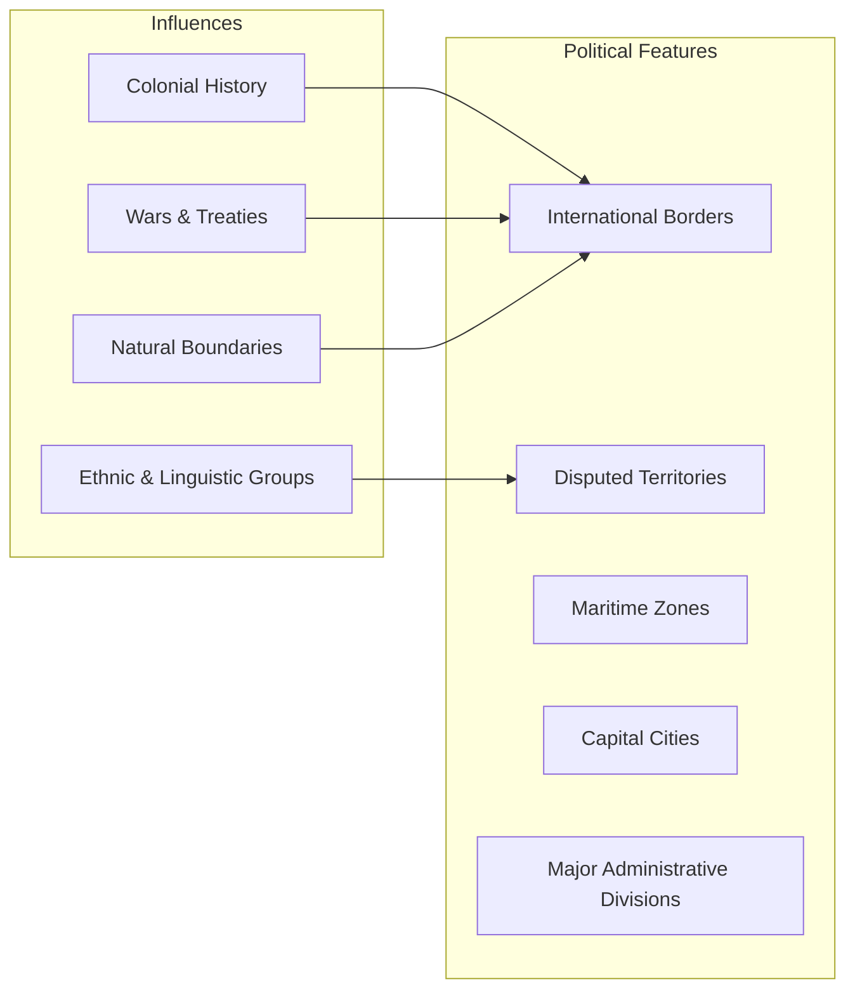

# Core Concepts

The foundational ideas in modern cartography and geographic understanding.

## Physical Geography

The atlas presents Earth's physical systems: plate tectonics, mountain building, river systems, ocean currents, climate zones, and biomes. These physical features form the stage on which human history unfolds. Understanding why mountains form where they do, how ocean currents distribute heat, and where fertile soils occur provides essential context for understanding human settlement patterns.

## Political Geography

The atlas shows the world's political boundaries with the most current information available. Beyond static borders, the maps show disputed territories, maritime boundaries, and capital cities. The political maps reveal how human history has carved the planet into sovereign states with often arbitrary borders that nevertheless have real consequences.

## Thematic Maps

The atlas's most valuable innovation is its thematic sections covering global issues: population density and distribution, climate change impacts, energy resources and consumption, freshwater availability, biodiversity hotspots, and global health indicators. These maps tell stories that physical and political maps alone cannot convey.

## Remote Sensing and GIS

The atlas makes extensive use of satellite imagery and Geographic Information Systems technology. Landsat imagery provides true-color views of Earth's surface, while false-color imagery reveals features invisible to the naked eye. GIS analysis enables the creation of thematic layers that can be combined to reveal patterns and relationships.

# Key Sections

## World Thematic Section

Global maps on topics including tectonic plates, climate, population, languages, religions, GDP, and environmental change. These thematic maps provide context for understanding the regional maps that follow.

## Continent and Regional Maps

Detailed physical and political maps of every continent and region. Major mountain ranges, rivers, lakes, cities, and political boundaries are shown with National Geographic's characteristic cartographic style and precision.

## Ocean Maps

Comprehensive maps of the world's oceans showing seafloor topography, ocean currents, marine ecosystems, shipping routes, and territorial waters. The ocean maps are a highlight of the atlas, revealing the three-quarters of Earth's surface that standard maps treat as empty blue space.

## Space and Satellite Imagery

Stunning satellite images of Earth from space, showing the planet as it appears from orbit. These images include both true-color composites and specialized imagery showing vegetation, urban areas, and environmental changes.

# Practical Applications

- **Geographic literacy**: Build a mental map of the world that supports understanding of global affairs
- **Travel planning**: Understand the geography of destinations before visiting
- **Educational reference**: Support geography, history, and social studies education
- **Data visualization inspiration**: See how complex data can be presented through mapping

# Actionable Lessons

1. **Maps are arguments** — Every map makes choices about what to show and how to show it
2. **Scale matters** — The level of detail appropriate for a city map differs from a continental map
3. **Projections distort** — Every flat map of a spherical Earth involves trade-offs in area, shape, and distance
4. **Thematic layers reveal patterns** — Combining data types on a single map can reveal unexpected relationships

# Action Plan

## Sufficiency Assessment

This summary describes the atlas's scope and features but cannot substitute for the maps themselves.

## Recommended Reading Path

| Reader Type | Time | What to Read |
|---|---|---|
| Casual browser | ~30 min | Thematic section + one continent |
| Geography student | ~3 hr | Full thematic section + regions of interest |
| Reference user | Ongoing | Consult as needed |

## What You'll Miss

- The exquisite cartographic detail of the full-size maps
- The satellite imagery and remote sensing data
- The statistical tables and geographic comparisons
- The experience of exploring physical and human geography through world-class cartography
