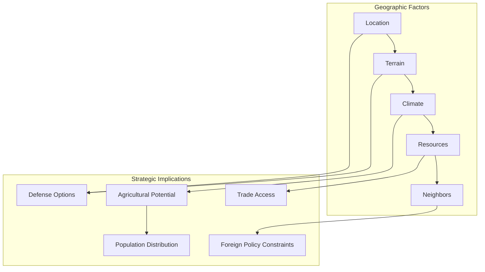
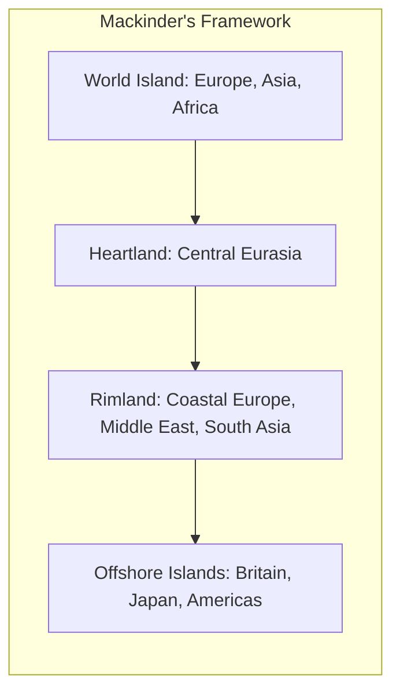

# Core Concepts

The foundational ideas in political geography and geopolitics.

## The Geographic Constraint

Marshall's central thesis is that geography sets the parameters within which political and strategic choices are made. Nations cannot choose their location, terrain, climate, or neighbors. These factors create enduring constraints and opportunities that persist regardless of technological change.

## The Heartland Theory

Marshall draws on Mackinder's Heartland Theory, which argues that the Eurasian landmass is the geopolitical pivot of the world. Whoever controls the heartland controls Eurasia; whoever controls Eurasia controls the world. While this theory was developed in 1904, Marshall argues it retains relevance for understanding Russian and Chinese strategic thinking.

## Access to the Sea

A recurring theme throughout the book is the importance of access to navigable waters for trade and military power. Nations with warm-water ports have strategic advantages over those whose ports freeze in winter or are bottled up by chokepoints.

# Chapter Insights

## Russia

Russia's defining geographic feature is its lack of a warm-water port that is not controlled by potential adversaries. The Baltic ports freeze in winter, the Black Sea is bottled up by Turkey, and the Pacific ports are distant. This geographic reality has driven Russian expansionism for centuries — the search for secure access to global trade routes.

## China

China's geography of mountains to the west, deserts to the north, and the Pacific to the east created a sense of civilizational isolation that persists in Chinese strategic thinking. The Himalayan barrier, the Gobi Desert, and the vast Pacific created natural boundaries that made China the center of its own world.

## The United States

The United States enjoys the most advantageous strategic geography of any great power: two vast ocean buffers, weak neighbors to north and south, and abundant natural resources. This geography has shaped American foreign policy, allowing the US to project power globally while remaining relatively secure at home.

## Western Europe

Europe's fragmented geography — river systems, mountain ranges, and proximity to multiple seas — created a continent of competing states. The lack of natural defensive barriers and the presence of navigable rivers connecting interior to coast shaped Europe's history of war and trade.

## Africa

Africa's geography presented unique challenges: the north-south orientation of its river systems creates natural barriers; the tsetse fly belt made large-scale animal husbandry difficult; the scarcity of natural harbors limited trade. These geographic factors, combined with the legacy of colonialism, shaped Africa's development trajectory.

## The Middle East

The Middle East's geography of oil reserves and water scarcity creates a region of permanent geopolitical tension. The physical terrain that enabled the region's oil wealth also created vulnerabilities: narrow chokepoints, vulnerable pipelines, and dependence on desalination.

# Practical Applications

- **Understand news events**: Geographic context for current conflicts and alliances
- **Strategic thinking**: Consider geographic constraints in business and personal decisions
- **Travel perspective**: Appreciate how terrain has shaped the places you visit

# Actionable Lessons

1. **Geography is the stage** — Politics, economics, and culture play out on a physical terrain that constrains possibilities
2. **Look at a map** — Many geopolitical issues become clearer when viewed through a geographic lens
3. **Technology has limits** — Drones and satellites change warfare but don't eliminate the importance of terrain

# Action Plan

## Sufficiency Assessment

This summary captures the geographic framework and regional analysis but omits the detailed historical and political context for each region.

## Recommended Reading Path

| Reader Type | Time | What to Read |
|---|---|---|
| Casual | ~30 min | This summary + 2-3 chapters |
| Interested | ~2 hr | Russia, China, US, Middle East chapters |
| Enthusiast | ~4-5 hr | Full book |

## What You'll Miss

- The detailed historical examples supporting each geographic analysis
- Marshall's journalistic anecdotes from covering these regions
- The nuanced discussion of how technology is changing (but not eliminating) geographic constraints
- The specific maps and satellite images that illustrate the geographic arguments
