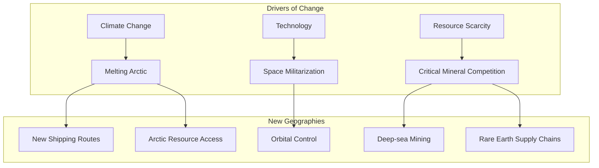
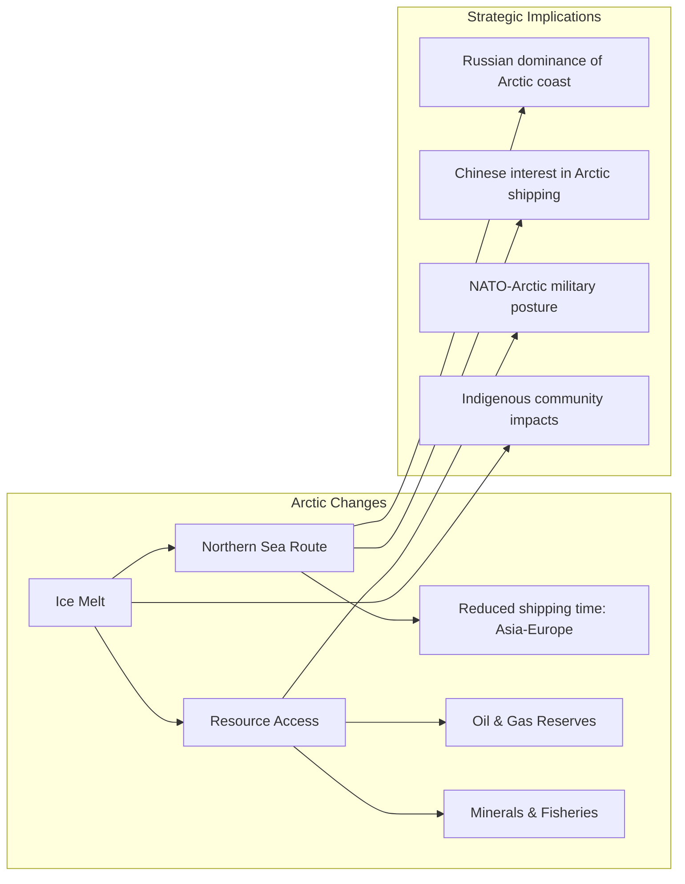

# Core Concepts

The foundational ideas about 21st-century geopolitics and geographic change.

## The New Geopolitical Landscape

While Prisoners of Geography focused on enduring geographic constraints, The Power of Geography examines how these constraints are shifting due to climate change, technological change, and the rise of new powers. The melting of Arctic ice, the weaponization of space, and the scramble for critical minerals are creating new geographic realities.

## The Arctic Opening

The most dramatic geographic change of the 21st century is the opening of the Arctic. As sea ice melts, the Arctic Ocean is becoming a viable shipping route between Europe and Asia, cutting transit times by weeks compared to the Suez Canal route. The region also holds vast untapped oil and gas reserves. The Arctic is becoming a new arena of strategic competition.

## The Space Domain

Marshall argues that space has become the ultimate strategic high ground. Satellites are essential for communications, navigation, intelligence, and military operations. The ability to deny adversaries access to space is becoming as important as controlling sea lanes or airspace.

## Strategic Chokepoints

The book analyzes several geographic chokepoints where global trade and military power converge: the Strait of Hormuz, the South China Sea, the Suez Canal, the Turkish Straits, and the Malacca Strait. Control of these chokepoints translates into disproportionate geopolitical influence.

# Chapter Insights

## Australia: The Lucky Country's Geographic Challenge

Australia's geographic isolation — an island continent far from major markets — is both a vulnerability and a strategic asset. The rise of China as a regional power challenges Australia's traditional assumption that it lives in a benign strategic environment.

## The Sahel: Climate Crisis Zone

The Sahel region across Africa is experiencing the world's most acute convergence of climate change, population growth, resource scarcity, and violent conflict. Desertification, water shortages, and competition for grazing land are driving migration and enabling extremist groups.

## The Arctic: The Great Thaw

The Arctic is warming four times faster than the global average. The implications are profound: new shipping routes, access to resources, and a new arena of great-power competition. Russia has been investing heavily in Arctic military infrastructure.

## Space: The Ultimate High Ground

Marshall examines the militarization of space: anti-satellite weapons, space-based missile defense, and the vulnerability of the satellites that modern civilization depends on for GPS, communications, and weather forecasting.

## The South China Sea: The World's Most Dangerous Flashpoint

The South China Sea is where multiple geographic factors converge: strategic shipping lanes, rich fisheries, potential oil and gas reserves, and competing territorial claims backed by military force. China's assertiveness in the region is reshaping the strategic environment of Southeast Asia.

# Practical Applications

- **Strategic foresight**: Understand the geographic trends that will shape the next decades
- **Investment perspective**: Recognize regions and resources that will gain strategic importance
- **Policy understanding**: Appreciate the geographic factors behind international tensions

# Actionable Lessons

1. **Geography is dynamic** — Climate change is reshaping geographic realities faster than any previous period
2. **New frontiers bring old conflicts** — The Arctic and space are becoming arenas of great-power competition
3. **Chokepoints remain crucial** — Control of strategic waterways continues to translate into geopolitical power

# Action Plan

## Sufficiency Assessment

This summary captures the key geographic changes and regional analyses but omits the detailed strategic context for each region.

## Recommended Reading Path

| Reader Type | Time | What to Read |
|---|---|---|
| Casual | ~30 min | This summary + Arctic & Space chapters |
| Interested | ~2 hr | Summary + 4-5 regions of interest |
| Enthusiast | ~4-5 hr | Full book |

## What You'll Miss

- The detailed analysis of each region's political dynamics
- Marshall's journalistic observations from the regions
- The specific data on Arctic ice melt and space capabilities
- The maps that illustrate the geographic arguments
