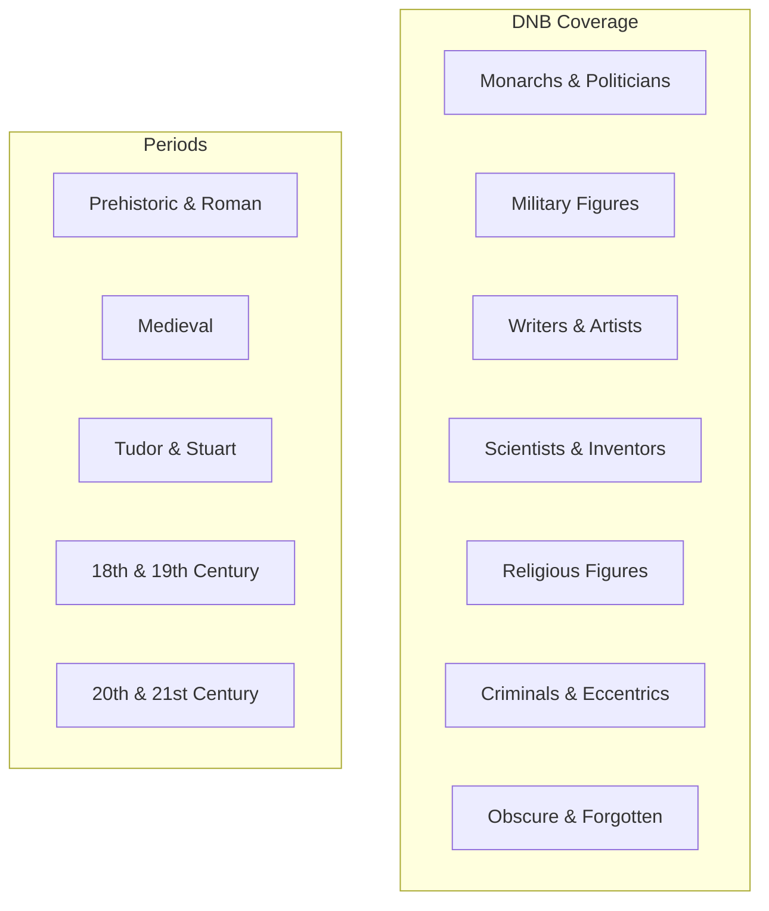

# Core Concepts

The foundational ideas about national biography and the DNB's approach.

## National Biography as History

The DNB treats biography as a form of national history. By documenting the lives of people from all social classes and walks of life, the DNB creates a collective portrait of the nation. The selection of subjects — who is included and who is excluded — itself tells a story about British values and historical priorities.

## The Scholarly Entry

Each DNB entry follows a standard format: subject's name and dates, a summary of their significance, detailed biographical narrative, critical assessment of their achievements and character, and a bibliography of sources. Entries are written by scholars who are experts in the relevant field and are peer-reviewed before publication.

## The Revision Process

The original DNB (1885-1900) reflected Victorian values and biases. The Oxford DNB (2004) undertook a complete revision, adding over 15,000 new subjects to improve coverage of women, non-white Britons, and previously neglected social groups. Every existing entry was revised and updated.

## The Online Edition

The Oxford DNB is now primarily accessed online. The online edition is updated quarterly with new entries and corrections, making it a living resource that continues to grow and improve. The online format also enables full-text searching, cross-referencing, and access to images and thematic collections.

# Key Features

## Thematic Collections

The online Oxford DNB organizes entries into thematic collections: "Women in the DNB," "Black British History," "LGBT History," "Scientists," "Writers," and many more. These collections allow users to explore biographical patterns across traditional historical categories.

## Group Biography

Some entries cover groups rather than individuals, including biographies of families, teams, and communities. These group entries provide context for understanding how individuals operated within social networks and institutions.

## Subject Area Articles

Beyond individual biographies, the Oxford DNB includes thematic articles on broad subjects like "Theatre," "Medicine," and "The Armed Forces," providing context for understanding biographical entries within their professional and institutional settings.

# Practical Applications

- **Academic research**: Authoritative biographical data for papers and publications
- **Historical research**: Context and connections between historical figures
- **Genealogical research**: Detailed biographical information about ancestors
- **Educational reference**: Reliable biographical information for teaching

# Actionable Lessons

1. **Biography is selective** — Whom we choose to remember tells us about our values
2. **Scholarship evolves** — The revision from DNB to Oxford DNB shows how historical understanding changes
3. **Cross-reference broadly** — The DNB's network of biographies reveals connections between fields and periods

# Action Plan

## Sufficiency Assessment

This summary describes the DNB's scope, structure, and significance but cannot replace access to the entries themselves.

## Recommended Reading Path

| User Type | Approach |
|---|---|
| Researcher | Search by subject name or field |
| Curious browser | Browse thematic collections |
| Historian | Use as starting point for deeper research |

## What You'll Miss

- The detailed biographical narratives for 60,000+ subjects
- The scholarly assessment and critical judgment in each entry
- The bibliographic references pointing to further sources
- The thematic collections that reveal patterns across individual lives
