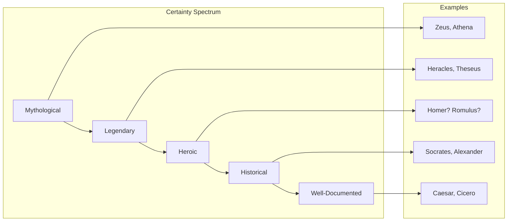
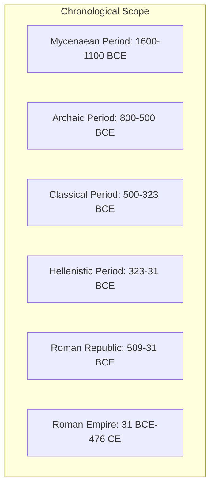

# Core Concepts

The foundational ideas about the ancient world and biographical reference.

## Myth and History in the Ancient World

Hazel's approach acknowledges that for the ancient world, the boundary between mythology and history is often indistinct. Figures like Homer, the Trojan War heroes, and early Roman kings exist in a space between legend and documentary history. Hazel covers both categories, noting where the evidence is literary versus archaeological.

## The Greek and Roman World

The book covers figures from the entire Greco-Roman world, including Greek city-states, the Hellenistic kingdoms, the Roman Republic, and the Roman Empire. Geographic coverage extends from Britain to Egypt, from Spain to Asia Minor.

## Key Figure Categories

Hazel organizes his material around several major categories: mythological figures (gods, heroes, monsters), political and military leaders, philosophers and writers, artists and architects, and historical figures known primarily from their appearance in literary works.

# Key Features

## Entry Format

Each entry provides: the figure's name (Greek and Roman variants), dates (where known), a brief identification of their significance, biographical narrative, historical context, and assessment of their importance. Cross-references to related entries are provided in bold.

## Genealogical Tables

The book includes genealogical tables of major mythological families: the Olympian gods, the House of Atreus, the royal houses of Thebes and Troy, and the Roman imperial families. These tables help readers navigate the complex relationships in Greek mythology.

## Maps and Chronology

A chronology of the ancient world and maps of Greece, Italy, and the Mediterranean provide geographic and temporal context for the biographical entries.

# Practical Applications

- **Reading classical literature**: Identify figures when reading Homer, the Greek dramatists, or Roman historians
- **Historical research**: Quick biographical verification for ancient figures
- **Travel and tourism**: Context for visiting historical sites
- **Educational reference**: Support for classics and ancient history courses

# Actionable Lessons

1. **Ancient biography is interpretive** — Sources for ancient lives are often fragmentary or biased
2. **Myth reflects history** — Mythological stories often encode historical events and social values
3. **Context is essential** — Understanding a figure requires knowledge of their historical moment

# Action Plan

## Sufficiency Assessment

This summary describes the scope and approach of the reference work but cannot replace the individual entries.

## Recommended Reading Path

| User Type | Approach |
|---|---|
| Student | Look up figures encountered in reading |
| Casual browser | Browse by period or category |
| Traveler | Read entries on figures from destination region |

## What You'll Miss

- The individual biographical entries with their specific details
- The genealogical tables of mythological families
- The chronological and geographic context materials
- The cross-references linking related figures
