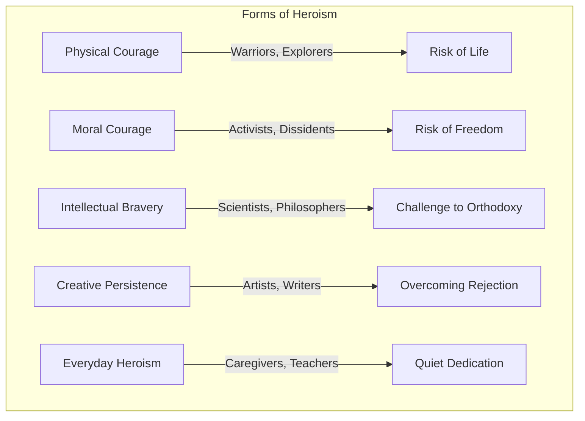
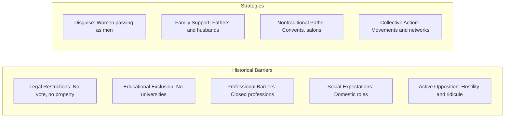

# Core Concepts

The foundational ideas about heroism and women's history.

## Redefining Heroism

The book expands conventional definitions of heroism beyond battlefield courage to include intellectual bravery, moral conviction, artistic innovation, and persistence against overwhelming odds. This broader definition allows recognition of a more diverse range of achievements and attributes.

## Historical Context of Women's Contributions

The book situates each woman in her historical context, acknowledging the barriers they faced — legal restrictions, social expectations, limited access to education, and active opposition. Their achievements are presented as triumphs over these barriers, not just accomplishments in isolation.

## The Power of Role Models

The book argues that visibility matters. Knowing that women have achieved greatness in every field is essential for inspiring future generations. The biographical approach is deliberately chosen to make abstract concepts of female achievement concrete and personal.

# Key Figures Covered

## Warriors and Leaders

Profiles of women who led armies, ruled nations, and fought in combat: Boudica, Joan of Arc, Queen Nzinga, Catherine the Great, Harriet Tubman, and modern military pioneers.

## Scientists and Innovators

Hypatia, Marie Curie, Rosalind Franklin, Ada Lovelace, Jane Goodall, and contemporary scientists across disciplines.

## Artists and Writers

Sappho, Emily Dickinson, Frida Kahlo, Virginia Woolf, Maya Angelou, and other transformative creative figures.

## Activists and Change-Makers

Sojourner Truth, Susan B. Anthony, Emmeline Pankhurst, Rosa Parks, Malala Yousafzai, and grassroots organizers.

## Explorers and Adventurers

Women who traveled the world, climbed mountains, flew planes, and went where women were not supposed to go.

# Practical Applications

- **Education**: Use profiles as teaching tools for history and social studies
- **Inspiration**: Draw on stories of persistence and courage
- **Representation**: Ensure diverse role models are visible in reading material

# Actionable Lessons

1. **Courage takes many forms** — Recognize heroism in all its varieties
2. **Context matters** — Achievements should be understood relative to the barriers faced
3. **Representation inspires** — Seeing people like you succeed makes success seem attainable

# Action Plan

## Sufficiency Assessment

This summary captures the book's approach and representative content but cannot substitute for the individual profiles.

## Recommended Reading Path

| Reader Type | Time | What to Read |
|---|---|---|
| Young reader | ~2 hr | Favorite figures of interest |
| Parent | ~1 hr | Browse for discussion topics |
| Adult | ~3-4 hr | Full book as quick inspiration |

## What You'll Miss

- The detailed biographical narratives for each figure
- The illustrations that bring each story to life
- The thematic organization showing connections between figures
- The variety of lesser-known figures alongside famous names
