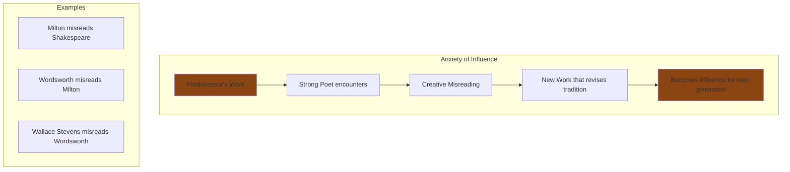
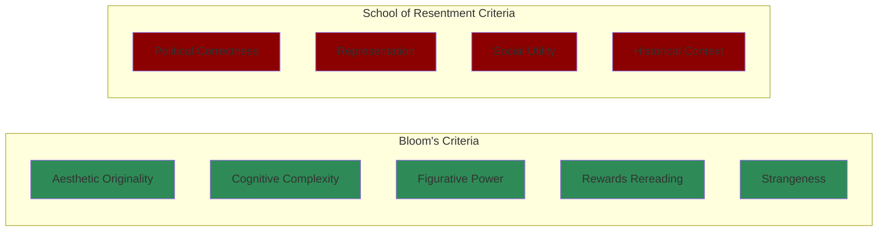

# Core Concepts

The foundational ideas about the literary canon.

## The Anxiety of Influence

Bloom's most famous theoretical contribution: strong writers are shaped by their creative misreading of predecessors. Every new poet struggles with the influence of earlier poets, and the strongest poets overcome this anxiety through acts of creative misprision — deliberately misreading their predecessors to create space for their own originality.

## Aesthetic Value vs. Political Utility

Bloom's central argument: "The Western Canon" is a polemic against what he calls the "School of Resentment" — feminist, Marxist, postcolonial, and other politicized approaches to literature that judge works by their social utility rather than their aesthetic achievement. Bloom insists that the canon should be based solely on aesthetic criteria: originality, complexity, figurative power, and cognitive depth.

## Shakespeare as the Center

Bloom argues that Shakespeare is the center of the Western canon, the author who defines what literary achievement looks like. Shakespeare's characters are more psychologically complex than any before them, his language is more flexible and original, and his influence pervades all subsequent Western literature.

# Key Canonical Authors

## The Theocratic Age (Dante to Milton)

Dante, Chaucer, Montaigne, Shakespeare, Cervantes, Milton. Bloom argues that these writers, writing in an age dominated by religious worldviews, created works that transcend their theological contexts through their aesthetic power and human insight.

## The Aristocratic Age (Enlightenment to Romanticism)

The writers of the Enlightenment and Romantic periods: Goethe, Wordsworth, Austen, Dickens, Tolstoy, Dostoevsky, Ibsen. These authors, writing in an age of emerging democratic and individualist values, expanded the range of literary representation.

## The Democratic Age (Modernism)

The modernists: Whitman, Proust, Joyce, Woolf, Kafka, Borges, Neruda, Beckett. These writers pushed literary form to its limits, experimenting with consciousness, time, and language itself.

# Practical Applications

- **Reading lists**: Use Bloom's canon as a guide for structuring your reading
- **Critical thinking**: Engage with Bloom's criteria for aesthetic judgment
- **Literary understanding**: Understand the tradition of influence connecting great works

# Actionable Lessons

1. **Read for strangeness** — The most valuable works are those that resist easy comprehension
2. **Reread deeply** — Great works reveal new dimensions on each encounter
3. **Judge aesthetically** — Ask not what a work says about society but how it transforms our perception

# Action Plan

## Sufficiency Assessment

This summary captures Bloom's framework and canonical authors but cannot substitute for his detailed readings.

## Recommended Reading Path

| Reader Type | Time | What to Read |
|---|---|---|
| Curious | ~1 hr | Introduction + Bloom's criteria |
| Literature student | ~6 hr | Introduction + authors of interest |
| Serious reader | ~12-15 hr | Full book |

## What You'll Miss

- Bloom's detailed close readings of specific works
- The polemical energy of Bloom's prose
- The nuanced discussions of influence between writers
- The annotated reading list in the appendix
