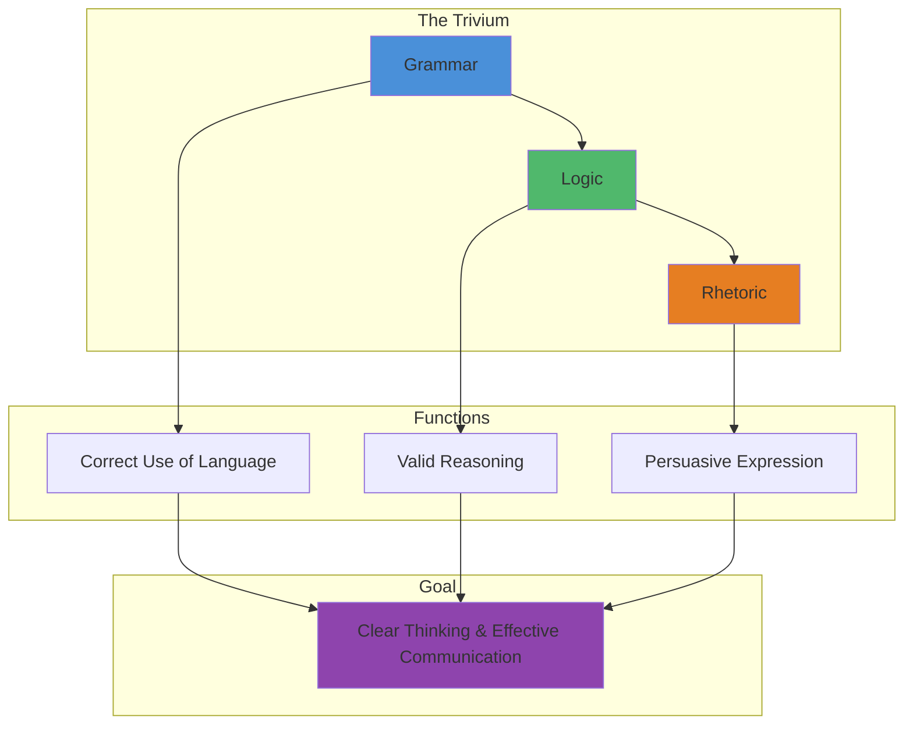
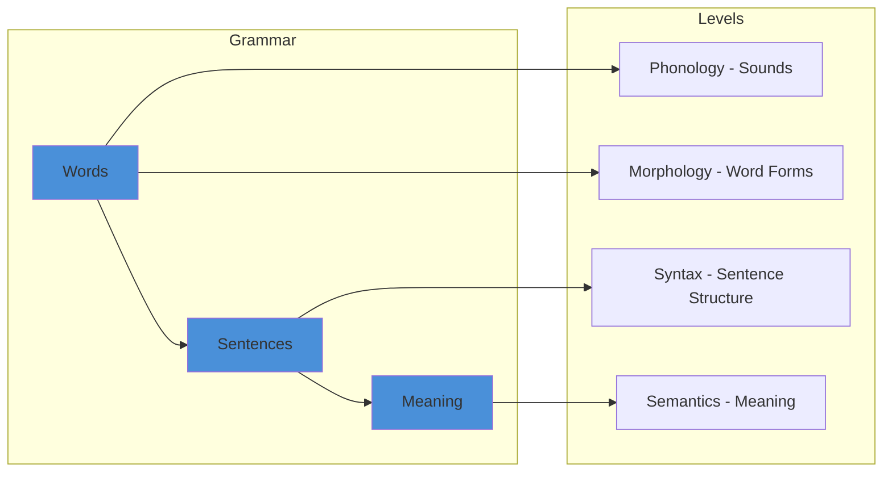
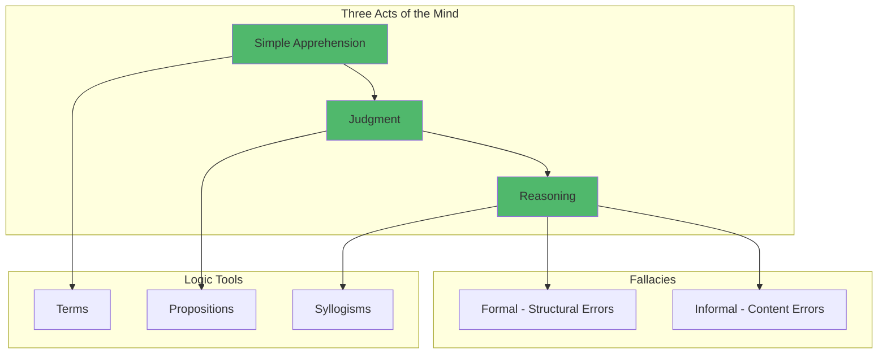
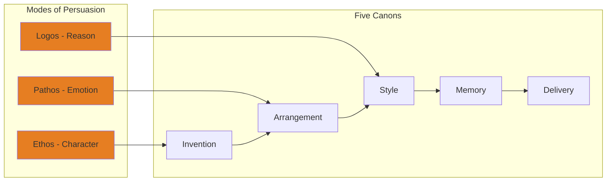
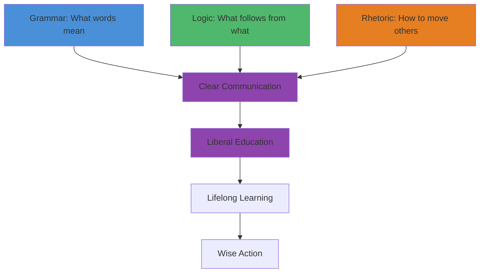

# Core Concepts

The trivium is the threefold path of the liberal arts, designed to cultivate the mind through language and reason.

## The Nature of the Trivium

Sister Miriam Joseph defines the trivium as the three arts pertaining to language and reason: grammar, logic, and rhetoric. These are not merely academic subjects but tools for thinking — the arts by which the human mind discovers truth, orders it, and communicates it to others. They are called "liberal" because they free the mind for higher learning.

## Grammar: The Art of Language

Grammar is the art of using language correctly. It provides the raw material for all thought and communication. Sister Miriam Joseph distinguishes between positive grammar (the rules governing a particular language) and philosophical grammar (the universal principles underlying all language). Mastery of grammar means understanding the parts of speech, sentence structure, and the relationship between words and the ideas they represent.

## Logic: The Art of Reasoning

Logic is the art of reasoning correctly. It provides the rules for moving from premises to conclusions, distinguishing valid arguments from fallacious ones. The book covers the three acts of the mind — simple apprehension (forming concepts), judgment (affirming or denying), and reasoning (moving from known to unknown). Logic teaches the syllogism, the propositional calculus, and the detection of fallacies.

Sister Miriam Joseph presents logic as a tool for discovering truth, not merely winning arguments. She distinguishes formal logic (the structure of correct reasoning) from material logic (the content of arguments and the discovery of evidence).

## Rhetoric: The Art of Persuasion

Rhetoric is the art of communicating effectively to move an audience. It integrates grammar and logic toward the end of persuasion. The book covers the three modes of persuasion — ethos (character of the speaker), pathos (emotional appeal), and logos (logical argument) — along with the five canons of rhetoric: invention (finding arguments), arrangement (organizing), style (expression), memory, and delivery.

Sister Miriam Joseph emphasizes that rhetoric is not mere ornament or manipulation. It is the culmination of the trivium, applying the tools of grammar and logic to communicate truth in a way that others can understand and act upon.

## The Interdependence of the Arts

The central insight of the book is that the three arts are not independent subjects but mutually reinforcing tools. Grammar without logic produces correct but empty speech. Logic without rhetoric produces valid arguments that fail to persuade. Rhetoric without grammar and logic produces mere manipulation. True mastery requires all three, working together.

# Chapter Insights

## Part 1: Grammar

The book opens with the most fundamental art. Grammar is presented as the gateway to all learning because language is the medium of thought. Sister Miriam Joseph covers the parts of speech, the structure of sentences, and the relationship between grammatical forms and logical categories. She emphasizes that mastering grammar is mastering the tools by which all subsequent learning happens.

## Part 2: Logic

The central section covers the art of reasoning systematically. The author explains the three acts of the mind, the nature of terms and propositions, the structure of syllogisms, and the classification of fallacies. This section is the most demanding, requiring careful attention to distinctions and technical vocabulary.

## Part 3: Rhetoric

The final section shows how grammar and logic come together in persuasive communication. The author covers the modes of persuasion, the canons of rhetoric, and the figures of speech. She emphasizes that rhetoric is the practical application of the trivium — the art by which knowledge becomes effective in the world.

# Practical Applications

- **Writing**: Apply grammatical precision, logical structure, and rhetorical effectiveness
- **Debate**: Detect fallacies in opponents' arguments and construct sound counter-arguments
- **Reading**: Analyze texts for grammatical accuracy, logical validity, and rhetorical strategy
- **Teaching**: Use the trivium as a framework for curriculum design

# Actionable Lessons

1. **Master terms before propositions** — Understand words precisely before making claims
2. **Detect fallacies** — Learn the common patterns of invalid reasoning
3. **Know your audience** — Adapt rhetorical strategy to the listeners' state
4. **Build arguments syllogistically** — Structure reasoning from premises to conclusion
5. **Practice the trivium daily** — Read, reason, and speak with conscious attention to each art

# Reading Guide

## Sufficiency Assessment

This summary captures the structure and key concepts of the trivium. It covers the three arts, their interrelationships, and their practical applications. The full book contains many more examples, exercises, and historical references.

## Recommended Reading Path

| Reader Type | Time | What to Read |
|---|---|---|
| Curious | ~20 min | This summary |
| Student | ~3-4 hr | Summary + Part 1 and 2 |
| Serious scholar | ~6-8 hr | Full book |

## What You'll Miss

- Detailed exercises for each art
- Historical context of the liberal arts tradition
- Sister Miriam Joseph's examples from literature and philosophy
