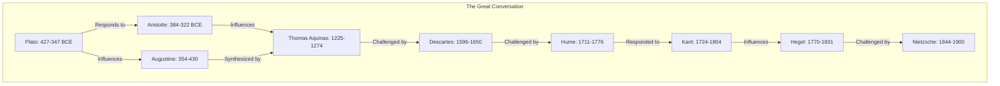
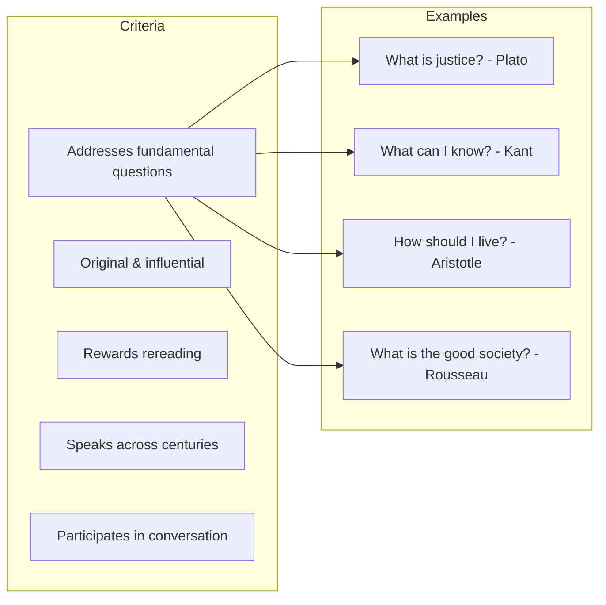

# Core Concepts

The foundational ideas about the Great Books and the Great Conversation.

## The Great Conversation

Adler's central metaphor: the Great Books of the Western world constitute an ongoing conversation that spans more than 2,500 years. Authors respond to each other across centuries — Plato addresses questions that Aristotle will answer; Augustine builds on Plato; Aquinas synthesizes Aristotle and Augustine; Kant responds to Hume. Reading these books in conversation with each other reveals the development of Western thought.

## The Criteria for Greatness

Adler offers criteria for what makes a book "great": it addresses the most fundamental human questions; it is original and influential; it rewards repeated reading; it speaks across centuries to readers in different contexts; it participates in the conversation with other great books.

## The Syntopicon

Adler's most ambitious creation: the Syntopicon is a two-volume index of "great ideas" that cross-references passages across all the Great Books. It organizes Western thought around 102 fundamental ideas (Being, Cause, Democracy, God, Justice, Love, Truth, etc.), showing how different authors have addressed each idea.

## The Great Books of the Western World

The 54-volume set (first edition, 1952) includes 443 works by 74 authors from Homer to Freud. Adler explains the principles of selection and organization, including why some authors are included and others excluded.

# Key Sections

## Part 1: The Great Conversation

Introduces the concept of the Great Conversation and explains why reading the Great Books in sequence reveals patterns in Western thought. Adler argues that this conversation is the core of liberal education.

## Part 2: The Great Books

Explains the criteria for inclusion in the set and provides an overview of the authors and works included. Adler discusses the challenges of selection and acknowledges the necessary limitations of any canon.

## Part 3: The Syntopicon

Introduces the 102 Great Ideas and explains how the Syntopicon works as a tool for tracing ideas across the set. This section is a user's guide to the most distinctive feature of the Great Books project.

# Practical Applications

- **Reading program**: Use the Great Books list as a guide for self-education
- **Thematic study**: Use the Syntopicon to trace ideas across authors and periods
- **Liberal education**: Understand the vision behind Great Books education

# Actionable Lessons

1. **Read chronologically** — Follow the conversation as it developed over time
2. **Read syntopically** — Compare how different authors address the same idea
3. **Engage actively** — The Great Books reward the kind of analytical reading Adler teaches

# Action Plan

## Sufficiency Assessment

This summary captures Adler's vision and framework but cannot replace the full exposition of the Great Conversation.

## Recommended Reading Path

| Reader Type | Time | What to Read |
|---|---|---|
| Curious | ~30 min | This summary |
| Beginning Great Books reader | ~4-5 hr | Full book |
| Educator | ~6 hr | Full book + browse Syntopicon |

## What You'll Miss

- The detailed exposition of the Great Conversation across periods
- The specific analysis of how authors respond to each other
- The explanation of the Syntopicon's structure and use
- The complete list of Great Books with Adler's commentary
