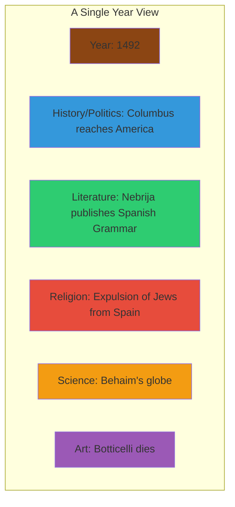

# Core Concepts

The foundational ideas about chronological reference.

## The Parallel-Column Format

Grun's innovation is presenting history in parallel columns that show simultaneous events across different categories of human activity. Rather than a single chronological narrative, the book displays history as a tapestry of simultaneous developments.

## The Seven Categories

The book organizes events into seven categories: History and Politics; Literature and Theater; Religion and Philosophy; Science, Technology, and Medicine; Art and Architecture; Music; and Daily Life. These categories appear as parallel columns on each page.

## The Scope of Coverage

The book covers 7,000 years from 5000 BCE to 1990 CE. The early periods are sparse — only major archaeological and historical milestones are recorded. Coverage becomes increasingly dense as the modern period approaches, reflecting both the expansion of human activity and the availability of recorded history.

# Key Features

## The Index

A comprehensive index of names and subjects allows readers to find specific events and see what else was happening at the time. This feature transforms the book from a browsing reference into a research tool.

## The Prehistory Section

The earliest section (5000 BCE to 1 CE) covers the development of civilization: the invention of writing, the rise of cities, the great empires of the ancient Near East, classical Greece and Rome. These pages reveal the foundational developments that underpin all subsequent history.

## The Modern Period

The 20th century section is the most detailed, reflecting both the explosion of recorded events and the acceleration of change. World wars, technological revolutions, and cultural transformations appear in dense parallel columns.

# Practical Applications

- **Research**: Place any historical event in its chronological context
- **Writing**: Ensure historical accuracy when mentioning contemporaneous events
- **Education**: Help students understand chronological relationships
- **General knowledge**: Build a mental timeline of world history

# Actionable Lessons

1. **Context is everything** — Events that seem isolated are part of larger patterns
2. **Progress happens in parallel** — Political, scientific, and cultural developments reinforce each other
3. **The density of history increases** — The modern world has dramatically more recorded events

# Action Plan

## Sufficiency Assessment

This summary describes the book's format and utility but cannot substitute for the reference itself.

## Recommended Reading Path

| User Type | Approach |
|---|---|
| Casual browser | Open to any page and explore |
| Researcher | Use index to find specific events |
| Student | Study periods relevant to courses |

## What You'll Miss

- The specific entries for each year across all seven categories
- The visual experience of seeing history unfold in parallel columns
- The comprehensive index connecting names and events
- The cumulative effect of browsing through centuries of development
