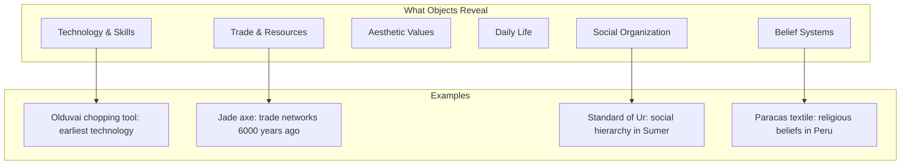
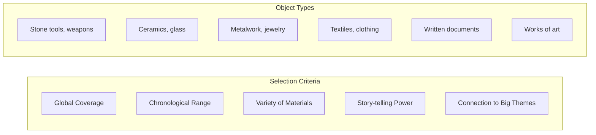

# Core Concepts

The foundational ideas about object-based history.

## Objects as Historical Sources

MacGregor argues that physical objects provide a kind of historical evidence that texts cannot. Objects reveal technologies, trade networks, aesthetic values, and daily practices that may never have been written down. An object made by someone who could not write still carries information about their skills, resources, and cultural context.

## The Selection Process

MacGregor chose objects to represent the full span of human history across all inhabited continents. The selection balances famous treasures (the Rosetta Stone, the Sutton Hoo helmet) with humble objects (a stone tool, a ceramic pot, a credit card). Each object was chosen for its ability to tell a larger story about the culture that produced it.

## The BBC Radio 4 Origin

The book began as a 100-episode BBC Radio 4 series broadcast in 2010, with each 15-minute episode focused on one object. MacGregor's spoken introductions were transcribed and expanded for the book. The radio origin explains the book's accessible, conversational tone.

# Key Objects

## Part 1: Making Us Human (2 million - 9000 BCE)

Begins with a stone chopping tool from Olduvai Gorge (1.8 million years old), a handaxe, and early artistic expression in the form of carved figurines. These objects reveal the emergence of human culture.

## Part 2: After the Ice Age (9000 - 3500 BCE)

Objects from the Neolithic Revolution: farming tools, early pottery, and evidence of settled communities. A jade axe from Britain shows trade networks spanning Europe.

## Part 3: The First Cities and States (3500 - 2000 BCE)

The Standard of Ur, the Indus Valley seal, and early writing tablets. These objects reveal the emergence of urban civilization, writing, and organized states.

## Part 4: Empire and Trade (2000 BCE - 500 CE)

Spans from Egypt to China to the Americas. The Rosetta Stone, the Minoan bull-leaper fresco, Chinese bronze vessels, and Peruvian textiles demonstrate the diversity of ancient civilizations.

## Part 5: The Medieval World (500 - 1500 CE)

The Sutton Hoo helmet, the Harem wall-painting fragments from Baghdad, the Ife head from Nigeria, and the stained glass from Canterbury. Objects reveal the global Middle Ages.

## Part 6: The Modern World (1500 - 2000)

From Benin bronzes to revolutionary porcelain to the solar-powered lamp and the credit card. This section traces the acceleration of global connection and exchange.

# Practical Applications

- **Museum visits**: Approach collections with a new understanding of what objects can reveal
- **Historical thinking**: Consider material evidence alongside written sources
- **Teaching**: Use specific objects to make abstract historical concepts concrete

# Actionable Lessons

1. **Objects tell stories** — Every artifact has a biography worth exploring
2. **History is material** — The things people made and used are primary historical evidence
3. **Context matters** — An object's meaning depends on understanding the culture that produced it

# Action Plan

## Sufficiency Assessment

This summary captures the book's framework and representative objects but cannot substitute for the 100 individual essays.

## Recommended Reading Path

| Reader Type | Time | What to Read |
|---|---|---|
| Casual | ~1 hr | 10-15 objects of interest |
| Enthusiast | ~6 hr | All 100 objects |
| Student | ~10-12 hr | Full book with notes |

## What You'll Miss

- The individual essays for each of the 100 objects
- MacGregor's insightful connections between objects across time
- The photographs of each object
- The audio recordings of the original BBC radio series
