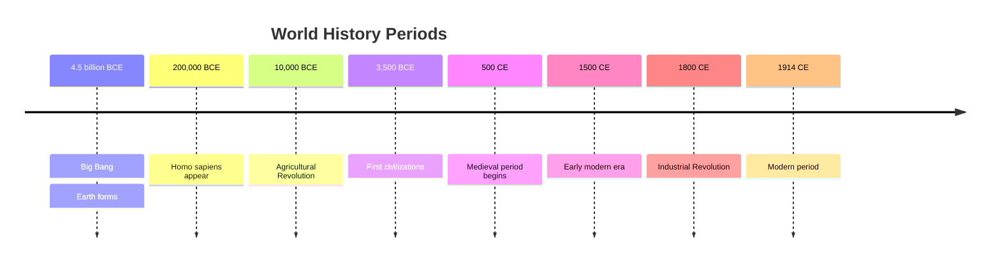
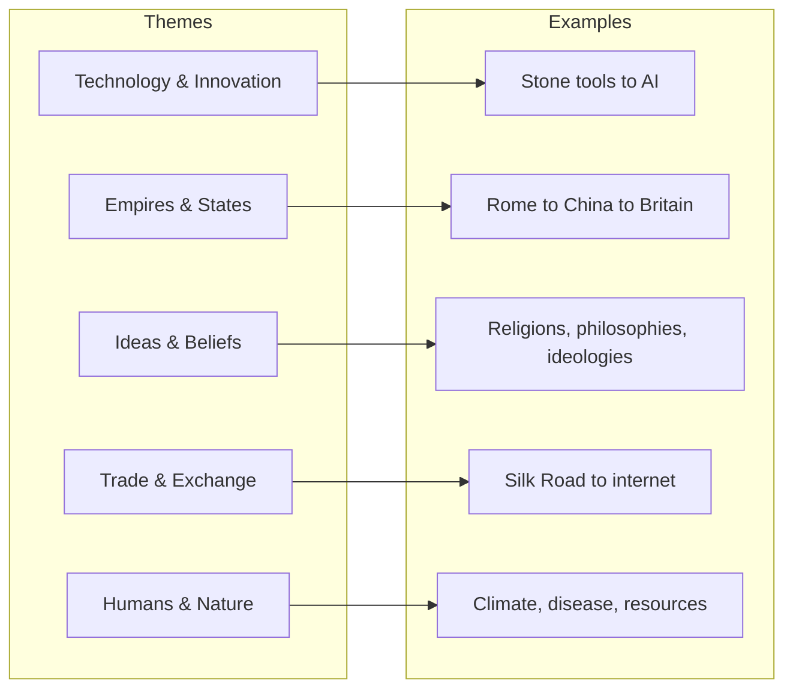

# Core Concepts

The foundational ideas about concise historical overview.

## Chronological Framework

The book organizes world history into a clear chronological framework: the ancient world, the medieval period, the early modern era, the 19th century, and the modern period. Within each period, key developments in politics, science, culture, and society are presented.

## Key Themes

The book traces several themes across all periods: the development of technology, the rise and fall of empires, the evolution of ideas and beliefs, the growth of trade and communication, and the changing relationship between humans and the natural world.

## Accessibility as Goal

Marriott's primary goal is accessibility. The book is designed for readers who may have limited or fragmented knowledge of world history and want to build a coherent framework. Technical terms are explained, events are contextualized, and connections between periods are made explicit.

# Key Sections

## The Ancient World (to 500 CE)

From the origins of humanity through the great civilizations of Mesopotamia, Egypt, Greece, Rome, India, and China. Major empires, philosophical developments, and technological innovations are covered.

## The Medieval World (500-1500 CE)

The rise of Islam, medieval Europe, the Mongol Empire, the civilizations of Africa and the Americas, and the beginnings of global trade networks.

## The Early Modern World (1500-1800 CE)

The Age of Exploration, the Reformation, the Scientific Revolution, the Enlightenment, and the beginnings of European global dominance.

## The 19th Century

The Industrial Revolution, nationalism and imperialism, the transformation of science and society, and the build-up to World War I.

## The Modern World (1914-present)

World wars, the Cold War, decolonization, globalization, and the major challenges of the 21st century.

# Practical Applications

- **Education**: Build a framework for understanding more detailed historical study
- **General knowledge**: Fill gaps in historical understanding
- **Conversation**: Have a basic understanding of major historical events

# Actionable Lessons

1. **History is connected** — Events in different parts of the world influence each other
2. **Patterns repeat** — Understanding historical patterns helps understand current events
3. **Context is essential** — No event can be understood without its historical context

# Action Plan

## Sufficiency Assessment

This summary captures the book's structure and themes but cannot replace the individual sections.

## Recommended Reading Path

| Reader Type | Time | What to Read |
|---|---|---|
| Casual | ~1 hr | Periods of interest |
| Student | ~3-4 hr | Full book |
| Refresher | ~2 hr | Weakest periods |

## What You'll Miss

- The specific events and figures covered in each period
- The timelines and fact boxes that reinforce learning
- The connections drawn between different periods and regions
- The concise explanations of complex historical developments
