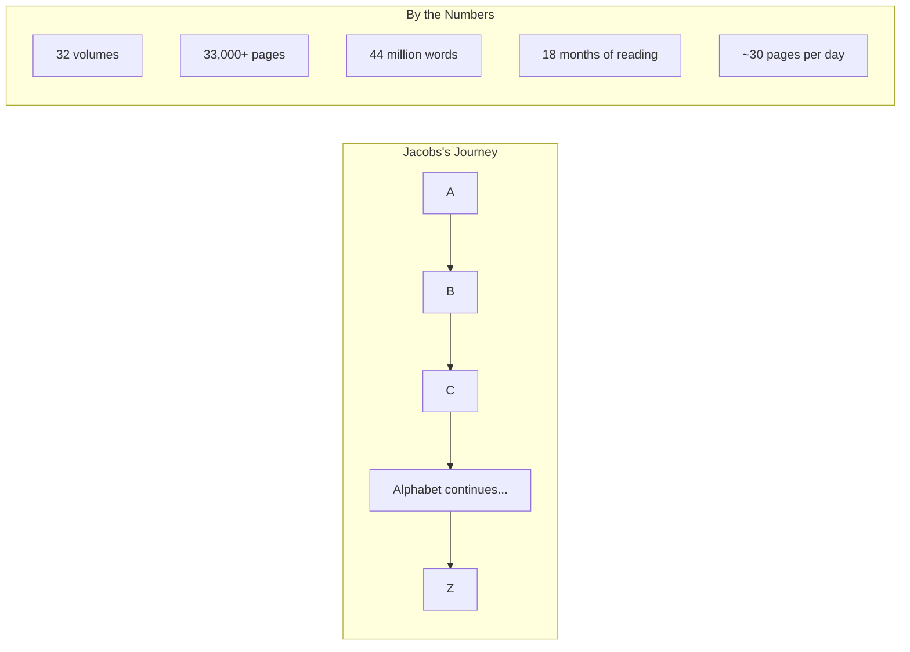
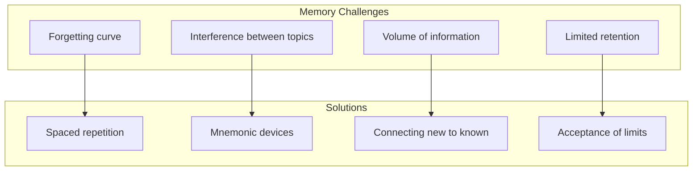

# Core Concepts

The foundational ideas about knowledge, learning, and the encyclopedia project.

## The Encyclopedia as Journey

Jacobs treats the Encyclopedia Britannica as a landscape to be traversed, with each letter of the alphabet representing a new territory. The journey takes him from "a-ak" (a type of bark cloth) to "Zywiec" (a Polish town), covering over 33,000 pages and 44 million words.

## Knowledge vs. Understanding

A central tension in the book: Jacobs learns millions of facts but wrestles with whether this makes him any wiser. He meets Mensa members, Nobel laureates, and professional trivia champions, discovering that knowing facts and understanding the world are different skills.

## The Britannica as Historical Artifact

Jacobs also explores the history of the Britannica itself — its Scottish origins, its famous contributors (Sigmund Freud, Albert Einstein, Harry Houdini), and the controversies and biases embedded in its entries.

# Key Themes

## The Pleasure of Trivia

Jacobs discovers genuine joy in learning obscure facts: the shortest war in history (Britain vs. Zanzibar, 38 minutes), the inventor of the stapler, the chemical formula for a banana. The book celebrates the pleasure of knowing things simply because they are interesting.

## The Limits of Memory

A recurring theme: Jacobs struggles to retain what he reads. He meets memory champions and learns techniques for retention, ultimately discovering that the value of his quest lies not in what he remembers but in the experience of learning.

## The Social Life of a Knowledge Seeker

Jacobs takes his quest into the world: he joins Mensa, visits the Britannica headquarters, appears on quiz shows, and debates the meaning of intelligence with experts. These encounters provide the human drama that makes the book more than a collection of facts.

# Practical Applications

- **Self-education**: Inspiration to pursue your own learning quest
- **Humility**: Understanding the limits of what any one person can know
- **Curiosity**: Rediscovering the joy of learning for its own sake

# Actionable Lessons

1. **Learning is a journey**, not a destination — the process matters more than the outcome
2. **Embrace your ignorance** — Recognizing what you don't know is the beginning of wisdom
3. **Connect facts to ideas** — Trivia is more valuable when linked to broader understanding

# Action Plan

## Sufficiency Assessment

This summary captures the book's themes and approach but cannot replace Jacobs's witty narrative.

## Recommended Reading Path

| Reader Type | Time | What to Read |
|---|---|---|
| Casual | ~30 min | First few chapters |
| Enthusiast | ~6-8 hr | Full book |
| Jacobs fan | ~8 hr | Full book + companion reading |

## What You'll Miss

- Jacobs's hilarious personal anecdotes
- The specific fascinating facts he discovers
- The encounters with experts and eccentrics
- The emotional arc of his 18-month journey
