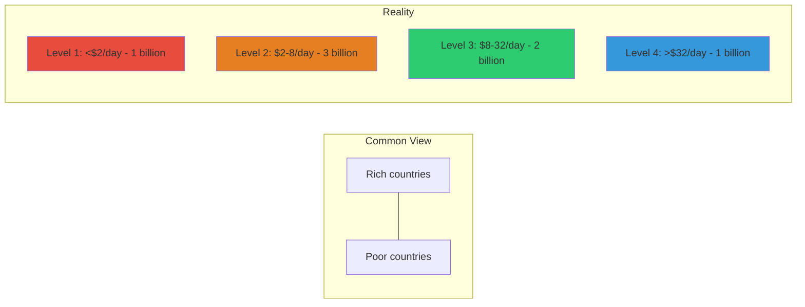
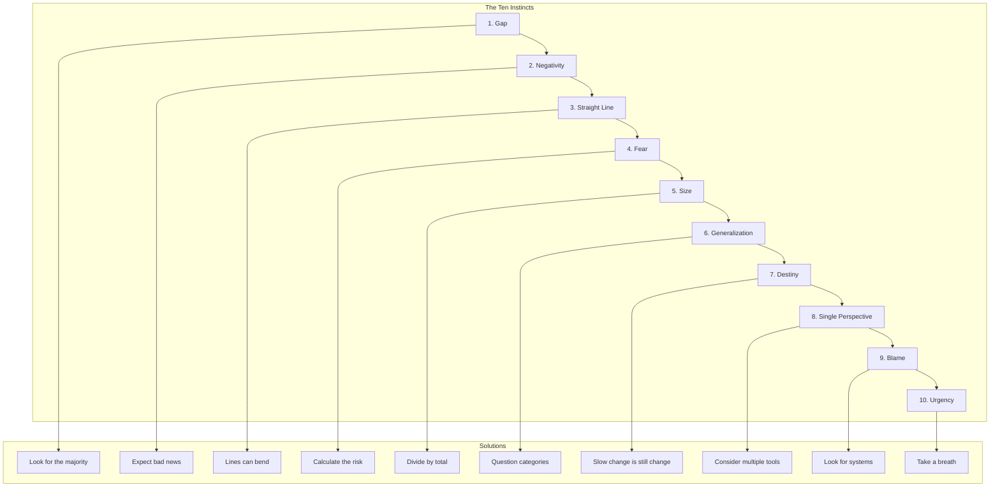

# Core Concepts

The foundational ideas about global trends and our misconceptions.

## The Gap Instinct

Rosling's first and most important instinct: we tend to divide the world into "us" and "them" — rich and poor, developed and developing. In reality, most countries are in the middle. The gap between the richest and poorest has narrowed dramatically.

## The Negativity Instinct

Our tendency to notice bad things more than good things. Rosling shows that news media systematically focus on negative events because that is what grabs attention. Progress is gradual and undramatic; disasters are sudden and newsworthy.

## The Straight Line Instinct

Our assumption that current trends will continue in a straight line. Many important global trends — population growth, poverty reduction, child mortality — are following S-curves or other non-linear patterns.

## The Ten Instincts

Rosling identifies ten instincts that distort our worldview: Gap, Negativity, Straight Line, Fear, Size, Generalization, Destiny, Single Perspective, Blame, and Urgency. Each chapter provides the tools to overcome one instinct.

# Chapter Insights

## Chapter 1: The Gap Instinct

When we think about global income, we imagine two groups: rich and poor. In reality, most people are in the middle. The four income levels show that the world has moved from a bimodal to a unimodal distribution.

## Chapter 2: The Negativity Instinct

Our news diet is overwhelmingly negative. Rosling shows that every major metric of human well-being has improved — but we do not know this because progress is not newsworthy.

## Chapter 3: The Straight Line Instinct

We assume lines continue straight, but many important trends bend. The world's population will likely stabilize around 10-12 billion. Child mortality has fallen dramatically. The key is to recognize when trends will and will not continue.

## Chapter 4: The Fear Instinct

Our fear of rare but dramatic events (plane crashes, terrorist attacks) distorts our perception of risk. We worry about the wrong things — things that are dramatic but unlikely — while ignoring real but undramatic risks.

## Chapter 5: The Urgency Instinct

When we feel urgency, we make bad decisions. Rosling argues that the feeling of urgency is often manufactured by those who want us to act without thinking carefully.

# Practical Applications

- **News literacy**: Recognize negativity bias in media coverage
- **Global perspective**: Understand the real state of the world
- **Decision-making**: Avoid the urgency trap in personal and professional choices
- **Teaching**: Help others develop a fact-based worldview

# Actionable Lessons

1. **Look for the majority** — Most things are neither as good nor as bad as extremes suggest
2. **Expect bad news** — The world can be improving while still having problems
3. **Calculate risks** — Distinguish between dramatic risks and real risks
4. **Question your categories** — The divisions we create often obscure reality

# Action Plan

## Sufficiency Assessment

This summary captures the framework but cannot replace Rosling's data visualizations and compelling examples.

## Recommended Reading Path

| Reader Type | Time | What to Read |
|---|---|---|
| Curious | ~1 hr | Chapters 1, 2, 4 |
| Committed | ~5-6 hr | Full book |
| Educator | ~8 hr | Full book + Gapminder tools |

## What You'll Miss

- Rosling's compelling data visualizations
- The stories illustrating each instinct
- The specific data showing global improvements
- The quizzes that reveal your own misconceptions
