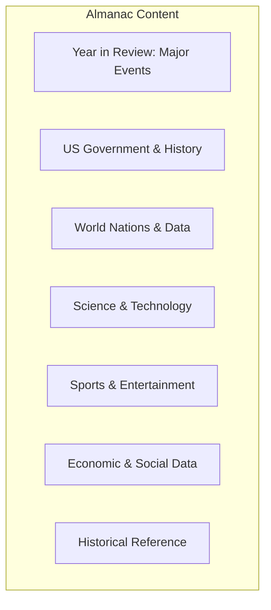

# Core Concepts

The foundational ideas about almanac organization and use.

## The Almanac as Yearly Snapshot

Each annual edition of the World Almanac captures the state of the world at a particular moment. The 2025 edition covers data from 2024, providing a permanent record of what happened and what the world looked like.

## Year-over-Year Comparison

One of the almanac's most valuable features is the ability to compare data across years. How has the population of a country changed? How have economic indicators shifted? The almanac maintains consistent categories and definitions across editions.

## The Year in Review

Each edition includes a special section covering the major events of the previous year: elections, natural disasters, scientific breakthroughs, cultural milestones, and notable deaths.

# Key Sections

## Calendar and Holidays

Astronomical data, calendars for the coming years, holidays for all major religions, and historical anniversaries.

## US Government

The Constitution, the Declaration of Independence, information on all three branches of government, and detailed data on federal spending, taxes, and elections.

## US States

Comprehensive data on all 50 states: population, geography, economy, education, and government. Includes state symbols and historical information.

## World Nations

Data on every country recognized by the US State Department: population, capital, area, government type, economy, and key statistics.

## Science and Technology

Nobel Prize winners, major scientific discoveries of the year, space exploration milestones, and reference data on astronomy, geology, and weather.

## Sports

Final standings, championship results, and records for all major professional and college sports.

# Practical Applications

- **Research**: Quick access to reliable data on virtually any topic
- **Trivia**: Fact-checking arguments and settling debates
- **Education**: Supplementary reference for student projects
- **Civic engagement**: Understanding government and political data

# Actionable Lessons

1. **Use as first reference** — The Almanac is an excellent starting point for research
2. **Compare editions** — Year-over-year data reveals important trends
3. **Verify facts** — The Almanac is a reliable source for settling factual disputes

# Action Plan

## Sufficiency Assessment

This summary describes the almanac's scope and organization but cannot replace the detailed data within.

## Recommended Reading Path

| User Type | Approach |
|---|---|
| General reader | Browse sections of interest |
| Researcher | Use index for specific topics |
| Student | Study relevant sections for projects |

## What You'll Miss

- The thousands of specific data points and statistics
- The year-in-review coverage of major events
- The historical data for year-over-year comparison
- The specialized reference sections on niche topics
