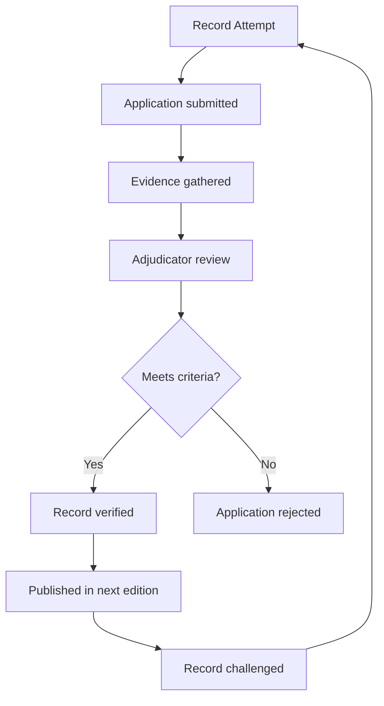
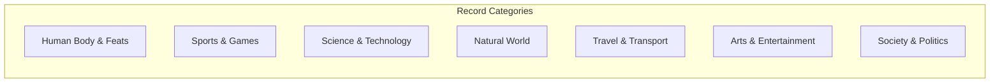

# Core Concepts

The foundational ideas about records and verification.

## The Verification Process

Guinness World Records maintains a team of official adjudicators who verify record attempts. Records must be measurable, breakable, and standardized. Evidence including photographs, videos, witness statements, and independent verification is required.

## Categories of Records

The book organizes records into major categories: human body, extraordinary feats, sports and games, science and technology, the natural world, travel and transport, arts and entertainment, and society and politics.

## The Evolution of Records

Records are not static. Each edition shows how records have evolved as human capability and technology advance. The 100-meter sprint record, the tallest building, and the fastest computer all change over time.

# Key Sections

## Human Feats

The strongest, fastest, most enduring humans. Includes weightlifting, marathon running, breath-holding, and other physical achievements.

## Natural World

The largest, smallest, fastest, and most extreme animals, plants, and geological features.

## Science and Technology

The fastest computers, the most powerful engines, the largest structures, and the most advanced technology.

## Sports

World records across every major sport, from athletics to soccer to esports.

## Young Achievers

Records set by young people, inspiring the next generation of record-breakers.

# Practical Applications

- **Inspiration**: Records demonstrate what is possible with dedication
- **Education**: Engaging entry point into science, geography, and human biology
- **Conversation**: Shareable facts and figures

# Actionable Lessons

1. **Limits are made to be broken** — Records show that perceived limits are often surpassed
2. **Verification matters** — Extraordinary claims require extraordinary evidence
3. **Human diversity is remarkable** — The range of human bodies and abilities is extraordinary

# Action Plan

## Sufficiency Assessment

This summary describes the book's scope and organization but cannot replace the specific records.

## Recommended Reading Path

| Reader Type | Time | What to Read |
|---|---|---|
| Casual browser | ~1 hr | Any interesting category |
| Enthusiast | ~3-4 hr | Full book |
| Reference | Ongoing | Look up specific records |

## What You'll Miss

- The specific records with their photographs and statistics
- The stories behind the record-breakers
- The year-by-year evolution of records
- The variety of extraordinary achievements documented
