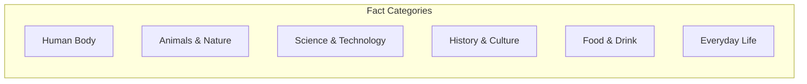

# Core Concepts

The foundational ideas about the pleasure of curious facts.

## The Joy of Discovery

The book is built on the premise that discovering new facts about the world is inherently pleasurable. Each fact is a small revelation that challenges assumptions or reveals something unexpected about how the world works.

## Categories of Facts

The book organizes facts into categories: the human body, animals and nature, science and technology, history and culture, food and drink, and everyday life.

## The Philosophy of Trivia

The book implicitly argues that curiosity is a virtue and that knowing interesting things about the world enriches life. Facts are presented not as testable knowledge but as gifts of wonder.

# Sample Facts

- A cockroach can live for several weeks without its head, eventually dying of starvation rather than the injury.
- The average person produces enough saliva in a lifetime to fill two swimming pools.
- Bananas are technically berries, while strawberries are not.
- The Eiffel Tower grows about six inches taller in the summer due to thermal expansion.
- Honey never spoils. Archaeologists have found 3,000-year-old honey in Egyptian tombs that is still edible.
- The shortest war in history was between Britain and Zanzibar on August 27, 1896. Zanzibar surrendered after 38 minutes.
- Octopuses have three hearts, blue blood, and a brain shaped like a donut.
- A bolt of lightning contains enough energy to toast 100,000 slices of bread.

# Thematic Organization

## Nature's Wonders

Facts about the natural world that reveal its astonishing diversity and adaptability. From the deepest ocean trenches to the highest mountains, life finds a way.

## The Human Marvel

Facts about the human body that reveal how extraordinary our biology is. Our bodies perform countless complex operations every moment without our conscious awareness.

## Historical Curiosities

Facts from history that challenge our understanding of the past. Many historical "facts" we learned in school turn out to be simplified or wrong.

# Practical Applications

- **Conversation**: Interesting facts make great social lubricants
- **Teaching**: Engage students with surprising information
- **Writing**: Add color and interest to any piece
- **Wonder**: Maintain a sense of curiosity about the world

# Actionable Lessons

1. **Stay curious** — The world is full of surprising things
2. **Share interesting facts** — Knowledge is more valuable when shared
3. **Question assumptions** — Many "facts" are wrong or oversimplified
4. **Enjoy learning** — Knowledge for its own sake is a pleasure

# Action Plan

## Sufficiency Assessment

This summary captures the book's approach and sample facts but cannot replace the full collection.

## Recommended Reading Path

| Reader Type | Time | What to Read |
|---|---|---|
| Casual | ~30 min | Browse any category |
| Enthusiast | ~2-3 hr | Full book |
| Reference | Ongoing | Dip in anytime |

## What You'll Miss

- The hundreds of specific facts with their precise wording
- The cumulative effect of reading many surprising facts
- The illustrations and design elements
- The specific categories and thematic organization
