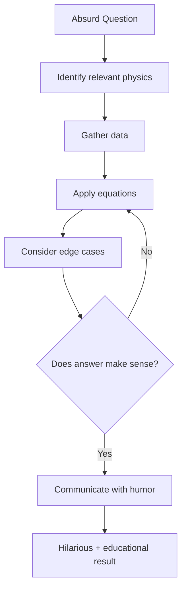

# Core Concepts

The foundational ideas about scientific thinking and absurd hypotheticals.

## The xkCD Approach

Munroe's method: take a ridiculous question and follow the science wherever it leads, no matter how absurd the intermediate steps. The humor comes from the contrast between the absurd premise and the deadpan, rigorous analysis.

## The Questions and Their Answers

Each chapter addresses a specific question. Sample chapters include: "What if everyone on Earth jumped at the same time?" (nothing noticeable happens, but it would be loud), "What if you built a periodic table out of actual elements?" (you would die very quickly from the toxic elements), and "What if you tried to hit a baseball at 90% of the speed of light?" (the ball would trigger a nuclear fusion reaction).

## The Method

Munroe demonstrates a systematic approach to problem-solving: define the question, identify the relevant physics, estimate the parameters, do the math, and communicate the results clearly. This method is a model of scientific reasoning.

# Key Questions

## "What if everyone on Earth stood as close as they could and jumped at the same time?"

Munroe calculates that everyone would be crushed to death in a human pile before anyone could jump, but even if they could all jump simultaneously, the effect on Earth would be negligible — though the noise would be briefly remarkable.

## "What if you built a periodic table of actual elements?"

The lighter elements would be straightforward, but the radioactive elements would be deadly, the gases would dissipate, and the liquid elements (mercury, bromine) would create a toxic mess. The most dangerous part would be assembling the transuranic elements.

## "What if you tried to hit a baseball at 90% of the speed of light?"

Munroe's most famous answer: the ball would trigger a fusion reaction in the air, creating a mushroom cloud and destroying the entire stadium. The pitcher would be killed by the backflash. The batter would never see the ball coming.

## "What if you made a lava lamp the size of a building?"

The lava lamp would require so much heat to melt the lava that the building would catch fire, and the "lava" (actually wax) would cool and solidify before reaching the top, creating a giant column of solid wax.

# Practical Applications

- **Problem-solving**: Munroe's approach is a model of scientific reasoning
- **Science communication**: See how to make complex topics accessible and fun
- **Critical thinking**: Apply rigorous analysis to any question

# Actionable Lessons

1. **Ask ridiculous questions** — They often lead to deep insights
2. **Follow the math** — The numbers will tell you where the truth lies
3. **Estimate first** — Order-of-magnitude calculations are powerful
4. **Communicate with humor** — It makes science memorable

# Action Plan

## Sufficiency Assessment

This summary captures the book's approach and famous examples but cannot replace Munroe's full answers.

## Recommended Reading Path

| Reader Type | Time | What to Read |
|---|---|---|
| Casual | ~1 hr | 5-10 favorite questions |
| Enthusiast | ~4-5 hr | Full book |
| Reference | Ongoing | Revisit favorite answers |

## What You'll Miss

- Munroe's distinctive stick-figure illustrations and diagrams
- The specific calculations and reasoning for each question
- The appendices with additional material
- The unique blend of humor and scientific rigor
