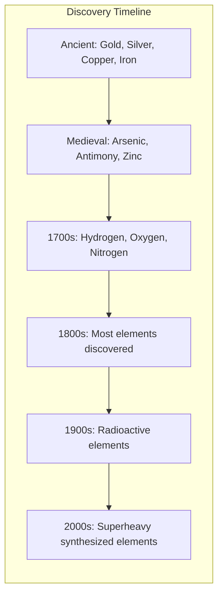
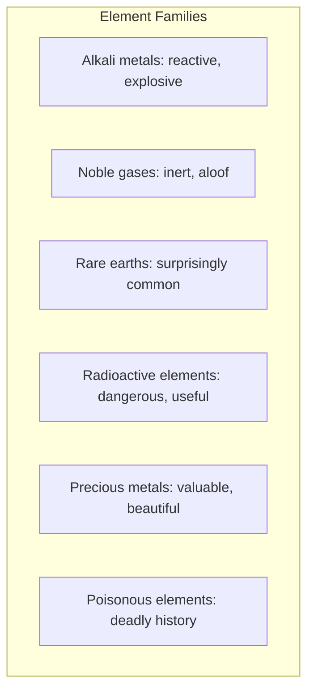

# Core Concepts

The foundational ideas about the periodic table and its stories.

## The Periodic Table as Human Record

Kean argues that the periodic table is not just a scientific classification system but a record of human history. The discovery of elements tracks the development of civilization: which elements were discovered when reveals what technologies were available, what scientific theories dominated, and what cultures were active in scientific discovery.

## The Element Families

The book is organized around families of elements with related properties and stories. Each chapter covers a group of elements connected by their chemical behavior, history, or cultural impact.

## The Madness of Scientists

A recurring theme: many element discoverers were eccentric, obsessive, or outright mad in their pursuit of new elements. Kean tells the stories of scientists who poisoned themselves, blew up their labs, and waged bitter priority disputes.

# Key Stories

## The Disappearing Spoon

The title story: gallium has a melting point of about 85 degrees Fahrenheit, so a spoon made of gallium would melt when stirred in hot tea, "disappearing" into the liquid. This gag was a favorite of Victorian parlor pranks.

## Poison and Politics

Arsenic, lead, mercury, and polonium have all played roles in political assassinations and accidental poisonings. Kean traces the history of poison from ancient Rome to the murder of Alexander Litvinenko.

## The Element That Almost Wasn't

The discovery of element 75 (rhenium) involved a detective story worthy of Sherlock Holmes, with scientists chasing false leads and missing the element despite having it in their hands multiple times.

## War and the Elements

Strategic elements like tungsten, uranium, and platinum have shaped the outcomes of wars. The race for the atomic bomb was ultimately a race to produce enough enriched uranium and plutonium.

# Practical Applications

- **Understanding chemistry**: Learn element properties through memorable stories
- **Science history**: Appreciate the human context of scientific discovery
- **Conversation**: Share fascinating stories about everyday materials

# Actionable Lessons

1. **Chemistry is everywhere** — Elements shape history, culture, and daily life
2. **Science is human** — Discovery involves ambition, competition, and occasional fraud
3. **Everything has a story** — Even the most mundane materials have fascinating histories

# Action Plan

## Sufficiency Assessment

This summary captures the book's approach and representative stories but cannot replace the full narrative.

## Recommended Reading Path

| Reader Type | Time | What to Read |
|---|---|---|
| Casual | ~1 hr | 2-3 chapters of interest |
| Enthusiast | ~7-8 hr | Full book |
| Reference | Ongoing | Revisit specific element stories |

## What You'll Miss

- The specific narratives for each element family
- Kean's engaging storytelling and narrative voice
- The connections between element stories and historical events
- The cumulative effect of seeing the periodic table come alive
